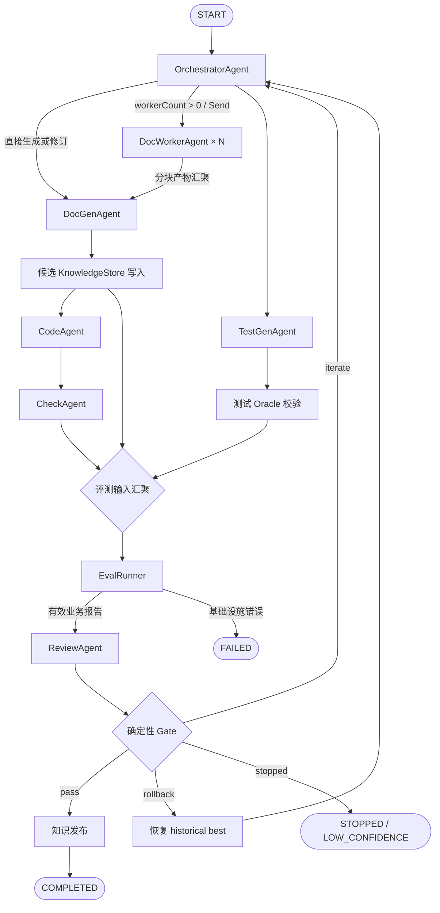

# LangGraph 整体框架设计

> 状态：框架 V1 设计基线  
> 原则：完整保留所有节点；先把图和平台接缝搭稳，再逐步替换 Agent 内部实现

## 1. 设计范围

LangGraph 是唯一的顶层编排器，负责节点、边、条件路由、并行 fan-out、循环和 checkpoint。Agent 内部实现通过 `AgentRunner` 接入，可以是 Codex、DeepSeek Harness（DSH）、其他开源 Agent 或自研实现，但不得反向控制或改写顶层工作流。

V1 采用 TypeScript。云服务器 Demo 可选 Codex，复用已有登录额度；公司环境不允许使用 Codex 或直接调用底层模型 API，只通过公司 CodeAgent CLI 接入。两者都只是 `AgentRunner` 实现，认证失败时显式报错，不静默切换后端。

## 2. 完整逻辑图



这是逻辑依赖图，不要求所有分支按图中视觉顺序串行。实际实现应在依赖满足时并行执行，但汇聚点不得遗漏任何必需输入。

## 3. 节点职责

| 节点 | 类型 | V1 框架阶段职责 | 允许的占位方式 |
|---|---|---|---|
| `OrchestratorAgent` | Agent 节点 | 读取确定性状态并安排下一阶段；V1 使用确定性代码 | 确定性实现 |
| `DocGenAgent` | Agent 节点 | 生成或修订知识文档，汇总 DocWorker 产物 | Fake / Codex / CodeAgent CLI |
| `DocWorkerAgent` | Agent 节点 | 按分块并行生成知识片段 | Fake / CodeAgent CLI；节点和 Send 路径必须保留 |
| `TestGenAgent` | Agent 节点 | 从源码与头文件产生候选测试 | Fake / Codex / CodeAgent CLI |
| `CodeAgent` | Agent 节点 | 仅依据知识和接口生成实现 | Fake / Codex / CodeAgent CLI |
| `CheckAgent` | Agent 节点 | 独立检查代码、diff 和判据，产出检查报告 | Fake / Codex / CodeAgent CLI |
| `ReviewAgent` | Agent 节点 | 审查所有有效 Eval 报告与 Check 结论并给出风险、修订建议 | Fake / Codex / CodeAgent CLI |
| Oracle 校验 | 确定性组件 | 验证候选测试的 expected output 与真实源码一致 | Fake 或命令实现 |
| `EvalRunner` | 确定性组件 | 执行可配置的编译、测试和其他评测器 | `FakeEvaluator` / `CommandEvaluator` |
| `Gate` | 确定性组件 | 根据结构化报告决定 pass、iterate、rollback、stopped | 规则代码，不使用 LLM |
| KnowledgeStore | 领域组件 | 保存候选版本、历史最佳版本和已验证版本 | 本地文件实现 |

## 4. 核心接口接缝

接口名称可以在实现时调整，但职责边界必须保持。

```typescript
type AgentKind =
  | "orchestrator"
  | "doc-gen"
  | "doc-worker"
  | "test-gen"
  | "code"
  | "check"
  | "review";

interface AgentRunner {
  run(input: AgentRunInput): Promise<AgentRunResult>;
  resume?(input: AgentResumeInput): Promise<AgentRunResult>;
}

interface AgentRunnerRegistry {
  get(kind: AgentKind): AgentRunner;
}

interface CodexAuthProvider {
  assertAvailable(): Promise<void>;
}

interface CodeAgentAuthProvider {
  assertAvailable(): Promise<void>;
}

interface Evaluator {
  evaluate(input: EvaluationInput): Promise<EvaluationReport>;
}

interface ArtifactStore {
  put(input: ArtifactWrite): Promise<ArtifactRef>;
  get(ref: ArtifactRef): Promise<Uint8Array>;
  verify(ref: ArtifactRef): Promise<boolean>;
}

interface CheckpointerFactory {
  create(config: CheckpointerConfig): Promise<Checkpointer>;
}

interface WorkspaceProvider {
  prepare(input: WorkspaceRequest): Promise<WorkspaceHandle>;
}

interface ApprovalProvider {
  request(input: ApprovalRequest): Promise<ApprovalDecision>;
}
```

首批实现：

- `FakeAgentRunner`：覆盖全图 smoke 与故障注入；
- `CodexAgentRunner`：至少选择一个代表性节点做真实集成；
- `ExistingLoginAuthProvider`：复用现有 Codex 登录状态；
- `CompanyCodeAgentCliRunner`：通过 `spawn` + stdin + `stream-json` 调用公司 CLI；
- `ExistingCodeAgentLoginAuthProvider`：通过 `codeagent auth status --json` 验证 IDAAS 登录；
- `FakeEvaluator`：稳定地产生 pass、fail、critical regression、infra error；
- `CommandEvaluator`：执行项目配置提供的命令，不在框架内写死 `g++`；
- `LocalFileArtifactStore`：写入本地运行目录；
- `SqliteCheckpointerFactory`：默认运行实现；
- `InMemoryCheckpointerFactory`：单元测试实现。

## 5. GraphState

GraphState 只保存编排所需的小数据和引用，不直接塞入源码、长 Prompt、完整文档或完整消息历史。

```typescript
interface GraphState {
  runId: string;                 // 同时作为 LangGraph thread_id
  status: RunStatus;
  currentNode?: string;
  iteration: number;
  maxIterations: number;        // 默认 5，可配置
  route?: "pass" | "iterate" | "rollback" | "stopped";
  agentThreadIds: Partial<Record<AgentKind, string>>;
  artifacts: ArtifactRef[];
  errors: RunError[];
}
```

未来由 `ContextBuilder` 根据 `ArtifactRef`、节点权限和本轮任务构造上下文。当前上下文协议尚未定案，不能把临时 Prompt 结构固化进核心 State。

## 6. Artifact-first 交接

每次运行使用独立目录：

```text
.agent-runs/{runId}/
  orchestrator/
  doc-gen/
  doc-worker/{workerId}/
  test-gen/
  code/
  check/
  eval/
  review/
  knowledge/
  events/
```

Agent 必须把主要结果写成文件；`finalResponse` 只保存摘要、日志或索引。框架在节点提交时验证文件存在，计算 SHA-256，并把路径、类型、大小、哈希和生产节点封装为 `ArtifactRef`。

`ArtifactStore` 使本地文件可以在后续替换成对象存储或云端同步，但 V1 不要求云存储。

## 7. 物理工作区隔离与权限

Prompt 约束不是安全边界。`WorkspaceProvider` 应为每个节点准备真实的可见目录，并由节点级 allowlist 限制读写：

| 节点 | 可读 | 可写 | 明确不可见 |
|---|---|---|---|
| DocGen / DocWorker | source、必要接口、上轮修订意见 | knowledge 候选区 | 测试答案等无关产物 |
| TestGen | source、headers | candidate tests | knowledge |
| CodeAgent | knowledge、headers | code | source、tests |
| CheckAgent | code、diff、criteria | check report | 无关工作区 |
| ReviewAgent | knowledge、eval report、check report | review report | 无关工作区 |

V1 权限策略：

- 非交互执行；
- 未授权操作直接失败；
- 不自动提权；
- `ApprovalProvider` 仅保留接口；
- 如未来提供 full-access debug，必须显式开启且不可成为默认路径。

## 8. 并行与汇聚

框架必须实现真实的 LangGraph 并行和 `Send` fan-out，而不是只在文档中声明支持：

- smoke 模式默认允许并行，使用 Fake Runner 验证 fan-out、全部完成后汇聚以及失败传播；
- Codex 模式默认顺序执行，初始并发上限可配置为 2，避免额度和会话相互干扰；
- `DocWorkerAgent` 默认 `workerCount = 0`，直到分块协议确定；
- 测试中必须设置 `workerCount > 1`，证明该节点和 Send 路径没有被架空；
- 将来增加 `ResourceClaim` 后，只有读写集合不冲突的任务才并行。

## 9. Checkpoint 与节点内恢复

V1 默认使用 SQLite Checkpointer，测试使用 InMemory。`runId` 同时作为 `thread_id`。LangGraph 在节点或 superstep 边界持久化状态，因此已完成节点在恢复后不应重跑。

节点内部按三阶段处理：

1. `prepare`：写入 attempt、输入引用、权限和会话信息；
2. `execute`：调用 Agent 或确定性程序并持续落盘必要记录；
3. `commit`：校验产物、计算 SHA-256、写 completion marker，再更新 State。

节点中途失败时，按以下顺序恢复：

1. 已存在且哈希有效的 committed Artifact：直接复用；
2. 有可恢复的 Codex thread：尝试 `resume`；
3. 否则创建新的 attempt 并重新执行节点。

Codex session resume 不等于精确恢复某条正在执行的指令，所以仍需超时、幂等提交和 Artifact 校验。V1 只承诺同一台本地或团队虚拟实例重启后的恢复，不承诺跨机器故障转移。

## 10. 会话策略

在上下文协议确定前，先采用可配置默认值：

- `DocGenAgent`：同一 run 的修订轮次复用自己的 Codex thread；
- `ReviewAgent`：每轮 review 使用全新 thread，降低先前生成过程的偏见；
- 其他节点：由配置决定，默认不跨 Agent 共享 thread；
- 每个 Agent 的 thread ID 只通过 State 的引用字段保存。

## 11. Review 与确定性 Gate

所有结构有效的业务评测报告都必须经过 `ReviewAgent`：

- Eval 失败：分析根因并指出应修订的知识；
- Eval 通过：检查证据完整性、warning、Check 发现和未覆盖高风险；
- 基础设施错误：不产生有效业务结论，直接进入 `FAILED`，不调用 Review。

Review 可以把 Eval 的 pass 降级为 iterate，但不能把 Eval 的 fail 升级为 pass。最终路线只由确定性 Gate 决定：

```text
infrastructure error
  -> failed
Eval pass + Check/Review 无 blocking issue
  -> pass
business failure 或 blocking issue，且 iteration < maxIterations
  -> iterate
criticalRegression 且存在 historicalBest
  -> rollback
iteration >= maxIterations
  -> stopped / LOW_CONFIDENCE
```

`maxIterations` 默认 5，可配置；它是初始工程预算，不是质量最优性的理论结论。

## 12. 对外入口与初始部署

框架核心先提供 TypeScript Service API：

```typescript
startRun(input): Promise<RunHandle>
resumeRun(runId): Promise<RunHandle>
getRunStatus(runId): Promise<RunStatusView>
cancelRun(runId): Promise<void>
getRunArtifacts(runId): Promise<ArtifactRef[]>
```

CLI 只调用同一 Service 层：

```text
run
resume <runId>
status <runId>
cancel <runId>
artifacts <runId>
```

V1 可以运行在个人本地环境，也可以运行在部门已有的单个虚拟实例中。两者都属于“单实例 + 本地 SQLite + 本地 Artifact”模式。HTTP 服务、多用户调度、对象存储、跨实例恢复和云端发布留给后续阶段，不应阻塞当前骨架验证。

## 13. 框架完成定义

当以下条件同时满足，才可认为“整体框架已搭起来”：

1. 七类 Agent 节点和所有确定性环节均出现在实际图中；
2. Fake Runner 可以驱动完整 happy path、迭代、回滚、停止和基础设施失败；
3. `DocWorkerAgent × N` 的 Send 与 join 有真实测试；
4. SQLite checkpoint 能从已完成节点之后恢复；
5. Artifact 提交、哈希、恢复与损坏检测有效；
6. 至少一个代表性节点从 Fake 切换到真实 Codex 后不修改图；
7. 新增或替换 Agent 只影响 Adapter/配置，不要求重写 State、运行时或 Gate。
