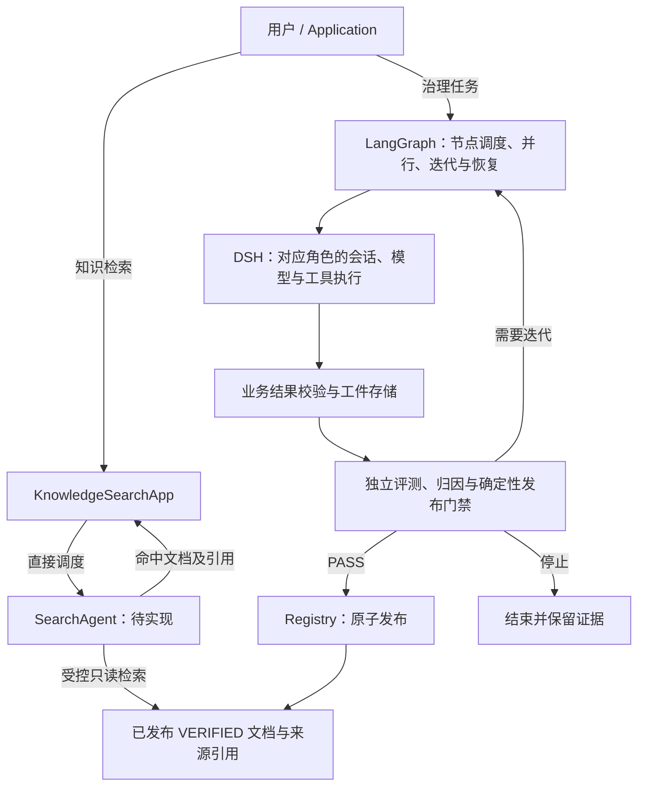
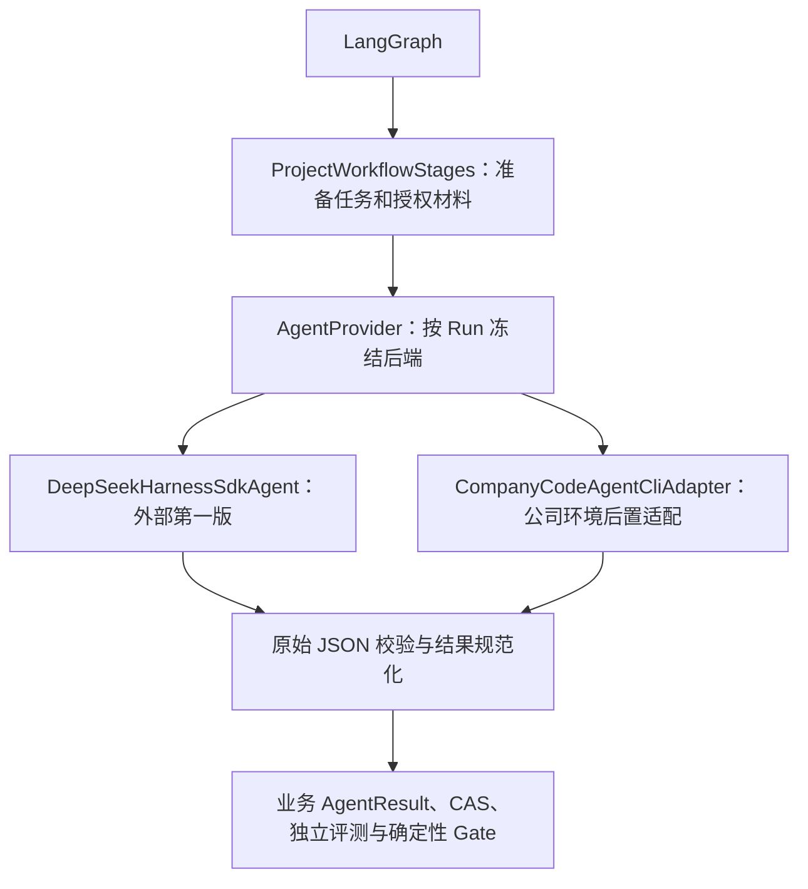

# Knowledge Flywheel 架构

> 文档语言：中文是规范说明的默认语言。类名、接口名和状态值保留英文，方便与代码互查。

<details lang="en">
<summary>English summary</summary>

domain-knowledge owns knowledge governance and execution. Its Domain/Application layers own `FlywheelRun`, evidence, `KnowledgeVersion`, the deterministic publication Gate and atomic publication. The isolated LangGraph infrastructure module owns fan-out, loops, cancellation and graph checkpoints. Both layers share `runId`, but LangGraph state never becomes a second business registry. wpKnowledge is the separate Git repository for reviewed knowledge content and evidence. The planned SearchAgent is invoked directly by Application to retrieve published VERIFIED documents, independently of OrchestratorAgent and the seven-role governance workflow.

</details>

<a id="target-architecture"></a>

## 已确认的目标架构（2026-09-08，实施中，尚未完成）

第一版先在外部环境完成真实闭环。LangGraph 编排七个角色，DSH 直接承担单个 Agent 的运行能力；项目保留业务输入输出约定和治理服务，不在两者之间再建设一套通用 Agent 运行框架。

目标新增独立的 [SearchAgent](../specs/06-agents/search-agent.md)：用户从 Application 的 `KnowledgeSearchApp` 直接调用它，检索飞轮治理后已发布的 `VERIFIED` 文档。SearchAgent 不经过 OrchestratorAgent 或 LangGraph，不加入七角色治理拓扑；当前仅完成设计文档，尚未实现。



图中表示职责和结果流向；发布或停止后流程结束，只有符合工作流规则的迭代才回到下一轮。评测和发布继续由系统服务执行，不交给模型自行判定。

检索请求用独立请求 ID 关联，由 Application 校验输入、权限和结果，通过 Port 使用 Agent Runtime 与知识读取工具。查询不创建 FlywheelRun、图 checkpoint 或节点投影，也不触发评测和发布。`ACCEPTED`、候选、低置信和已替代版本不能进入 SearchAgent 上下文；读取前核验 Registry 发布事实及 CAS 完整性。已有 `KnowledgeSearchApp` 普通查询是实现基础，不等于已具备 SearchAgent。

| 部分 | 目标职责 |
| --- | --- |
| LangGraph | 工作流状态、节点依赖、并行、业务迭代和恢复；调用 DSH 中对应的角色 |
| DSH | 复用其会话、模型调用、工具运行和事件能力；各开发者在 DSH 上开发角色 |
| 节点接线 | 将任务材料交给角色、接收结果并关联业务任务；保持必要的集成代码，不复制 DSH 的运行框架 |
| Domain / Application | 定义各角色应交付的业务结果，验证 Schema、权限与工件归属，持有 Registry/CAS、独立评测和发布权威 |
| CodeAgent CLI | 保留未来接入位置，使其交付相同的业务结果；真实协议适配与公司环境验收后置，不阻塞外部第一版 |

业务输入输出约定不是新的运行框架：DSH 可以运行 DocGen，但“候选知识必须包含哪些事实、来源和字段”仍由项目定义。DSH 的原始响应与事件通过校验后才能成为业务工件。SDK 类型不进入 Domain/Application，版本化业务 Schema 与 ArtifactRef 边界继续保留。

R1 已移除项目直接使用的 Pi Agent 框架；`ProjectWorkflowStages` 只做业务接线，预写输出位于显式 `FixtureProjectWorkflowStages`。默认配置使用 DSH 原生 sdk-minimal 和项目只读工具插件。项目路径、固定 commit、生成路径及评测命令属于版本化场景，通过公共 CLI/API 输入。DSH 不再嵌套调用 CodeAgent CLI。上游 DSH 间接依赖的 pi-ai 是可选模型适配包，不是项目 Pi Agent 执行链；原生 minimal 路径不加载它。

交付顺序为：**DSH 公共底座 → 普通 CPU 小模块的可运行角色范例 → 七角色能力开发与联调 → 外部真实闭环 → CodeAgent CLI 真实适配**。底座可用只证明开发者可以沿用范例开发角色，不代表七角色业务能力或第一版完整闭环已经验收。

<details lang="en">
<summary>Target architecture summary</summary>

The confirmed target uses LangGraph for workflow orchestration and DSH for individual agent execution. Business output contracts, evidence, evaluation and publication remain owned by this project. Pi and the project-specific executor leave the target foundation. CodeAgent CLI integration is reserved for a later stage. The R1 foundation is implemented and covered by controlled-provider tests; live model quality remains unverified.

</details>

实施增量及验收分层见 [DEV-019](../specs/changes/active/DEV-019-dsh-agent-foundation/proposal.md)，角色开发流程见[开发指南](guides/agent-customization.md)。以下章节描述当前代码；与目标的差异尚未通过实现消除。

<a id="codeagent-cli-integration"></a>

## CodeAgent CLI 接入方案（DEV-010，待真实适配）

CodeAgent CLI 接在现有 `AgentProvider` Port，作为 DSH 的替代实现。接入目标是用这一公司运行工具执行七个业务角色；其中 `code` 只是本项目的代码生成角色。LangGraph 继续负责节点调度、并行、迭代和恢复，CLI 每次只执行被分配的角色任务，不接管整条飞轮，也不经 DSH 嵌套调用。



上图是接入目标；现有 CLI 类和组合根分支已存在，真实协议、材料隔离和后端选择仍须按[接入步骤](OPERATIONS.md#codeagent-cli)核验。复用边界如下：

| 层与代码入口 | 接入时的职责 |
| --- | --- |
| [AgentProvider / AgentRequest](../src/application/ports/index.ts) | 保持 `run(request, signal)`：输入角色、Prompt、输出 Schema、幂等键、受信命令、工件引用和工作区；返回原始 JSON，CLI 专有字段留在 Adapter |
| [ProjectWorkflowStages](../src/application/services/automated-project-workflow.ts) | 复用 `buildAgentCommand()`、`runLiveAgent()`、`normalizeAgentResult()`；准备同样的授权材料，将原始 JSON 转为 CAS 工件与业务 `AgentResult`，继续校验身份与归属 |
| [CompanyCodeAgentCliAdapter](../src/infrastructure/agents/company-codeagent/index.ts) | 根据真实 CLI 版本实现认证、stdin、最终事件解析、工具映射、进程隔离、session、取消及脱敏审计 |
| [createComposition](../src/interfaces/runner/composition.ts) 与 [RegistryRunConfigurationService](../src/application/services/run-configuration.ts) | 装配后端并冻结实际生效配置；核验已有 DSH 设置的优先级、CLI 版本与权限策略摘要及旧 Run 恢复兼容性 |

角色指令、业务输入输出、场景、工作流和独立评测可以复用；DSH 的 `read_material` 插件、Bubblewrap 启动方式和 session 协议不能视为已被 CLI 继承。接入必须对齐现有[角色材料权限](../specs/09-security/data-boundaries.md)，并补足 CLI 自身的可验证实现。Code 返回允许路径的 `files`，由业务侧独立评测；CLI 不持有 Registry、发布凭据或 Gate 决策权。

本节是后续实施设计，不变更 Accepted Spec 或 DEV-010 验收状态。第一版仍按 DEV-019 完成外部闭环，后续 CLI 交付相同业务契约；不要求七个角色开发者各写一套 CLI 适配。

## 当前实现的架构边界

运行时采用 DDD 与六边形依赖方向：

```text
uiApi / CLI
     │
     ▼
Application
├── Orchestrator
├── FlywheelApp
├── EvalRunnerApp
├── KnowledgeSearchApp
├── KnowledgeDiscoveryApp
├── ContentGovernanceApp
├── ProviderOperationsApp
└── OperationalMetricsApp
     │
     ▼
Domain
├── FlywheelDomainService
│   ├── DocGenAgent
│   ├── TestGenAgent
│   └── CodeAgent
├── EvalRunnerDomainService
│   └── EvaluationAgent（确定性评测能力，不新增图节点）
└── AssociationDomainService
    ├── ExternalExtractor
    └── ReverseMapper
     │ Ports
     ▼
Infrastructure
├── Agent Runtime / LangGraph
├── DB：Knowledge / Workflow State / Agent Settings
└── Redis：Agent Context / Running State（目标 Adapter，当前未启用）
```

源码目录按同一依赖方向分层：

```text
src/
├── domain/
│   └── services/           # Flywheel / EvalRunner / Association 纯领域服务
├── application/
│   ├── apps/               # 八个用例入口
│   ├── ports/              # 入站和出站端口
│   └── services/           # 用例编排
├── infrastructure/         # 持久化、评测、智能体与工作流实现
└── interfaces/
    ├── ui-api/             # UI/HTTP 入站入口
    ├── runner/             # CLI、组合根与兼容入口
    └── dsh/                # DSH 查询接口
```

交互层和基础设施层可以依赖应用层，应用层可以依赖领域层，反向依赖一律禁止。目录收敛及旧源码根的处置见 [ADR-007](../specs/adr/ADR-007-ddd-layered-source-layout.md)。

`src/domain` 不引入工作流 SDK、数据库、模型 Provider、编译器或特定语言类型。`src/application/apps` 与 `src/application/services` 只依赖领域层和 Port。`src/infrastructure/workflow/langgraph` 用 LangGraph 实现工作流 Port，并保持独立模块形态。这样，图运行时可以继续演进，知识治理规则仍留在上层。架构契约测试会检查这些边界。详细决策见 [ADR-010](../specs/adr/ADR-010-application-domain-service-boundaries.md)。

`fw.mjs` 是 CLI 边缘的兼容门面。组件内统一维护产品 Spec、浏览器资源、HTTP Adapter、Console 只读投影、共享核心包、测试和验收 fixture。`src/interfaces/runner/server.ts` 是唯一 HTTP 实现。所有写路径都委派给共享 Application Service，不能另建 Registry、生命周期、评分、工作流或发布权威。

## 两类状态

系统有意保留两套状态模型，因为它们回答的问题不同：

- `FlywheelRun`、`KnowledgeVersion`、`EvaluationReport` 和 `PublicationReceipt` 是 domain-knowledge 持有的业务事实，持久化在 Registry。
- LangGraph `GraphState` 用于执行控制，记录当前节点、fan-out worker、路由、尝试次数和可恢复上下文。它由图 Checkpointer 保存，不能成为第二个知识库或发布库。

两层共享同一个 `runId`，在 LangGraph 中对应 `thread_id`。节点状态通过 `WorkflowObserver` 写入 `WorkflowNodeProjection`；Console 读取稳定投影，不直接打开图的 checkpoint 数据库。图 checkpoint 负责恢复执行，`GenerationKey`、CAS、Registry Event 和 publication key 负责保护业务副作用与审计记录。

图中有一个工作流路由 Gate，处理 `ITERATE`、`ROLLBACK`、`PASS` 和 `STOPPED`。`PASS` 只表示向上层请求发布；真正有权决定发布的仍是 Domain/Application 层的确定性知识 Gate。

## Agent 定制边界

七个图角色是 Orchestrator、DocGen、DocWorker、TestGen、Code、Check 和 Review。它们的标识、职责、输入输出契约、拓扑和工具权限固定在 `src/infrastructure/workflow/langgraph/agent-definitions.ts`。

上述清单只描述飞轮图角色。目标中的 SearchAgent 属于 Application 直接调用的检索角色，使用独立请求/结果契约，不加入该清单、治理 Run 配置快照或批次工作流图。

操作员可以在 Console 查看所有角色，但只能维护 `promptAddon`。运行时把追加提示词拼在有版本的基础提示词后面，不替换基础提示词，也不改变节点契约。`AgentCatalogService` 会记录提示词修订和审计信息。

## 知识生命周期

1. 摄取流程把 Markdown 原始字节写入 CAS，并在 SQLite 创建 `CANDIDATE` 版本。
2. 确定性 Quality Gate 检查结构、来源、验证锚点和内容是否充实。`ACCEPTED` 只表示候选可以进入行为评测，不表示内容正确。
3. Run 按显式且单调的状态机前进。`EvaluationReport` 绑定测试总数、关键失败、稳定性、工具链指纹和不可变证据。评测报告、Gate 决定、Review 状态迁移及对应 Event 在同一事务提交。完全相同的重试会重放既有结果，输入冲突的重试会被拒绝。
4. 确定性 Gate 返回 `PASS`、`ITERATE`、`ROLLBACK` 或 `STOPPED`。
5. 发布流程先验证 CAS 完整性，再用一个 SQLite 事务更新 Run、将旧版本标为 superseded、把新版本标为 verified、追加 Event 并创建发布回执。

真实源码验收还定义了 `ProjectEvaluator` Port。本地受信 Adapter 会解析并归档指定 Git commit，在临时目录执行，不改变源码仓库当前 checkout。生成文件只写入临时目录；工具必须在白名单中，且不得经过 shell。完整进程证据最终写入 CAS。

七角色结果均经过角色 JSON Schema、业务信封绑定和 CAS 校验。默认 Provider 是 DSH，Console 保存并验证模型配置后，通过原生 DSH SDK 执行；角色工具由 DSH 分派，仅可读取物化白名单材料，写入由业务 Result 提交。每次尝试使用独立 session/home，Prompt 通过 stdin JSON-RPC 传入。API 配置的模型流量经受信地址转发，固定已批准 DNS，禁止重定向，实际上游密钥不进入 DSH 子进程。显式 Fixture 仅用于自动化验收，公司 CLI Adapter 后置。

候选正文先过 Quality Gate。结构、验证锚点或可读性不足时，图会跳过本轮 CodeAgent，将 score、signals 和 weak points 放回下一轮 DocGen 上下文。行为评测仍在候选质量合格后执行，两个 Gate 不能合并。

## 持久化

- Artifact ID 使用 `sha256:<digest>`，并且必须与内容摘要一致。
- CAS 先写临时对象，flush 后重命名，再校验提交后的字节。
- SQLite 使用 WAL 和 `synchronous=FULL`。
- 状态、Event、GateDecision 和发布指针按事务提交。
- LangGraph 把执行 checkpoint 写入 `workflow/checkpoints.sqlite`；Registry 仍是业务事实和 Console 投影的唯一存储。
- `GenerationKey` 标识一次节点副作用。重复执行会返回已提交输出；首个执行尚在运行时，并发重复请求会 fail closed；失败记录可以重试，尝试次数和 Event 历史不会丢失。
- LangGraph 执行错误保持可恢复：`workflow-resume` 从最近一个带 task error 的 checkpoint 分支继续。它不会自动把 FlywheelRun 写成同名业务终态。
- publication key 为 `moduleId:versionId:policyId`；重复发布返回既有回执。

<a id="security-boundary"></a>

## 安全边界

- `/api/v1` 下的 HTTP GET 操作只读。
- 只有配置 `WP_KNOWLEDGE_WRITE_TOKEN` 且请求携带 Bearer token 时，HTTP 写接口才会启用。
- token 只是本地受信操作员边界，不是完整的用户、资源和动作授权矩阵。当前评测接口负责记录并校验提交的证据元数据，不自行编译或执行代码。
- 查询侧 DSH Adapter 只访问版本化 HTTP API；执行侧统一使用 DSH SDK。`ConfiguredDshProvider` 只将已验证模型配置映射到原生 SDK 并固定网络出口，不另建模型、会话或工具循环。旧 Pi Run 仅保留读取；诊断 headless 与后置公司 CLI 均不作为失败回退。
- `LocalAgentWorkspace` 为每个节点复制显式允许的文件，拒绝路径穿越和源码符号链接。Linux live 模式再由 Bubblewrap 只读挂载角色视图、运行依赖和 patch，并给该节点单独挂载可写 DSH_HOME；参考仓库不进入该 mount namespace。
- Bubblewrap 仍保留模型 API 所需的网络。它证明代码生成角色的模型会话看不到参考源码，不证明生成代码可以安全执行。`CodeAgent` 在旧设计文档里通常是角色名；只有部署显式选择 `company-codeagent-cli` 时才调用公司 CLI。
- 受信项目评测器会净化环境、拒绝路径穿越和符号链接目标、限制时间与输出，并终止进程树。这些措施用于避免验收任务误伤宿主机；子进程仍共享宿主机内核，不能用来运行敌对代码。
- 核心层另外定义了 Sandbox Port。真实 OS 隔离 Adapter 在通过逃逸、网络、文件系统和资源测试前，不受信的 C++ 执行必须 fail closed。

## 运行要求

项目场景由公共 CLI/API 显式传入，验收不依赖 WorkPanel 专属资产。OpenCode Go 由 DSH 适配层根据环境变量生成非秘密运行配置，不读取仓库部署目录；密钥只通过 `OPENCODE_GO_API_KEY` 提供，参数与优先级见 [DSH 运行配置](guides/dsh-runtime.md)。

本地 Adapter 使用内置 `node:sqlite` API，因此要求 Node.js 24 或更高版本。运行依赖包括内嵌 LangGraph/checkpointer 包，以及一次性迁移旧 OKF 所需的 `yaml`。正常知识存储使用 JSON 列和 CAS，不依赖 YAML 解析。
