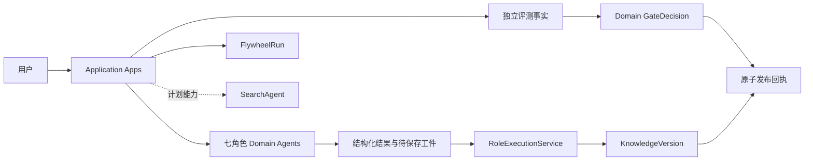
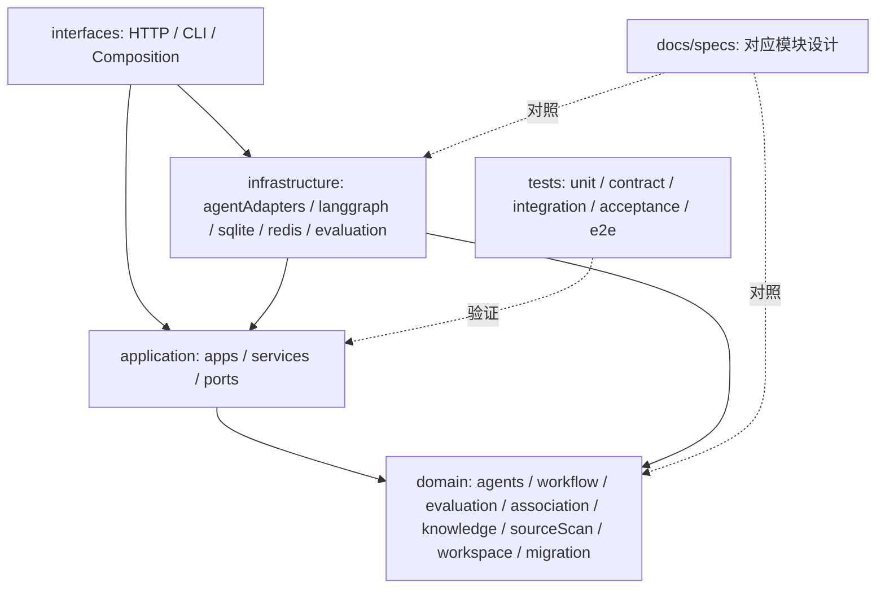
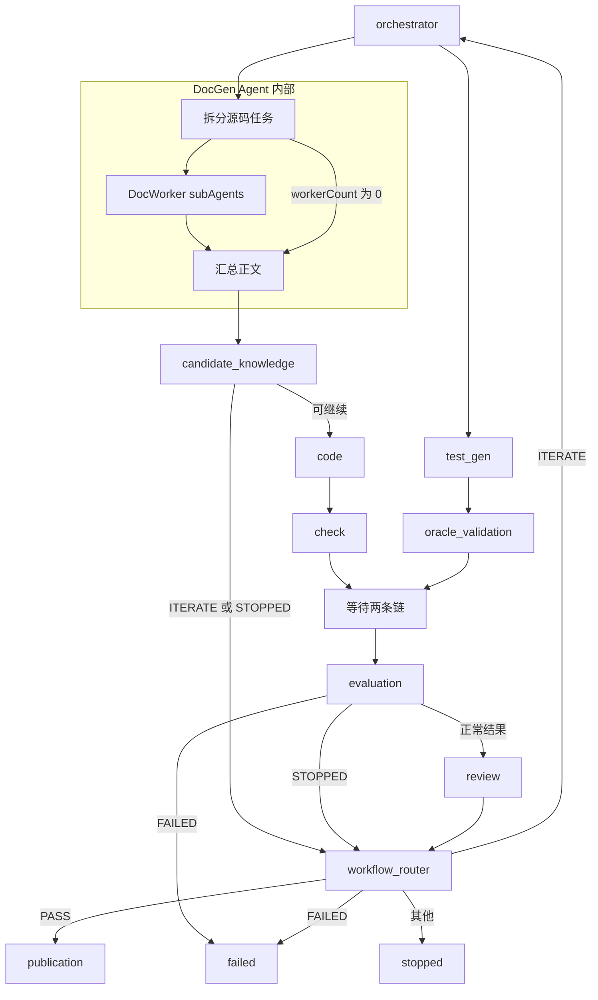
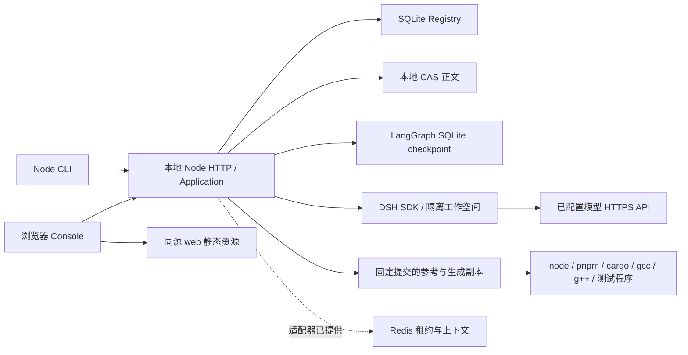
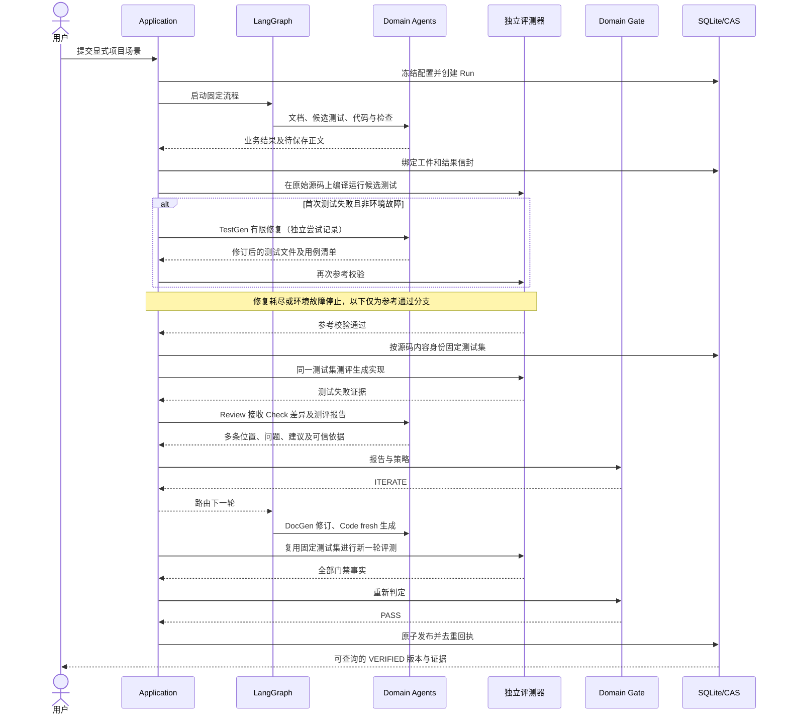
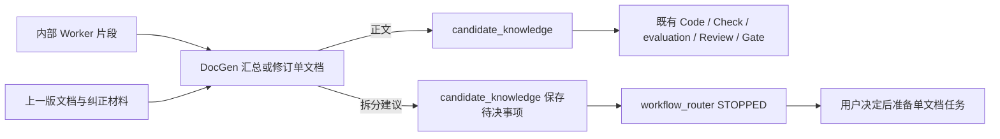

<!--
Copyright (c) 2026 linlisWorkTeam
SPDX-License-Identifier: MIT
文件功能：4+1 架构视图。
-->
# 4+1 架构视图

本文件对应 [架构设计](../specs/totalRules/Architecture.md)。五个视角描述同一套当前实现，不另建状态机。虚线表示未默认启用或仍为计划的接入。

## 逻辑视图：业务对象与职责

## 开发视图：代码与依赖

## 进程视图：并行、汇合和迭代

## 物理视图：本地运行与外部资源

CLI 和 HTTP 是两个可独立启动的入口，上图 Server 框表示共享应用装配，不要求 CLI 经 HTTP 转发。运行数据库、CAS 和项目副本位于运行目录，不提交到 Git；Redis 不成为知识事实源。

## 场景视图（+1）：一次失败后的修订与发布

该场景是已有两轮回归的设计路径。质量不足可在代码生成前进入下一轮；基础设施失败和取消另行记录；有图和受控测试不代表真实模型质量已验收。

### DocGen 单文档与待决结果

