<!--
Copyright (c) 2026 linlisWorkTeam
SPDX-License-Identifier: MIT
文件功能：4+1 架构视图。
-->
# 4+1 架构视图

本文件对应 [架构设计](../specs/totalRules/Architecture.md)。五个视角描述同一套当前实现，不另建状态机。虚线表示未默认启用或仍为计划的接入。

## 逻辑视图：业务对象与职责

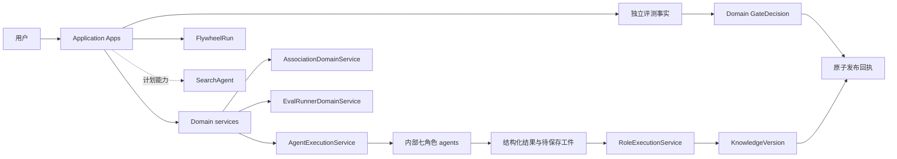

## 开发视图：代码与依赖

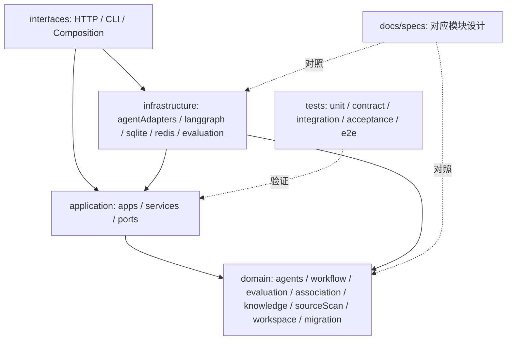

## 进程视图：并行、汇合和迭代

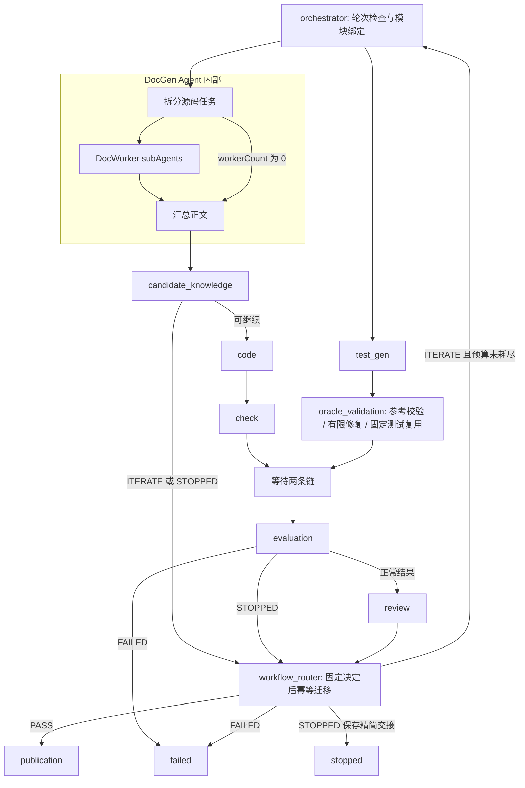

## 物理视图：本地运行与外部资源

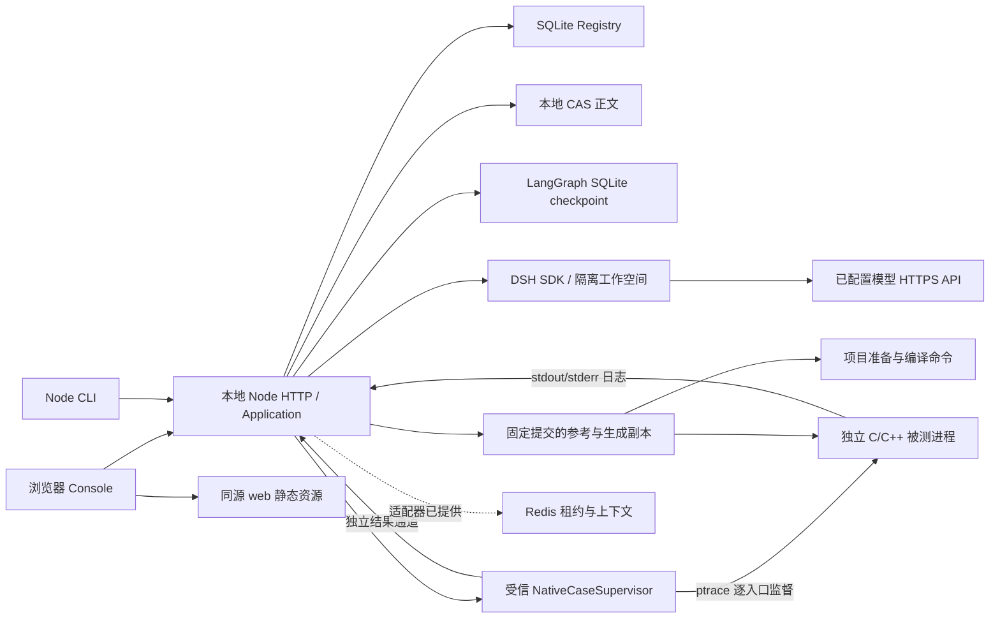

CLI 和 HTTP 是两个可独立启动的入口，上图 Server 框表示共享应用装配，不要求 CLI 经 HTTP 转发。运行数据库、CAS 和项目副本位于运行目录，不提交到 Git；Redis 不成为知识事实源。

Agent 材料边界由授权工件、受限工具和 DSH 工作区控制；原生用例由另一个受信父进程监督。当前监督器限定 Linux x86_64、gcc/nm、入口符号及可用 ptrace，不提供完整文件读取隔离或通用部署沙箱。Registry 先保存 route-v2 结果及幂等副作用，Graph 随后保存节点 checkpoint，两者不在同一事务中。

## 场景视图（+1）：一次失败后的修订与发布

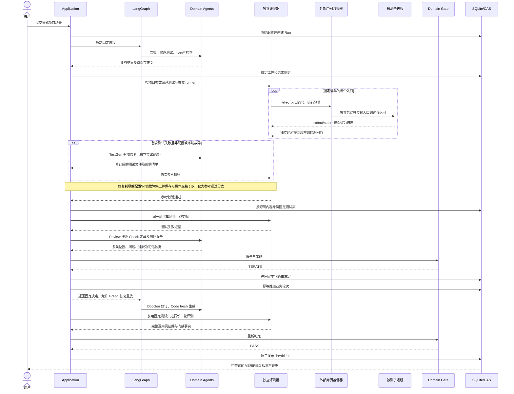

该场景是已有两轮回归的设计路径。质量不足可在代码生成前进入下一轮；基础设施失败和取消另行记录；有图和受控测试不代表真实模型质量已验收。

## 工作台场景：固定源码生成可阅读卡片

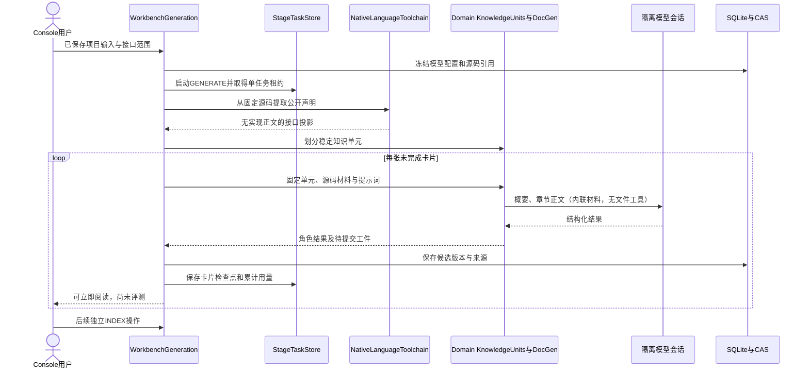

上图描述已接通的 C/C++ 生成入口，INDEX由KnowledgeIndexService执行。新阶段有自己的冻结输入、尝试审计和恢复记录，不借用旧Run的发布状态；FLYWHEEL、EVALUATE和ASSOCIATE已有独立应用入口；持久化一键编排已接通，自动知识修订仍未接通。

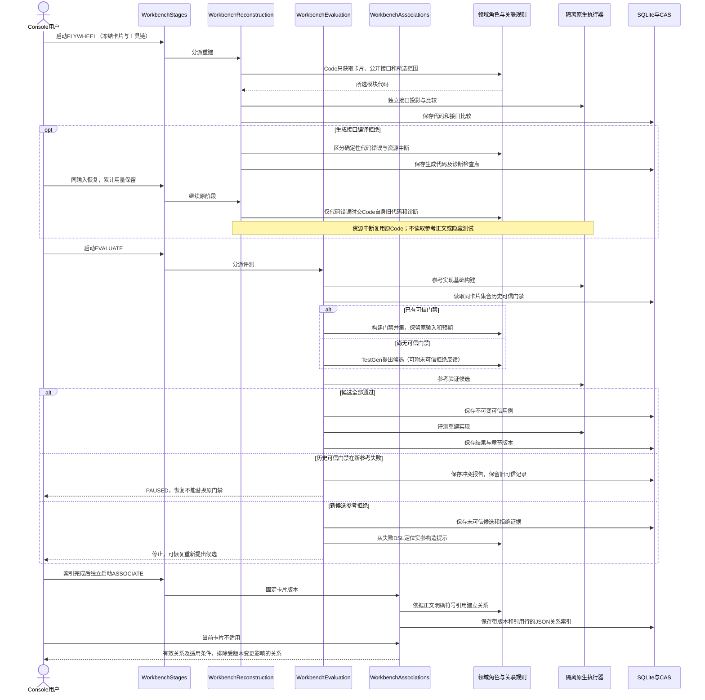

图中各阶段由同一持久化阶段服务承载，可分别启动或由knowledge-pipeline-v3独立协调租约顺序启动；行为通过不自动赋予发布资格。关系是可审计的引用事实，不保证可替代性；自动知识修订和发布为剩余实现范围。

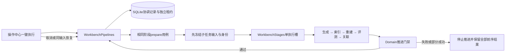

指定外部材料捕获链路（快照与关联任务选材已接线）：

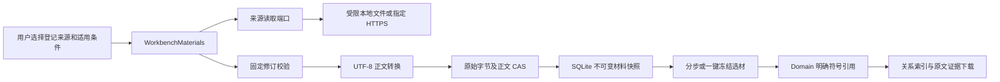

重建诊断在 Code 之后读取参考源码，缓存绑定不变输入：

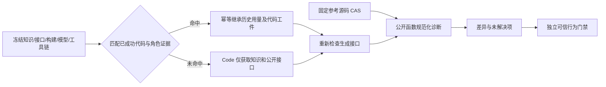

评测修订依据、独立修订与 v4 多轮自动推进已接通：

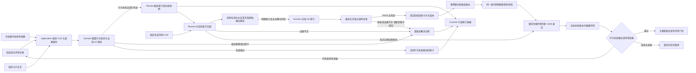

整卡来源复核独立于行为失败归因，当前接通入口如下：

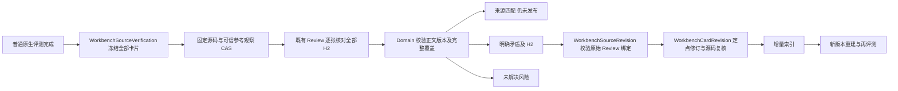

一键 pipeline-v13 接通来源与选定固定用例门禁：

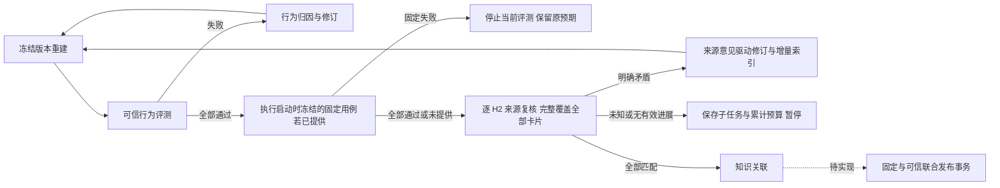

来源章节检查点、来源修订与行为子任务统一纳入轮次历史；通过行为评测结束该连续失败阶段，来源进展另按新完成的章节复核计数。旧 v10 及更早流程不跨版本恢复。

来源材料 v3 的逐章边界与独立固定评测：

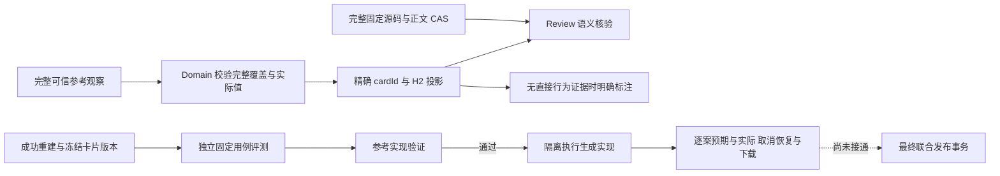

来源v4在新任务启动时冻结同正文既有明确矛盾：原任务/检查点/Review命令与输出校验 → 继承来源意见（不调用模型）→ 完整章节聚合 → 定点修订 → 新正文重建与重新评测。旧执行只读，不跨版本恢复；未变更正文不能由另一次PASS清除历史矛盾。

### DocGen 单文档与待决结果

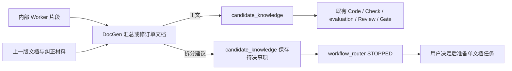

## Agent 证据交接补充（2026-09-10）

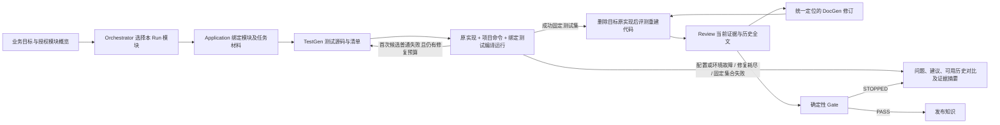

该图补充业务材料交接，不改变固定 LangGraph 拓扑。修订迭代继续使用选定模块及已固定测试集；原生参考与重建评测均采用外部逐入口监督。最终受控 SDK 验收运行两轮、五次评测后 PASS，只发布一次；模型质量仍待真实调用验证。运行可显式保留评测工作区、编译产物和完整证据，见 [报告](../reports/AgentSpecRepairAndE2E.md)。
