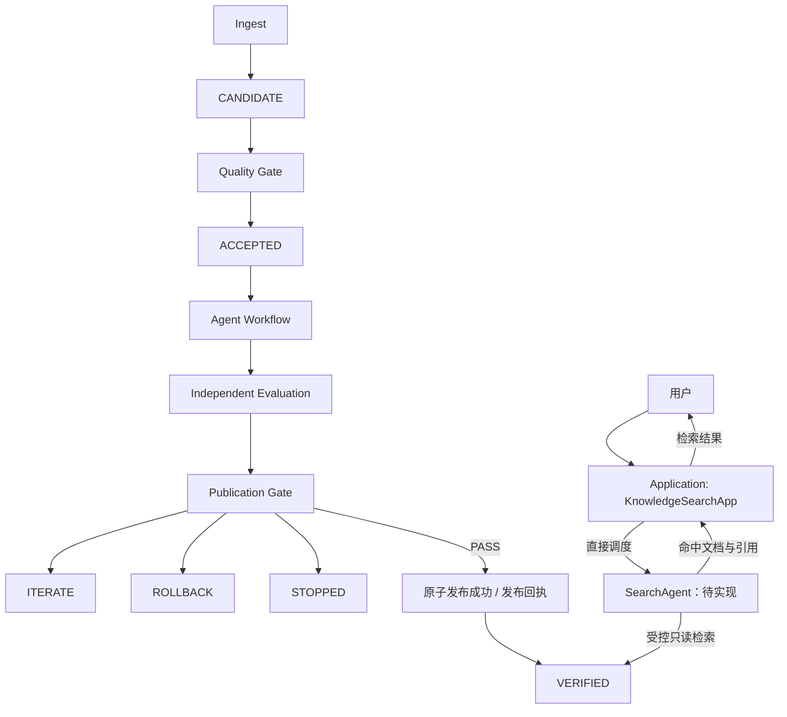

# 知识生命周期

`ACCEPTED` 只表示候选具备进入行为评测的条件；只有完整证据通过发布 Gate 并完成原子发布，才能进入 `VERIFIED`。

SearchAgent 只读取当前仍为 `VERIFIED` 且正文完整性有效的已发布文档，不消费候选或已替代版本。它由 Application 直接调度，不参与图中的治理状态迁移，也不在无命中时自动生成文档；检索能力当前处于设计阶段。
