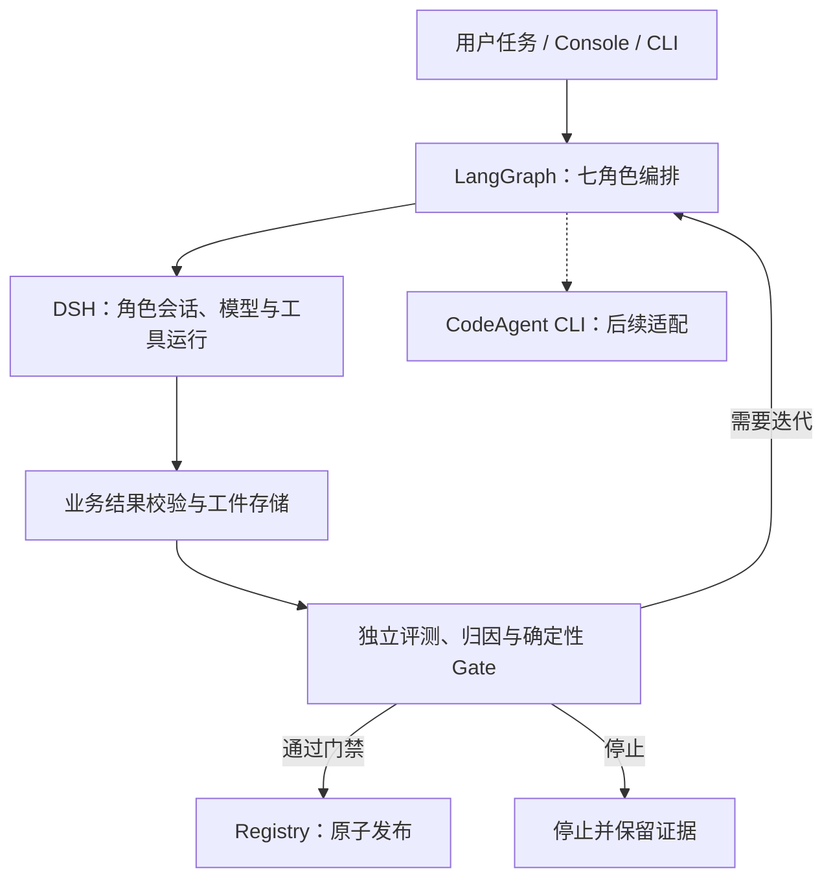
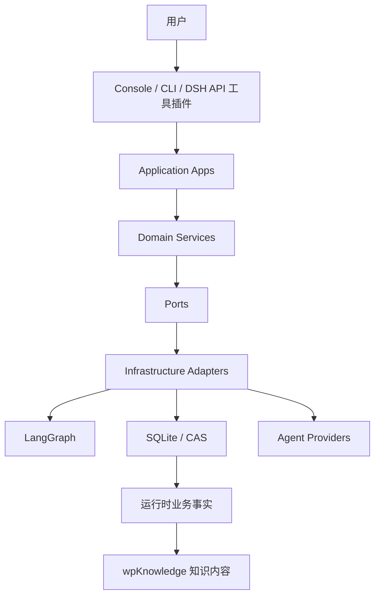

# 系统总览

## 目标运行关系（已确认，实施中）

先完成普通 CPU 小模块上的底座与真实角色范例，再开发七角色完整闭环。虚线仅表示未来接入，不表示当前已可用；Pi 与固定项目执行器退出目标底座。边界见[架构说明](../ARCHITECTURE.md#target-architecture)，不在 LangGraph 与 DSH 之间增加另一套 Agent 框架。

## 当前代码的依赖关系

对应源码：Application 在 `src/application/`，领域服务在 `src/domain/`，适配器在 `src/infrastructure/`，入口在 `src/interfaces/`。

这里的 DSH API 工具插件是外部 DSH 访问知识库的入口，与目标图中的 DSH 角色执行方向不同。图中的知识内容交付关系不表示自动 Git 提交或推送。
