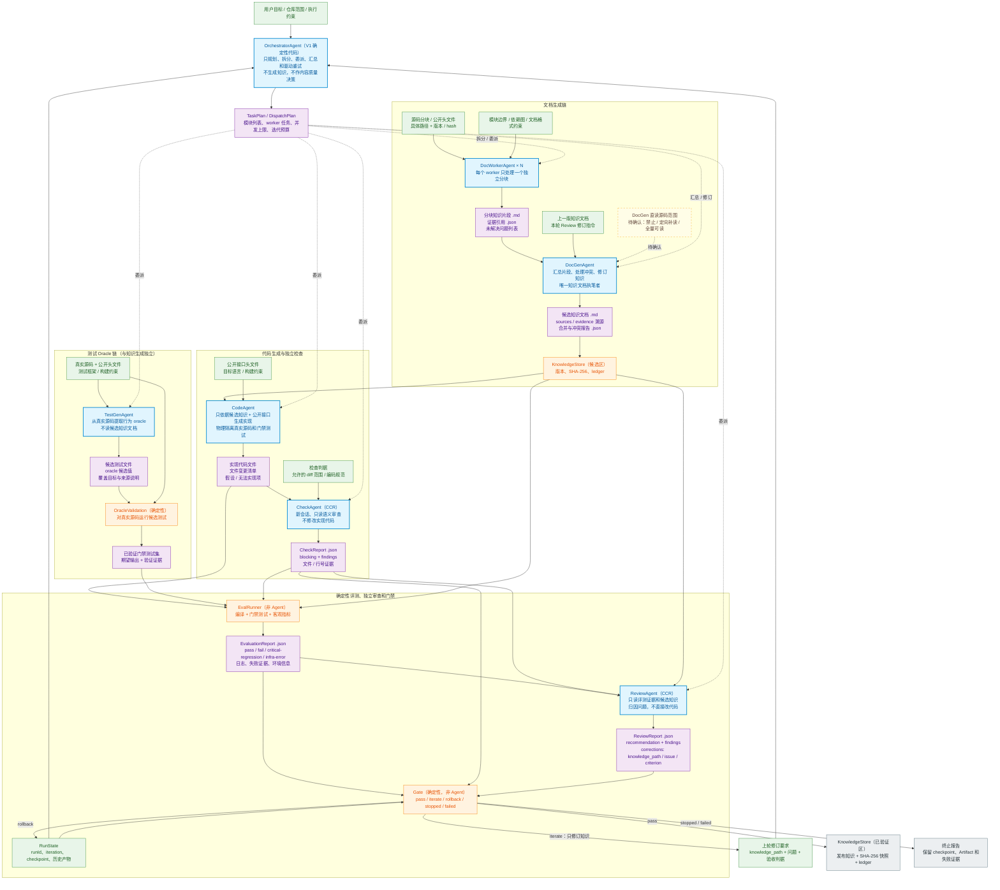
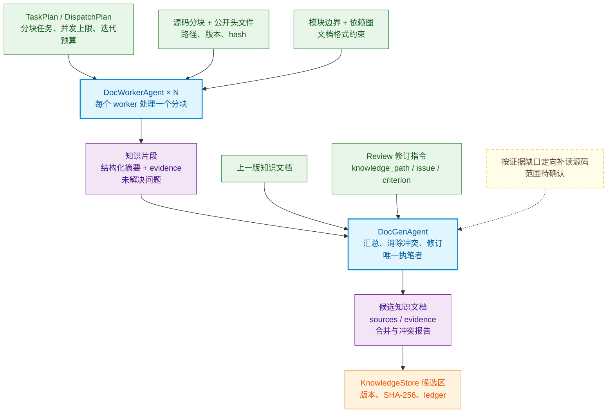
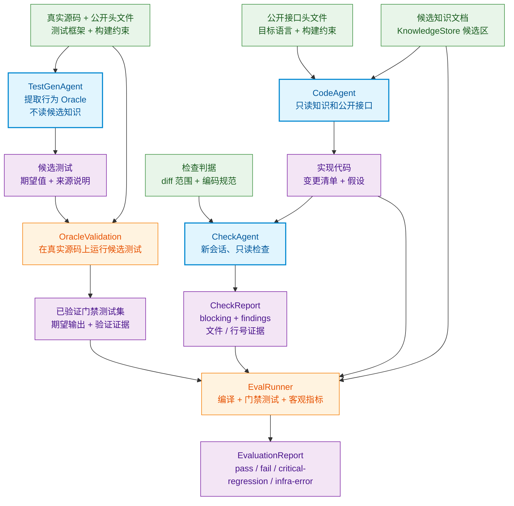
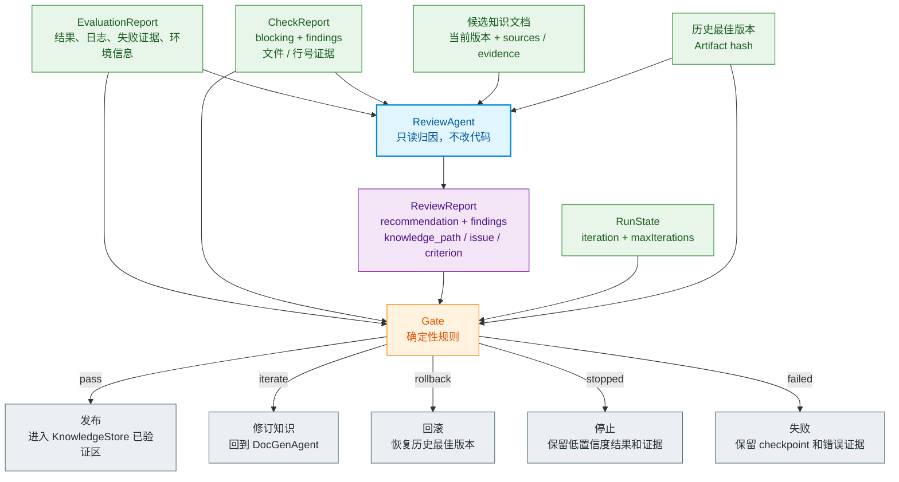
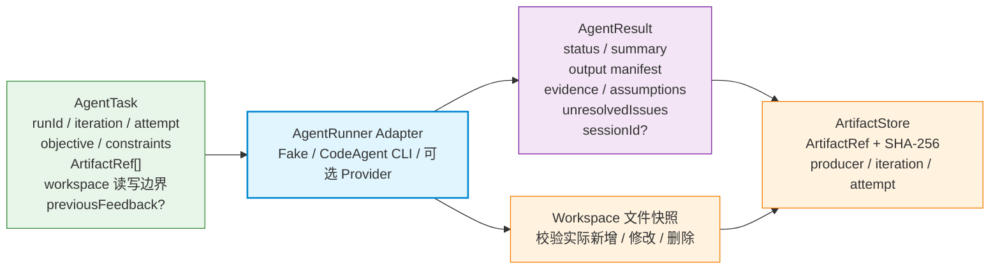

# Agent 输入输出总览（讨论稿）

> 用途：用于阶段汇报和后续 Agent 契约讨论。
>
> 基线：[01-多agent调研.md 的 4.5.1 总体工作流程](../01-多agent调研.md#451-总体工作流程mermaid-流程图)。
>
> 状态：输入输出边界草案，不代表 Prompt、Schema 和评测指标已定稿。

## 1. 总体产物流

### 图例

- 绿色：Agent 或确定性组件的输入。
- 蓝色：7 类 Agent；`OrchestratorAgent` 在 V1 中使用确定性代码实现，但保留角色位置。
- 紫色：需要落盘、引用或进入下游的产物。
- 橙色：确定性组件，不算 Agent。
- 黄色虚线：尚未确认的边界。

## 2. 分阶段产物流

总图适合检查链路是否完整。汇报单个阶段时，可以直接使用下面三张图。

### 2.1 文档生成

DocWorker 读取分块源码并输出带证据的知识片段，DocGen 是最终知识文档的唯一执笔者。上一版知识和 Review 修订指令也从这里进入下一轮。

### 2.2 代码生成与评测

代码生成和测试 Oracle 是两条隔离链路。CodeAgent 看不到真实源码和门禁测试；TestGenAgent 不读取候选知识。两条链路只在 EvalRunner 汇合。

### 2.3 Review、门禁与回写

ReviewAgent 负责读取证据、定位问题并给出修订要求。最终路线由确定性 Gate 决定，ReviewAgent 不能直接发布知识。

## 3. 公共 Agent 任务契约

下图是所有 Agent 都可共用的外层信封。具体 Prompt 和业务 Schema 可以后续调整，但不应要求改写 LangGraph 顶层图。

## 4. 每个 Agent 的最小输入输出

| Agent | 最小输入 | 最小输出 | 必须携带的证据 | 禁止项 |
|---|---|---|---|---|
| OrchestratorAgent | 用户目标、RunState、上轮修订要求 | TaskPlan、worker 任务、并发/迭代预算 | 每个任务的输入 ArtifactRef | 不执笔，不替代 Gate 作内容决策 |
| DocWorkerAgent | 源码分块、头文件、依赖图、分块目标 | 知识片段、结构化摘要、未解问题 | 源文件、symbol、行号/hash | 不跨越已分配模块范围 |
| DocGenAgent | DocWorker 片段、上版知识、Review 修订指令 | 候选知识文档、合并/冲突报告 | 每个事实的 sources/evidence | 不编造缺失行为；直读源码范围待确认 |
| TestGenAgent | 真实源码、头文件、测试/构建规范 | 候选测试、oracle 候选、覆盖目标 | oracle 的源码依据及实跑验证结果 | 不读候选知识，不由 LLM 单独确认期望值 |
| CodeAgent | 候选知识、公开头文件、构建约束 | 实现代码、变更清单、假设/无法实现项 | 知识段落 / 公开接口引用 | 不读真实源码和门禁测试 |
| CheckAgent | 实现代码、diff、判据清单 | blocking/findings 检查报告 | 文件、行号、触发的判据 | 只读，不直接修改代码，不给最终发布结论 |
| ReviewAgent | EvaluationReport、CheckReport、候选知识、历史版本 | recommendation、findings、corrections | 失败用例→knowledge_path→修订判据的映射 | 只读，不改代码，不越过确定性 Gate 发布 |

## 5. 当前需要继续确认的问题

1. DocGenAgent 是完全不读源码，还是允许根据证据缺口定向补读；
2. DocWorker 的分块单位是文件、symbol、模块还是依赖子图；
3. 知识文档最终格式是 OKF、Markdown + front matter，还是另定 Schema；
4. TestGenAgent 的候选测试如何进入受保护门禁集，以及哪些测试需要人工复核；
5. CodeAgent 允许使用的构建命令、第三方依赖和输出目录；
6. CheckReport 和 ReviewReport 的 severity、blocking 和修订指令 Schema；
7. 不同 Agent 的 session 是同轮复用、跨轮复用，还是每次新建。

这些问题不影响当前 LangGraph 拓扑和 `AgentRunner` Adapter 边界，但会决定后续每个 Agent 的具体 Prompt、上下文构建和业务评测方法。
