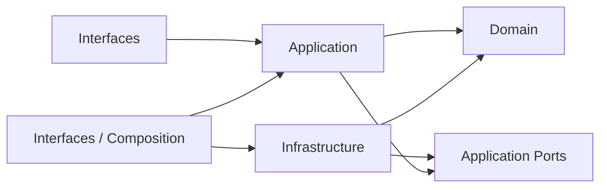
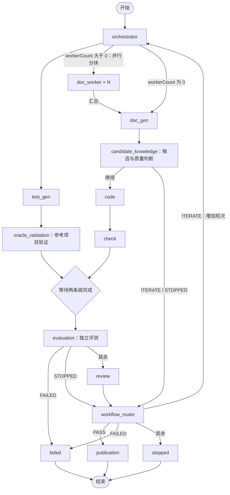

<!--
Copyright (c) 2026 linlisWorkTeam
SPDX-License-Identifier: MIT
文件功能：汇总项目目录与 DDD 架构，说明 Spec 驱动开发、AI 实施方式和七角色编排修改位置。
-->
# 项目架构与 Spec 驱动开发报告

报告日期：2026-09-08。核对基线：[`a1453e066602c76ccfea9a875f39ca1ce265e495`](https://github.com/linlisWorkTeam/domain-knowledge/tree/a1453e066602c76ccfea9a875f39ca1ce265e495)。

本报告先整理目录与 DDD 结构，再依次补充框架功能、Spec 开发模式、AI 实施方法和 Agent 编排。它是本次代码快照的阅读报告；后续行为约定以 [Spec 目录](../specs/README.md)为准，操作以[开发指南](../Development.md)和 [Agent 开发指南](../AgentDevelopment.md)为准。

## 一、项目目录树与对应的 DDD 结构

以下展示主要受版本管理的目录和定位文件，省略部分同类文件；依赖、缓存和运行产物不属于架构模块。

```text
domain-knowledge/
├── src/
│   ├── interfaces/                          # 接口层
│   │   ├── uiApi/UiApi.ts                    # Console API 服务入口
│   │   ├── runner/
│   │   │   ├── Cli.ts                       # 命令行
│   │   │   ├── Server.ts                    # HTTP 路由
│   │   │   ├── Composition.ts               # 依赖装配组合根
│   │   │   ├── AgentRun.ts                  # 单角色开发入口
│   │   │   ├── ConsoleReadModel.ts          # Console 读模型
│   │   │   ├── DemoReport.ts                # 脱敏运行报告
│   │   │   ├── ProjectScenario.ts           # 场景输入入口
│   │   │   └── Compat.ts                    # 兼容入口
│   │   └── dsh/Dsh.ts                       # DSH 接口适配
│   ├── application/                         # 应用层
│   │   ├── apps/
│   │   │   ├── ApplicationApps.ts           # 公共导出
│   │   │   ├── Orchestrator.ts
│   │   │   ├── FlywheelApp.ts
│   │   │   ├── EvalRunnerApp.ts
│   │   │   ├── KnowledgeSearchApp.ts
│   │   │   ├── KnowledgeDiscoveryApp.ts
│   │   │   ├── ContentGovernanceApp.ts
│   │   │   ├── ProviderOperationsApp.ts
│   │   │   └── OperationalMetricsApp.ts
│   │   ├── ports/ApplicationPorts.ts        # 存储、模型、评测与引擎端口
│   │   └── services/
│   │       ├── ApplicationServices.ts       # 生命周期用例协调
│   │       ├── AutomatedProjectWorkflow.ts  # 阶段协调、可信材料加载
│   │       ├── RoleExecution.ts             # 统一角色执行与工件提交
│   │       ├── RunConfiguration.ts          # 执行配置冻结及兼容检查
│   │       ├── WorkflowControl.ts
│   │       ├── ProjectFlow.ts
│   │       ├── ProjectScenario.ts
│   │       ├── QueryService.ts
│   │       ├── QualityPolicy.ts
│   │       ├── KnowledgeWritingGuide.ts
│   │       ├── AgentExample.ts              # 独立角色样例用例
│   │       └── AgentDevelopmentObserver.ts
│   ├── domain/                              # 领域层
│   │   ├── Domain.ts                        # 模型、状态规则、Gate、事件
│   │   ├── agents/
│   │   │   ├── AgentContracts.ts            # 公共角色契约
│   │   │   ├── AgentExecution.ts            # 执行协议与版本
│   │   │   ├── AgentRegistry.ts             # 显式角色注册
│   │   │   ├── orchestratorAgent/
│   │   │   ├── docWorkerAgent/
│   │   │   ├── docGenAgent/
│   │   │   ├── testGenAgent/
│   │   │   ├── codeAgent/
│   │   │   ├── checkAgent/
│   │   │   └── reviewAgent/
│   │   ├── services/
│   │   │   ├── DomainServices.ts            # 公共导出
│   │   │   ├── FlywheelDomainService.ts
│   │   │   ├── EvalRunnerDomainService.ts
│   │   │   ├── AssociationDomainService.ts
│   │   │   ├── MarkdownDiff.ts
│   │   │   └── workflow/
│   │   │       ├── Workflow.ts              # 固定业务连接与纯路由
│   │   │       └── AgentDefinitions.ts      # 角色到节点的映射
│   │   ├── sourceScan/SourceScan.ts
│   │   ├── workspace/LocalAgentWorkspace.ts
│   │   └── migration/LegacyOkf.ts
│   └── infrastructure/                      # 基础设施层
│       ├── agentAdapters/
│       │   ├── ModelExecution.ts
│       │   ├── companyCodeAgent/
│       │   ├── deepSeekHarness/
│       │   ├── contracts/
│       │   ├── provider/
│       │   └── scenario/
│       ├── langgraph/                       # Graph、Runtime、State 等
│       ├── sqlite/                          # Registry、CAS、治理数据
│       ├── redis/                           # 运行状态适配
│       ├── evaluation/project/              # 独立项目评测执行器
│       ├── observability/                   # 运行指标
│       └── http/                            # HTTPS 技术能力
├── web/                                     # 本地 Console
│   └── prototype/                           # 页面原型
├── site/                                    # 项目静态网站
├── docs/
│   ├── specs/
│   │   ├── totalRules/                      # 需求、架构、DDD、验收规则
│   │   ├── domainFunction/                  # 领域模块设计
│   │   ├── application/
│   │   ├── infrastructure/
│   │   ├── interfaces/
│   │   └── schemas/                         # 版本化 JSON 契约
│   ├── diagrams/Views4Plus1.md
│   ├── reports/                             # 本次架构与开发报告
│   ├── epitaph/                             # 最近三次交接
│   └── ...                                  # 开发、运行、运维等指南
├── tests/                                   # unit、contract、integration、
│                                            # acceptance、e2e、security、helpers
├── scripts/                                 # bootstrap、规范校验、评测与截图
├── .github/                                 # CI 与仓库协作配置
├── fw.mjs                                   # 外部兼容启动入口
├── Runner.config.json                       # 默认本地配置
├── package.json
├── package-lock.json
└── AGENTS.md                                # 仓库协作约定
```

### DDD 四层职责与依赖

| 层 | 拥有的职责 | 不能越过的边界 |
| --- | --- | --- |
| Interfaces | 参数解析、路由、响应、依赖装配 | 业务入口经 Application App，不绕过用例直接操作数据库 |
| Application | 可信材料加载、配置冻结、角色调用、评测与提交顺序 | 依赖 Domain 和端口，不导入具体 SDK 或数据库 Adapter |
| Domain | 角色业务步骤、跨角色流转、状态不变量、确定性 Gate | 不依赖 Application、Interfaces、LangGraph、模型 SDK、数据库 SDK |
| Infrastructure | 模型、图引擎、网络、外部进程和存储实现 | 实现端口，不把技术执行状态当成知识发布结论 |



图中箭头表示代码依赖；运行时 Application 通过注入的端口调用 Adapter。组合根位于 [Composition.ts](../../src/interfaces/runner/Composition.ts)。

| DDD 概念 | 当前实现 | 业务含义 |
| --- | --- | --- |
| 聚合边界与实体 | `FlywheelRun` | 批次身份、生命周期、轮次和当前最佳版本 |
| 聚合边界与实体 | `KnowledgeVersion` | 正文、来源、父版本及治理状态 |
| 评测证据 | `EvaluationReport` | 独立执行器产生的事实 |
| 策略与领域决策 | `GatePolicy`、`GateDecision` | 从证据确定 PASS、ITERATE 或 STOPPED |
| 值对象式引用 | `ArtifactRef`、`ProvenanceRef` | 内容摘要、工件身份与来源位置 |
| 领域事件 | `DomainEvent` | 运行状态变化、工件提交、知识发布等业务事实 |

这些模型集中在 [Domain.ts](../../src/domain/Domain.ts)，采用接口与规则函数，没有拆成独立的 entities、valueObjects、aggregates 目录。八个 App 是用例入口，不能直接当成八个独立限界上下文。

当前分层保留明确取舍：`sourceScan`、`workspace`、`migration` 仍使用文件系统、Git 或 YAML；`QualityPolicy`、`KnowledgeWritingGuide` 仍位于 Application。架构契约测试限制这些例外，不代表领域层全面无 Node 依赖。依据见 [DDD 约定](../specs/totalRules/DomainDrivenDesign.md)、[架构说明](../specs/totalRules/Architecture.md)和[架构测试](../../tests/contract/Architecture.test.ts)。

## 二、整个代码框架的组成、架构与功能

### 2.1 从外部入口到应用用例

用户通过 `web/` Console 或 CLI 发起请求。`src/interfaces/uiApi/UiApi.ts` 启动 HTTP 服务，`runner/Server.ts` 承担路由；CLI 在 `runner/Cli.ts`。`Composition.ts` 组装 App、存储、模型和工作流实现。

| application/apps 下的入口 | 功能 |
| --- | --- |
| `Orchestrator.ts` | 工作流协调入口及运行信息访问 |
| `FlywheelApp.ts` | 批次、候选知识、生命周期与发布用例 |
| `EvalRunnerApp.ts` | 协调独立评测与领域判定 |
| `KnowledgeSearchApp.ts` | 知识查询；当前为普通查询服务 |
| `KnowledgeDiscoveryApp.ts` | 来源发现、关联和旧知识迁移 |
| `ContentGovernanceApp.ts` | 内容治理相关查询与操作 |
| `ProviderOperationsApp.ts` | Provider 配置与运行操作 |
| `OperationalMetricsApp.ts` | 生成和治理运行指标 |

独立角色开发另由 `application/services/AgentExample.ts` 提供用例，组合根也装配该能力；“八个 App”指上述正式入口文件，不表示组合对象只能拥有八项能力。

### 2.2 领域与应用服务如何合作

`domain/agents/` 拥有角色步骤、Prompt 和输出契约；`domain/services/workflow/` 决定角色之间怎样流转。`FlywheelDomainService`、`EvalRunnerDomainService` 和 `Domain.ts` 提供生命周期、评测及 Gate 规则；`AssociationDomainService` 校验事实与关联目标关系。

`application/services/AutomatedProjectWorkflow.ts` 中的 `ProjectWorkflowStages` 按阶段加载可信材料、历史正文、纠正意见和质量反馈。`RoleExecution.ts` 调用角色，将待保存工件写入 CAS，再绑定引用并校验结果信封。角色不直接读历史数据库，也不直接提交发布事务。

### 2.3 基础设施如何承接外部能力

| infrastructure 目录 | 实现内容 | 对业务的作用 |
| --- | --- | --- |
| `agentAdapters/deepSeekHarness` | DSH SDK、角色工具、隔离启动 | 执行真实模型调用 |
| `agentAdapters/companyCodeAgent` | 公司 CLI 协议适配 | 保留外部代码 Agent 接入能力，真实公司协议尚未验收 |
| `agentAdapters/contracts` | JSON Schema 校验 | 拒绝不符合契约的输出 |
| `agentAdapters/provider` | Provider 配置 | 管理模型接入配置 |
| `agentAdapters/scenario` | 场景与可控模型夹具 | 为测试和开发提供可重复输入输出 |
| `langgraph` | 建图、调度、并行、取消、checkpoint 恢复 | 执行领域定义的工作流 |
| `sqlite` | Registry、CAS、行动项、内容治理存储 | 保存业务事实和内容寻址工件 |
| `redis` | 运行状态端口实现 | 提供可替换的运行状态能力；本地组合根仍以 SQLite 和进程内执行表为主 |
| `evaluation/project` | 可信项目命令执行与证据收集 | 为 Gate 提供独立评测事实 |
| `observability` | SQLite 指标查询 | 支撑 Console 运行观测 |
| `http` | 公网 HTTPS 访问相关技术能力 | 承接外部网络访问约束 |

Registry 保存业务事实；LangGraph checkpoint 保存引擎恢复状态。二者共享 runId，但“节点执行完成”不能直接等同于知识 `VERIFIED`。质量 Gate 和行为发布 Gate 分开，只有完整证据与确定性 PASS 才能进入发布。

### 2.4 配套目录与仓库边界

`web/` 是本地操作 Console，`site/` 是对外静态网站；`tests/` 覆盖领域规则、架构约束、集成、验收、安全和 UI。角色自身的单元测试还与源码共同放在 `domain/agents/xxxAgent/`，不全在根 tests 下。

`scripts/` 提供工作树 bootstrap、Spec 校验、需求追踪校验、框架评测和 Console 截图。`.workpanel/` 是默认本地运行数据位置，不是长期知识内容目录。运行代码属于本仓库，经过评审的知识内容与外部证据由 `wpKnowledge` 仓库保存；当前发布事务不会自动提交或推送 Git。

`docs/specs/domainFunction/languagePlugins/` 目前只对应端口契约，没有具体语言插件实现；SearchAgent 仍为规划能力，不属于七角色枚举。详见[当前开发状态](../Status.md)。

## 三、框架开发模式：如何使用和修改 Spec

### 3.1 先认识 docs：遇到什么问题，就读什么文件

新接手项目时，先打开 `docs/README.md`。不需要一次读完所有文档：先把项目跑起来，再按这次要修改的功能查找设计。

```text
docs/
├── README.md                  # 文档总入口：不知道读哪份时先看这里
├── GettingStarted.md          # 怎么安装、启动 Console、运行第一个工作流
├── Development.md             # 怎么准备环境、修改代码、验证和交付
├── AgentDevelopment.md        # 怎么修改和单独运行一个 Agent，含 DocGen 示例
├── Runtime.md                 # 怎么配置 DSH、模型和运行环境
├── Operations.md              # 怎么初始化数据、执行日常操作和排查运行问题
├── Status.md                  # 项目做到哪里了，哪些功能还没完成
├── specs/                     # 功能应该怎样工作：本次开发要遵守和修改的设计
│   └── README.md              # 从功能或代码目录找到对应 Spec
├── diagrams/
│   └── Views4Plus1.md         # 用架构图理解模块关系、运行过程和部署方式
├── reports/
│   └── FrameworkArchitectureAndSpecDevelopment.md
│                              # 本报告：帮助新人认识项目，反映核对时的代码状态
├── epitaph/                   # 最近三次交接：开始任务前读文件名时间最新的一篇
├── HistoryEpitaph.md          # 更早的交接摘要和历史记录链接
└── FileCatalog.json           # JSON、图片等文件的版权和功能登记
```

例如，“服务怎么启动”查 `GettingStarted.md`；“DocGen 应该收到哪些材料”查 `specs/` 下的角色设计；“DocGen 怎么单独跑一次”查 `AgentDevelopment.md`。历史交接用于了解背景，当前需求仍要以本次任务和现有 Spec 为准。

### 3.2 再认识 specs：每份设计负责什么

Spec 就是写给开发者看的功能说明：接收什么输入、执行什么步骤、返回什么结果、遇到错误怎么办，以及怎样判断做对了。本仓库把这些说明按代码模块放在下面的目录里。

```text
docs/specs/
├── README.md                         # 设计导航，列出设计与代码的对应关系
├── totalRules/                       # 全项目共用的要求
│   ├── Requirements.md              # 项目需要提供哪些功能；需求编号在这里查
│   ├── Architecture.md              # 各模块怎样合作、职责怎样分配
│   ├── DomainDrivenDesign.md        # DDD 分层规则，哪些层能依赖哪些层
│   ├── CodeTaste.md                 # 文件命名、代码组织、注释和文档约定
│   ├── UiuxDesign.md                # Console 页面与交互应该怎样表现
│   └── Verification.md             # 怎样验收；需求对应哪些实现和测试
├── domainFunction/                   # 业务规则，对应 src/domain/
│   ├── agents/
│   │   └── Agents.md                # 七个角色分别做什么、读什么、输出什么
│   ├── services/
│   │   ├── Knowledge.md             # 知识版本、来源、状态、关联和发布条件
│   │   ├── Evaluation.md            # 根据评测事实判断通过、迭代或停止
│   │   └── workflow/
│   │       └── Workflow.md          # 角色的先后、并行、汇合和下一轮规则
│   ├── sourceScan/
│   │   └── SourceScan.md            # 怎样扫描来源文件
│   ├── workspace/
│   │   └── Workspace.md             # Agent 工作区如何准备和限制访问
│   ├── migration/
│   │   └── LegacyOkf.md             # 旧知识怎样迁移进来
│   └── languagePlugins/
│       └── LanguagePlugins.md       # 语言插件的约定；当前尚无具体插件实现
├── application/                      # 用例协调，对应 src/application/
│   └── Application.md               # 怎样加载材料、调用角色、保存结果与协调发布
├── infrastructure/                   # 外部技术实现，对应 src/infrastructure/
│   ├── agentAdapters/
│   │   └── AgentAdapters.md         # 怎样接模型 SDK、公司 CLI 和角色工具
│   ├── evaluation/
│   │   └── Evaluation.md            # 怎样实际运行项目命令并收集评测证据
│   ├── langgraph/
│   │   └── LangGraph.md             # 图引擎怎样调度、取消和恢复执行
│   ├── sqlite/
│   │   └── Sqlite.md                # 业务记录、工件和事务怎样存储
│   ├── redis/
│   │   └── Redis.md                 # Redis 运行状态适配的约定
│   ├── http/
│   │   └── Http.md                  # 对外 HTTPS 访问的技术约束
│   └── observability/
│       └── Observability.md         # 运行指标如何记录、计算和展示
├── interfaces/                       # 外部调用方式
│   └── HttpApi.md                   # HTTP 路由、请求、响应和错误
└── schemas/                          # 程序可检查的数据格式，下面单独展开
```

两个 `Evaluation.md` 分别回答不同问题：领域设计写“什么结果算通过”，基础设施设计写“怎样运行检查并拿到结果”。同样，`interfaces/HttpApi.md` 写本服务的 API，`infrastructure/http/Http.md` 写对外网络访问约束。

`schemas/` 中的 JSON Schema 会被程序用于检查字段和格式。只有涉及对应数据结构时才需要修改，先看该目录的 `README.md`。

```text
docs/specs/schemas/
├── README.md                         # Schema 用法、引用方式和版本兼容规则
├── AgentCommand.schema.json          # 发给 Agent 的命令和输入数据
├── AgentResult.schema.json           # Agent 返回结果的统一格式
├── ArtifactRef.schema.json           # 工件引用：标识、摘要、大小等
├── Correction.schema.json            # Review 给出的修订意见
├── EvaluationReport.schema.json      # 一次评测的事实报告
├── EvaluationSummary.schema.json     # 跨批次评测汇总
├── EvaluationRule.schema.json        # 评测规则及其版本
├── Event.schema.json                 # 领域事件
├── ActionItem.schema.json            # 待处理的治理事项
├── RunProgress.schema.json           # 批次进度
├── Activity.schema.json              # 跨批次活动记录
├── ComponentStatus.schema.json       # 组件健康状态
├── KnowledgeLineage.schema.json      # 知识版本的来源和关联关系
├── KnowledgeDiff.schema.json         # 知识正文的结构化差异
├── KnowledgeHealth.schema.json       # 知识健康度及计算口径
├── Source.schema.json                # 来源注册信息
└── LanguagePlugin.schema.json        # 语言插件数据格式，属于规划能力
```

### 3.3 第一次接任务，按这个顺序读

假设任务是“修改 DocGen 的文档生成规则”，建议按以下顺序开始：

1. **看交接和现状。** 读根目录 `AGENTS.md`、最新 `docs/epitaph/` 记录和 `docs/Status.md`，执行 `git status` 确认是否已有未提交修改。
2. **准备开发环境。** 按 `docs/Development.md` 操作；新建工作树后执行 `npm run bootstrap:worktree`，得到 `status: READY` 再开始。
3. **找到本次设计。** 打开 `docs/specs/README.md`，定位 `domainFunction/agents/Agents.md` 的 DocGen 条目。
4. **找到对应代码。** 读 Spec 中的代码链接，再到 `src/domain/agents/docGenAgent/` 看入口、Contract、Prompt 和测试。
5. **按需补读。** 如果只是修改 DocGen 内部规则，就围绕该角色工作；如果要给它增加上游材料，再读 `application/Application.md`；如果要改变角色先后顺序，再读 `services/workflow/Workflow.md`。

第一次涉及分层或目录调整时，也要读 `totalRules/Architecture.md`、`DomainDrivenDesign.md` 和 `CodeTaste.md`。每次任务只深入本次影响的模块。

### 3.4 Spec 驱动开发，实际就是先写清楚，再照着实现

一次功能修改按这个顺序完成：

```text
读当前 Spec 和代码
        ↓
在原有 Spec 中写清楚这次要改变的行为
        ↓
自己改代码，或让开发 AI 按这段 Spec 改代码
        ↓
用测试检查正常情况和失败情况
        ↓
一起审查 Spec、代码和测试，再提交
```

Spec 需要让接手的人回答四个问题：**什么情况下触发？输入是什么？结果是什么？失败时怎么办？** 尽量给出能检查的例子。

例如，假设下一次需求是将 DocGen 的正文最短长度从当前 200 字符提高到 300 字符。下面只是教学示例，本报告没有实施这项变更。

**第一步：改原来的设计。** 打开 `docs/specs/domainFunction/agents/Agents.md`，在 DocGen 条目更新原有长度规则，并在相关输出约束处补清楚：

```text
DocGen 输出的 body 至少包含 300 个字符，沿用现有字符串长度计数方式。
不足 300 个字符时，拒绝该角色输出，不提交为成功的知识正文工件。
长度边界验证：299 个字符应被拒绝；300 个字符且其余字段合法时应通过。
```

这样下一位开发者知道要改的数值、处理位置和边界结果。不要只写“提高文档质量”，也不要另建一份与 Agents.md 重复的设计。

**第二步：找实现这条规则的地方。** 在 `src/domain/agents/docGenAgent/` 搜索正文长度相关约束，检查 `DocGenAgentContract.ts`、`DocGenAgent.ts`、`DocGenAgentPrompt.ts` 和测试。更新实际负责强制校验的位置；提示词中的描述也要一致。正文规则涉及公共 Schema 或样例时同步修改；若不涉及，就不必改那些文件。

**第三步：验证边界。** 添加或调整 299 与 300 字符的测试，并通过相关提交链路检查确认被拒绝的输出不会当成成功知识正文保存。已有其他规则继续保留，不能为了让新测试通过而删掉旧断言。

**第四步：交付时对照原文检查。** Spec 写了 300，代码是否仍写 200？Prompt 是否还提示旧限制？合法样例是否仍满足约束？测试是否覆盖拒绝和通过两种结果？这些都对上，才算完成这条 Spec。

如果是修复代码，使其符合已经写清楚的 Spec，可以保留原设计，只补必要的澄清和回归测试。Spec 驱动并不要求每次修复都改文档。

### 3.5 哪些情况还需要一起改其他文档

下面按实际影响决定，不需要每次把整个 specs 目录改一遍。

| 本次改动 | 还需要检查什么 |
| --- | --- |
| 增加或改变用户能使用的功能 | `Requirements.md`；页面行为还涉及 `UiuxDesign.md` |
| 增加或改变验收要求 | `Verification.md` 中的场景和需求对应的代码、测试路径；保留已有编号，新增编号先查重 |
| 增删公共输入输出字段 | `schemas/`、角色 Contract、读写该字段的代码和样例；版本兼容按 schemas/README.md |
| 改变角色之间的顺序或材料传递 | `Workflow.md`、`Application.md` 及对应实现 |
| 改变架构关系 | `Architecture.md` 和 `docs/diagrams/Views4Plus1.md` 的相关部分 |
| 改变启动命令或操作方式 | `GettingStarted.md`、`AgentDevelopment.md` 等已有指南中对应的步骤 |

`Verification.md` 的 `Implemented` 表示已有实现和测试入口，`Partial` 表示只完成一部分，`Planned` 表示还在计划中。不要因为写好了 Spec 就把状态改成已实现，也不要把本次任务之外的计划功能一起开发。

### 3.6 改完后怎样检查

行为修改按开发指南完成以下检查；单角色调试还可先运行第五部分给出的角色命令。

```bash
npm run typecheck        # 检查 TypeScript 类型是否匹配
npm run validate:specs   # 检查规范链接、数据格式、需求编号和验收对应关系
npm test                # 检查代码行为是否符合测试要求

# 改了 Console 页面或交互时，再运行
npm run test:ui
```

`validate:specs` 通过，只代表这些规范检查通过。它不会生成代码，也不能证明“文档写得更好”这类内容质量目标已经达到。真实模型效果需要对应的实际运行证据。

提交时把本次 Spec、代码和测试放在一起供审查，说明改了什么、跑了哪些检查、还有什么没验证。纯报告或低影响文案修改按范围选择链接和 diff 等静态检查即可。让 AI 实施时，可以直接使用下一部分的任务指令。

## 四、修改好 Spec 后，如何让 AI 生成并落实代码

### 4.1 交给开发 AI 的输入

将有仓库读写和命令执行能力的开发 AI 工作目录设为本项目，提供：改动的 Spec 路径及章节、需求或验收编号、预期行为、范围限制和交付要求。Spec 尚未提交时说明“以工作区 diff 为准”；已提交时给出提交号或比较基线。

开发 AI 应先将每条要求映射到实现与测试，再执行改动和验证。仓库的七角色运行流不会自动监听 `docs/specs/` 变化；当前没有“保存 Spec 后自动重写整个框架”的命令。

### 4.2 可直接复制的任务指令

下面以修改 CodeAgent 路径校验为例；替换具体行为与章节后即可使用。这是交付指令示例，不是本报告授权实施的新需求。

```text
请在当前 domain-knowledge 仓库实施我修改后的 Spec。

设计输入：
- docs/specs/domainFunction/agents/Agents.md 的 codeAgent 条目
- docs/specs/application/Application.md 中相关材料加载与提交约束
- 本次工作区中这些 Spec 的 diff（若已提交，使用我提供的提交号）

目标：按照 Spec 中明确的路径校验规则修改 CodeAgent，
并保证非法结果不会被提交为成功工件。

执行要求：
1. 先读 AGENTS.md 和最新 epitaph，确认工作区已有改动。
2. 对照每条 Spec 要求定位代码、契约和验收测试；仅实施本次变化。
3. 修改对应角色、必要的材料加载及消费者，遵守 DDD 依赖方向。
4. 增加或调整正常、非法输入及失败提交行为的测试；不弱化已有断言。
5. 执行适当的角色测试、typecheck、validate:specs 和受影响集成检查；
   跨模块行为变化按开发指南完成全量及必要 UI 检查。
6. 核对 Spec、Schema、样例和实现一致，报告修改文件、要求映射、
   验证结果及未完成项。有阻塞歧义时指出具体冲突，不自行扩大范围。

交付：完成代码和验证后给出可审查 diff；本指令未授权推送或发布。
```

如果希望 AI 提交并推送，在最后一行明确补充目标分支及推送授权。不要把一次发布授权写成后续会话的永久权限。

### 4.3 怎样判断 AI 真正完成了 Spec

审查输出中应能找到“要求 → 实现 → 测试/证据”的对应关系。重点核对失败路径和不变量，例如取消后不得提交、重复路径必须被拒绝、旧执行版本不能直接恢复、模型通过建议不能替代发布 Gate。

如果 AI 只改 Prompt，而 Spec 要求强制输入校验，通常还未完成；如果只通过 Schema 校验，也不能宣称业务正确。可控 fixture 证明执行和提交机制，真实模型调用证明当前接入可运行，内容质量仍需对应验收。

### 4.4 开发 AI 与框架内 Agent 的入口区别

| 任务 | 使用方式 | 结果 |
| --- | --- | --- |
| 根据 Spec 修改本仓库框架 | 将上述任务交给开发 AI | 源码、Spec、测试及可审查 diff |
| 独立验证一个框架角色 | `npm run agent:run -- ...` | 单角色 Run、工件和审计结果 |
| 执行完整知识工作流 | `npm run knowledge -- workflow-run --scenario ...` | 场景驱动的生成、评测、迭代与发布记录 |

完整流程示意命令：

```bash
npm run knowledge -- workflow-run --scenario /absolute/path/scenario.json --repository /absolute/path/project
```

路径需要替换为实际项目和有效场景，模型配置按 [Runtime](../Runtime.md)，场景及启动方式按 [GettingStarted](../GettingStarted.md)。场景 JSON 不是 Markdown Spec 的替代格式；该命令执行已实现的工作流，不负责根据修改后的框架 Spec 自动改仓库代码。

## 五、Agent 具体编排及手动修改位置

### 5.1 七角色与非模型阶段



业务节点和路由由 [Workflow.ts](../../src/domain/workflow/Workflow.ts)定义，角色映射由 [AgentDefinitions.ts](../../src/domain/workflow/AgentDefinitions.ts)定义，执行图由 [Graph.ts](../../src/infrastructure/langgraph/Graph.ts)承接。图中的汇合菱形用于说明等待关系，不是新增运行节点。节点异常由引擎错误处理进入失败路径，取消由运行控制传递。

`candidate_knowledge`、`oracle_validation`、`evaluation`、`workflow_router`、`publication` 是业务阶段，不是新增模型角色。OrchestratorAgent 输出计划工件，但没有动态改写图拓扑的权限。

当前 `oracle_validation` 执行场景中可信的 `referenceCommands`；TestGen 生成的候选命令尚未直接进入 Gate。Review 当前也未单独绑定 Check findings 明细，因此不能把现有结构描述成完整的测试 oracle 验收或审查归因能力。

### 5.2 每个角色做什么、改哪里

所有角色的设计入口均为 [Agents.md](../specs/domainFunction/agents/Agents.md)。下面路径均相对于 `src/domain/agents/`。

| 角色 ID | 目录与入口 | 输入材料与功能 | 主要输出或限制 |
| --- | --- | --- | --- |
| `orchestrator` | `orchestratorAgent/OrchestratorAgent.ts` | 策略、模块材料；生成当前轮固定业务计划 | 固定任务计划，不能改连接 |
| `doc-worker` | `docWorkerAgent/DocWorkerAgent.ts` | 源码、公开接口和分块身份；提取文档片段 | 片段与来源引用，交 DocGen 汇总 |
| `doc-gen` | `docGenAgent/DocGenAgent.ts` | 源码、接口、片段、旧正文、纠正和质量反馈 | 正文、标题、描述及来源；正文至少 200 字符 |
| `test-gen` | `testGenAgent/TestGenAgent.ts` | 固定源码、接口、语言和测试策略 | 测试候选与 oracle 声明；不读取候选知识 |
| `code` | `codeAgent/CodeAgent.ts` | 知识、接口、构建契约、允许生成路径 | 文件列表；拒绝越界和重复路径，不读取参考源码及门禁测试 |
| `check` | `checkAgent/CheckAgent.ts` | Diff、判据、公开接口 | blocking 与 findings；只读检查，不修代码 |
| `review` | `reviewAgent/ReviewAgent.ts` | 知识、评测报告和判据 | 纠正意见或 null，绑定可信评测证据；信封为 corrections 数组 |

单角色目录结构以 CodeAgent 为例：

```text
src/domain/agents/codeAgent/
├── CodeAgent.ts                     # execute、材料检查、模型调用与语义校验
├── CodeAgentContract.ts             # 角色载荷、输出类型和 Schema
├── CodeAgentPrompt.ts               # 职责描述、基础提示词、工具等角色定义
├── CodeAgent.test.ts                # 角色正常、失败与取消等验证
└── examples/
    └── CodeAgentSample.json         # 显式材料与 fixture 模型输出
```

其他角色同构。DocGen 另有 `DocGenFixedSourceSample.json`、`DocGenReference.ts` 与 `DocGenExample.test.ts`，负责固定源码范例及其验证。

### 5.3 从修改意图定位具体文件

| 修改意图 | Spec 位置 | 实现位置与注意事项 |
| --- | --- | --- |
| 调整角色基础措辞、输出引导 | Agents | 对应 `XxxAgentPrompt.ts`；措辞不能替代强制校验 |
| 修改角色内部业务步骤 | Agents | 对应 `XxxAgent.ts` 和测试 |
| 增删输入输出字段、约束 | Agents、必要的 Application 和 schemas | `XxxAgentContract.ts`、公共 `AgentContracts.ts`、消费者、Schema、样例 |
| 给角色增加历史知识或上游材料 | Application、Agents | `AutomatedProjectWorkflow.ts` 的材料加载/命令构建；同步角色载荷和隔离测试 |
| 改共同执行、工件落库或信封处理 | Application、相关存储设计 | `RoleExecution.ts`；必要时 `ApplicationPorts.ts` 与 SQLite Adapter |
| 调整并行、汇合、循环或业务路由 | Workflow | `Workflow.ts`；新节点还需显式更新 `Graph.ts` 和应用阶段执行 |
| 改角色注册、节点名称、显示绑定 | Agents、Workflow | `AgentRegistry.ts`、`AgentContracts.ts`、`AgentDefinitions.ts` |
| 改取消、checkpoint 或调度机制 | LangGraph、Application | `infrastructure/langgraph/Graph.ts`、`Runtime.ts`、`State.ts` 及 `WorkflowControl.ts` |
| 改评测、质量或发布规则 | Knowledge、Evaluation、Application | `Domain.ts`、领域服务、`QualityPolicy.ts`、应用协调与评测 Adapter |
| 增加模型工具、隔离权限或 Provider | AgentAdapters、Workspace、Agents | `agentAdapters/deepSeekHarness/RoleTools.mjs`、`IsolationLauncher.mjs`、SDK Adapter 及角色定义 |
| 改配置冻结和恢复兼容 | Application、Agents、Workflow | `RunConfiguration.ts`、`AgentExecution.ts` 中 `ROLE_EXECUTION_VERSION` |
| 改 CLI、HTTP 或 Console 操作 | HttpApi、UiuxDesign、Application | `interfaces/runner/`、相应 App 与 `web/` |

手动修改与 AI 修改遵守同一链条：先更新所属 Spec，再改实现、契约、样例与测试。新增角色需显式更新角色枚举、注册、节点映射、图连接、可信输入加载及版本化信封；不采用自动扫描注册或通用步骤 DSL。

### 5.4 修改单角色后的最小验证路径

以 CodeAgent 为例，先验证内部规则，再验证共同提交链路：

```bash
node --test src/domain/agents/codeAgent/CodeAgent.test.ts
npm run agent:run -- --role code --input src/domain/agents/codeAgent/examples/CodeAgentSample.json --output /tmp/code-development
npm run typecheck
npm run validate:specs
```

上述样例默认使用 fixture，不需要上游角色。运行会保存 `result.json`、脱敏 `audit.json` 和 runtime 下的 Run/CAS；失败保存 `failure.json`。该结果为 `NOT_EVALUATED`，不自动启动完整 LangGraph、评测或发布。

需要核对真实模型时，在 `agent:run` 命令后追加 `--provider dsh`，先按 Runtime 配置接入。真实执行不采用 fixture 的 `modelOutput`。改动公共契约或跨角色链路后还需执行相关集成、架构及完整工作流验收，不能仅凭单角色样例通过就结束验证。

### 5.5 只想调整运行提示词时

```bash
npm run knowledge -- agents
npm run knowledge -- set-agent-prompt --agent doc-gen --prompt '每个行为结论保留来源路径。'
```

Console/CLI 允许修改 `promptAddon`，最多 4000 字符，只影响新 Run；已有 Run 使用冻结配置。角色职责、输入输出契约、工具权限、图拓扑和发布权需要修改对应 Spec 与代码。改变执行语义还需审查版本兼容，旧执行版本不能直接恢复，但历史结果应保持可读。

## 六、本报告的核对与验证范围

报告通过当前源码、package.json、工作流实现及所属 Spec 交叉核对。已完成目录树与代码路径核对；报告及文档导航的相对链接均通过本地目标检查；`git diff --check` 通过；`npm run validate:specs` 返回 `SPEC_VALIDATION_OK schemas=17 commands=7 results=8 p0=51`。

本次仅新增报告及文档导航，不修改业务代码，不运行完整测试、UI 测试或真实模型调用。文中的命令是供后续开发使用的操作示例，不表示已在本次报告任务中执行。
