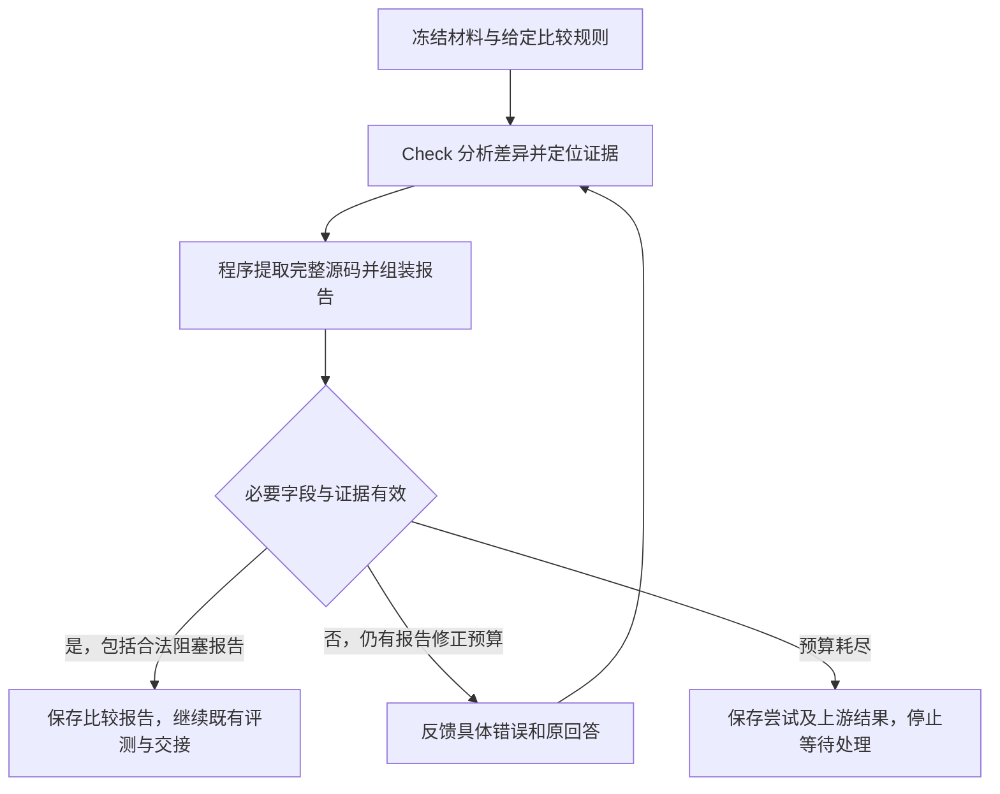

<!--
Copyright (c) 2026 linlisWorkTeam
SPDX-License-Identifier: MIT
文件功能：CheckAgent 的职责、输入输出与确认状态。
-->
# CheckAgent

状态：2026-09-14 已按确认方案实现报告证据提取和两次修正，职责边界保持不变。定向回归与真实模型验收的最终结果记入 Agent 验收报告，不能仅凭实现或 Schema 通过宣称真实验收完成。

## 1. 职责与边界

Check 根据项目给定的规则，比较原始源码与 Code 生成的实现，指出有依据的差异。它只读代码，不修改实现，也不运行测试。

比较报告提供给 Review 分析文档问题，并将阻塞标记交给 Gate。差异报告不能代替实际测试，也不能指定测试执行方式。

Check 解释代码差异及其与给定规则的关系；[Review](../reviewAgent/ReviewAgent.md)结合比较报告、实际评测和知识正文定位知识文档的问题，提出 DocGen 修订意见。Review 不接手 Check 未完成的源码一致性比较。本次报告修复不增加 Review 的裁决职责，不改变测试执行或 Gate 的发布规则。

## 2. 输入与输出

输入包括固定版本的原始源码、公开接口、全部生成代码及比较规则。原源码按白名单提供，生成文件以内联材料提供；每条规则必须有唯一编号和非空说明。

模型输出 scope 与 findings；每条差异包含规则、两侧证据定位或缺失声明、自由分析和严重程度。程序提取完整原文，组装 check-report-v2 并根据 findings 计算 blocking。无差异可返回空列表，但仍须声明完整比较范围。

## 3. 工作流程

### 检查比较条件

框架先加载 sourceSnapshotRef、generatedCodeRef、comparisonRulesRef 的正文，核对规则有效性。缺少规则时不调用模型，也不让模型自行创造规则继续。

### 按规则比较

例如，规则要求比较公开函数的返回行为，原实现为 return 4，生成实现为 return 3。Check 引用双方实际代码，解释这一差异，并按规则判断它是否阻塞通过。

Prompt 提供授权冻结材料的逐行编号，模型定位双方证据；框架核对范围和规则并提取完整原文，不要求模型抄写代码。单侧缺失按下文表达。

### 保存和交接报告

框架保存原始结构化报告，并转换为下游需要的差异记录。Check 完成后仍需等待参考测试校验，再进入重建评测。Review 收到真实比较报告正文及评测报告，Gate 使用 check.blocking 参与判定。

## 4. 关键约束与失败处理

### 输入边界与已实现方案

规则缺失、说明为空或编号重复时，在模型调用前抛出 CHECK_RULES_REQUIRED；必需材料或正文缺失同样提前失败。完整 scope、授权文件及既定规则不可绕过。报告错误与实际代码问题分别处理。

方案对应 IO-14、IO-15；实现于 `fix/check-report-evidence`，设计提交 `9324e7a`。保留现有只读比较、独立评测、Review 文档修订及 Gate 判定边界。

#### 分析正文与机器字段

报告同时供人和下游 Agent 阅读。分析正文允许自然语言或 Markdown，不规定标题、段落顺序、列表和排版样式，不因这些表达差异终止流程。机器约束只保护必要的流程字段、给定规则、比较范围和证据关联；最终仍需向既有消费者提供有依据的差异、严重程度及阻塞标记。

分析依据既定比较规则说明实际差异和影响，不能仅因函数位置、局部变量名称或实现写法不同而宣布行为不一致。确实无法判断的内容须明确具体缺失依据，不能将泛泛的“可能有问题”包装为已确认缺陷。保留现有 BLOCKER / INFO 语义，不增设疑点裁决流程，也不要求 Review 重新检查源码。

程序可以推导的内容不要求模型重复手填，例如源码原文、由证据定位得出的文件位置、由有效 findings 严重程度得出的整体 blocking。格式和引用真实只能证明报告可解析、原文存在，不能替代 Check 对业务差异的判断。

#### 模型定位、程序提取源码

模型负责指出所依据的规则、双方文件及具体位置，解释差异并判断严重程度；程序从本次冻结的原始源码和重建代码中提取、绑定原文。模型输出的自由分析与程序组装的证据应可区分，保留原始回答与最终报告的对应关系。

默认提供相关函数的完整实现；涉及类型、宏或全局变量时补充相关声明。多个相关函数分别附完整代码和文件、位置，不拼接成一段看似连续的源码。不为节选自行插入省略号或占位代码，源码本身已有的字符按原文保留。前台可以折叠展示，交给下游 Agent 的代码证据保持完整。

文件、位置及提取范围均须属于本次授权的冻结材料。无法可靠定位、存在歧义或无法提取完整边界时反馈具体问题，不猜测位置、不默默截断、不改用其他版本。模型不再手抄 original / generated，避免多余缩进、字符串转义或省略写法造成原文不匹配。

本次未确定必须建立函数编号目录，不把编号索引、相似度算法或新的代码检测系统作为实现前提。具体定位与提取技术须保持以上边界，不能把简单名称搜索等同于行为一致性判定。

#### 双侧对比与单侧缺失

| 报告情况 | 必需表达与证据 |
| --- | --- |
| 双方存在对应实现 | 双方文件、位置和程序提取的完整相关函数；必要时附声明，解释与给定规则相关的差异 |
| Check 判断一侧缺失 | 存在侧的完整相关函数及必要接口声明；缺失侧实际检查的冻结文件范围、未找到对应实现的结论及理由；不伪造第二段源码 |

公开接口兼容规则要求保留的实现遗漏，可以形成正常的差异报告。内部辅助函数合并、改名或内联不自动等于缺陷。单侧缺失是一种证据表达，不强制模型按函数名建立一一对应关系。

程序核对实际输入、授权范围、存在侧原文及缺失侧所指材料，不能仅凭“未检索到名称”证明实现缺失。定位工具失败与 Check 基于材料作出的缺失判断必须区分。缺失结论的业务正确性仍需 Check 按规则负责，证据格式校验不将该结论提升为确定性事实。

#### 报告内部修正

首次报告输出失败后最多修正 2 次，共最多 3 次报告尝试，与飞轮业务迭代次数分开。JSON / 必需字段错误和证据定位错误使用同一预算；Check 请求 outputAttempts=1，DSH 禁用嵌套 Schema 重试。每次报告尝试的 Provider 幂等键追加 report-N，原始命令、冻结输入和节点提交键保持绑定。

能够无歧义处理的外围包装由程序处理，例如从 Markdown 代码块中取得唯一明确的 JSON 对象；不能猜补分析、改写源码字符串、删除问题条目或改变严重程度来通过。排版变化不消耗报告修正次数。

需要模型修正时反馈上一次回答、具体错误条目、失败位置和预期要求，允许重新读取同一批授权材料；已经有效的证据保留。修正只处理本次 Check 报告，不重新运行已完成的 DocGen、Code 或 TestGen，也不改写冻结源码与重建结果。取消、必需输入缺失或授权边界故障不能通过修改答案绕过。

耗尽预算后保存失败原因、每次尝试及已有结果，停止本次 Check 并等待人工处理，沿用既有失败和交接边界。后续继续处理时应保留已完成的上游结果，恢复只能绑定相同冻结输入；不增设 Review 裁决或 Gate 放行机制。报告有效后继续现有流程，不把有效的 BLOCKER 差异报告当作角色执行异常。

提取器按保留字符偏移的 C/C++ 词法边界处理函数、声明和宏，屏蔽注释与普通/原始字符串中的括号。定位到函数内部时扩展到完整函数，模板类型成员扩展到完整类型声明。函数和声明都必须能由给定行范围唯一定位，同一行多个声明不能按长度猜选。构造函数初始化列表暂不支持，明确返回 CHECK_SOURCE_BOUNDARY_INVALID，不从初始化列表中途截取所谓完整函数。它不展开宏、不进行类型解析或编译；不能可靠识别的边界显式拒绝，不能宣称覆盖任意 C++ 语法。不会按字符串出现次数证明函数缺失。

成功报告附 check-attempts CAS 工件，记录每次原始回答、错误及有效证据。整体 Schema 校验前，按差异索引保留已可识别的既定规则、非空分析和合法严重程度；scope、兄弟条目或定位字段无效不能导致这些结论被删除或降级。DSH 的 Schema 失败携带原始文本和已解析对象，由 Check 保留结论，不在 Domain 猜补损坏的 JSON。已经通过整体 Schema 的报告继续保留差异数量和存在/缺失分类，只修定位和范围。耗尽时 Domain 携带待保存证据，RoleExecution 保存 CAS，并在既有 NodeFailed 错误中记录 reportEvidence 摘要；不提交成功 checkpoint。

执行版本为 domain-agents-v12-testgen-batches / contract-v12。旧报告仍能查看，旧运行不能以新协议静默恢复。原始命令与对外 AgentResult 信封不变，comparisonReportRef 指向组装后的完整报告；历史模型回答保留在独立尝试工件中。

## 5. 验收场景

- **有规则才能比较。** 给定返回行为规则可以执行；删除规则、使用空说明或重复编号，在调用模型前失败，工作流不得发布。
- **差异引用真实原文。** 对 return 4 与 return 3 的比较可以引用对应片段；改为不存在的原文、未授权规则或文件路径，结果拒绝。
- **完整边界与歧义。** 模板类型成员定位返回完整类型；构造函数初始化列表和同一行多个声明不能产生截断或猜选的成功证据。
- **格式修正保留意见。** 首次输出已有 BLOCKER，即使 scope 或其他条目导致 Schema 失败，后续删除或降级该意见也不能成功；保留意见并修正外围字段可以继续流程，覆盖 DSH 原始文本失败路径。
- **范围和阻塞一致。** 漏掉生成文件须修正；blocking 由有效 findings 计算，有 BLOCKER 必为 true。无差异时完整 scope 配合空列表可接受。
- **报告进入后续流程。** Review 收到实际比较报告和独立评测结果，Gate 检查阻塞条件；比较结果不能替换测试结果。

输入校验、原文依据及报告交接已有角色和流程回归。真实业务规则是否充分、模型判断是否准确仍需业务验收。

### 本次修复的验收口径

| 验收项 | 通过条件 |
| --- | --- |
| 原文提取与正文表达 | 模型给出有效位置时，程序从冻结材料提取完整函数和必要声明，原文可核验；正文排版变化不改变有效性，不再要求模型抄写源码 |
| 双侧及单侧证据 | 双侧差异可正常表达；规则要求保留的接口遗漏可输出带检查范围的单侧报告；内部函数改名不自动判错，定位失败不能冒充缺失 |
| 有限修正 | 定向测试覆盖格式和定位错误反馈、修正后成功、两次修正耗尽及取消；错误信息具体，预算不叠加，上游结果和有效证据保留 |
| 真实模型报告 | 使用 2026-09-11 cJSON 批次冻结的原始源码、重建代码及比较规则，调用真实模型生成 Check 报告；核对完整证据、准确定位和可交接内容，不用受控响应冒充真实模型 |
| 下游契约 | 完整报告能被现有后续流程读取，Review 继续定位知识文档问题；有效 BLOCKER 正常传递给既有评测和 Gate，不被误记为报告执行失败 |

验收材料沿用 Run `a0a2694c-ada1-491d-a10a-2b75b303f48b`，来源与失败证据见 [真实模型验收报告](../../../../reports/AgentSpecRepairAndE2E.md)。新 Check 验收须保留独立执行记录及输入摘要，不覆盖旧失败批次或手改其模型产物。真实调用不得只证明 JSON 可解析，还须复核报告定位、证据及实际交接数据；受控定向测试与真实模型结果分别报告。

Check 正常发现缺陷并输出阻塞报告，算检查执行成功；报告生成或修正机制失效才算本次修复未通过。整个 cJSON 飞轮 PASS 不作为本次通过条件，参考测试 48/49 和重建编译失败分别保留，不为让 Check 验收通过而修补其他角色产物。不得声称尚未发生的全流程评测、Review 或发布已经执行。

## 6. 未实现与待定事项

报告方案已实现；真实模型质量及本次实际验证结论见 Agent 验收报告。词法提取不代替完整 C/C++ 编译器，无法识别的边界不猜测。未实现原生提供方强约束 JSON 输出，不把提示词 Schema 宣称为服务端受约束解码。

相似度算法、评分、权重和阈值按 2026-09-10 的决定留待研究，尚未实现，也没有已确认的量化验收阈值。实现和评测不能自行给出一个相似度分数作为发布依据。

## 7. 实现及测试索引

角色 ID：`check`。规则对应：输入与比较规则为 IO-14；比较报告交接为 IO-15。

模型 Draft：scope、findings；每项 ruleId、original、generated、message、severity。存在侧为 status=present 与 locations（path/startLine/endLine/kind），kind 为 function 或 declaration；缺失侧为 status=missing、完整 checkedPaths 和 reason，两侧不能同时缺失。动态 Schema 限制规则和路径。

组装 Output：reportVersion=check-report-v2、scope、findings、blocking；存在侧 locations 转为包含完整 content 的 excerpts，缺失侧明确保留模型判断和检查范围。下游 AgentResult 继续映射 findingId、severity、criterionId、evidenceLocation 和说明，Review 消费完整 Output。

- 证据提取与失败边界：[CheckEvidence.test.ts](../../../../../src/domain/agents/checkAgent/CheckEvidence.test.ts)。
- 角色格式/定位统一预算：[CheckAgent.test.ts](../../../../../src/domain/agents/checkAgent/CheckAgent.test.ts)。
- 失败尝试持久化：[AgentExamples.test.ts](../../../../../tests/integration/AgentExamples.test.ts)。
- DSH 禁止嵌套重试：[DshConfiguredProvider.test.ts](../../../../../tests/integration/DshConfiguredProvider.test.ts)。

- 缺规则、虚构源码及交接回归：[AgentSpecRegression.test.mjs](../../../../../tests/integration/AgentSpecRegression.test.mjs)。
- 比较与 Review 的完整流程：[AgentRevisionFlow.test.ts](../../../../../tests/acceptance/AgentRevisionFlow.test.ts)。
- 阻塞条件参与 Gate：[Domain.test.ts](../../../../../tests/unit/Domain.test.ts)。

代码位置：[执行入口](../../../../../src/domain/agents/checkAgent/CheckAgent.ts)、[输入输出契约](../../../../../src/domain/agents/checkAgent/CheckAgentContract.ts)、[提示词与读取范围](../../../../../src/domain/agents/checkAgent/CheckAgentPrompt.ts)、[角色测试](../../../../../src/domain/agents/checkAgent/CheckAgent.test.ts)、[独立样例](../../../../../src/domain/agents/checkAgent/examples/CheckAgentSample.json)。
