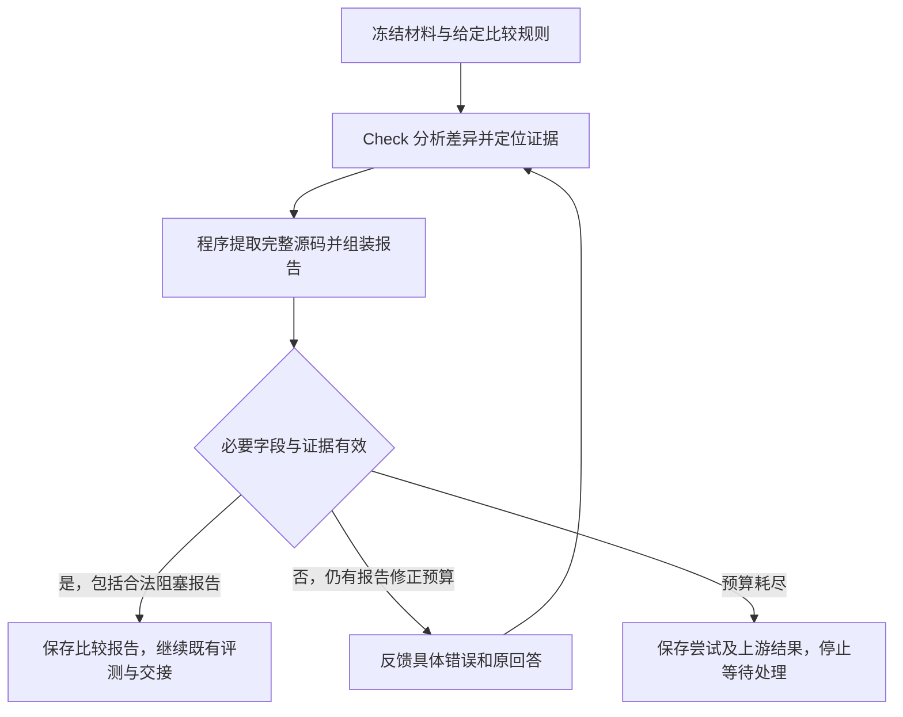

<!--
Copyright (c) 2026 linlisWorkTeam
SPDX-License-Identifier: MIT
文件功能：CheckAgent 的职责、输入输出与确认状态。
-->
# CheckAgent

状态：第 1 节职责边界保持不变。第 4 节“2026-09-14 已确认的报告修复方案”及对应验收为已确认、待实现；其余对当前执行入口和输出字段的描述仍是修复前实现。本次仅更新设计，未修改代码或执行模型。

## 1. 职责与边界

Check 根据项目给定的规则，比较原始源码与 Code 生成的实现，指出有依据的差异。它只读代码，不修改实现，也不运行测试。

比较报告提供给 Review 分析文档问题，并将阻塞标记交给 Gate。差异报告不能代替实际测试，也不能指定测试执行方式。

Check 解释代码差异及其与给定规则的关系；[Review](../reviewAgent/ReviewAgent.md)结合比较报告、实际评测和知识正文定位知识文档的问题，提出 DocGen 修订意见。Review 不接手 Check 未完成的源码一致性比较。本次报告修复不增加 Review 的裁决职责，不改变测试执行或 Gate 的发布规则。

## 2. 输入与输出

输入包括固定版本的原始源码、公开接口、全部生成代码及比较规则。原源码按白名单提供，生成文件以内联材料提供；每条规则必须有唯一编号和非空说明。

当前输出包含比较范围、差异列表和是否阻塞。每条差异说明采用的规则、双方文件位置、两段原文、差异含义及严重程度。没有差异时可以返回空列表，但仍需声明完整比较范围。下述待实现方案调整证据生成方式并补充单侧缺失的表达，不要求每条差异都能提供两侧存在的代码。

## 3. 工作流程

### 检查比较条件

框架先加载 sourceSnapshotRef、generatedCodeRef、comparisonRulesRef 的正文，核对规则有效性。缺少规则时不调用模型，也不让模型自行创造规则继续。

### 按规则比较

例如，规则要求比较公开函数的返回行为，原实现为 return 4，生成实现为 return 3。Check 引用双方实际代码，解释这一差异，并按规则判断它是否阻塞通过。

Prompt 要求只读、使用给定规则并引用双方原文。比较完成后，框架核对覆盖范围、规则编号、位置和片段，拒绝虚构引用。

### 保存和交接报告

框架保存原始结构化报告，并转换为下游需要的差异记录。Check 完成后仍需等待参考测试校验，再进入重建评测。Review 收到真实比较报告正文及评测报告，Gate 使用 check.blocking 参与判定。

## 4. 关键约束与失败处理

### 当前实现

规则缺失、说明为空或编号重复时，在模型调用前抛出 CHECK_RULES_REQUIRED。其他必需材料缺失同样提前失败。

scope 必须列全生成文件。每条差异只能引用授权源码、实际生成文件和给定规则；original 与 generated 片段必须分别存在于对应文件中。范围不完整、越界路径、伪造规则或片段均拒绝。

severity 只允许 BLOCKER 或 INFO；blocking 必须与是否存在 BLOCKER 一致，矛盾时拒绝。引用存在只能证明有这段原文，不能证明模型对业务差异的解释正确。共同执行与取消规则见 [Agents](../Agents.md)。

### 2026-09-14 已确认的报告修复方案（待实现）

本方案经逐项确认，范围为 Check 报告生成、真实证据组装和有限修正，仍对应 IO-14、IO-15。修复分支为 `fix/check-report-evidence`，设计起点 `59cb00b`。当前没有报告业务修正循环，不能将下面的目标能力描述为已可运行。

#### 分析正文与机器字段

报告同时供人和下游 Agent 阅读。分析正文允许自然语言或 Markdown，不规定标题、段落顺序、列表和排版样式，不因这些表达差异终止流程。机器约束只保护必要的流程字段、给定规则、比较范围和证据关联；最终仍需向既有消费者提供有依据的差异、严重程度及阻塞标记。

分析依据既定比较规则说明实际差异和影响，不能仅因函数位置、局部变量名称或实现写法不同而宣布行为不一致。确实无法判断的内容须明确具体缺失依据，不能将泛泛的“可能有问题”包装为已确认缺陷。保留现有 BLOCKER / INFO 语义，不增设疑点裁决流程，也不要求 Review 重新检查源码。

程序可以推导的内容不要求模型重复手填，例如源码原文、由证据定位得出的文件位置、由有效 findings 严重程度得出的整体 blocking。格式和引用真实只能证明报告可解析、原文存在，不能替代 Check 对业务差异的判断。

#### 模型定位、程序提取源码

模型负责指出所依据的规则、双方文件及具体位置，解释差异并判断严重程度；程序从本次冻结的原始源码和重建代码中提取、绑定原文。模型输出的自由分析与程序组装的证据应可区分，保留原始回答与最终报告的对应关系。

默认提供相关函数的完整实现；涉及类型、宏或全局变量时补充相关声明。多个相关函数分别附完整代码和文件、位置，不拼接成一段看似连续的源码。不为节选自行插入省略号或占位代码，源码本身已有的字符按原文保留。前台可以折叠展示，交给下游 Agent 的代码证据保持完整。

文件、位置及提取范围均须属于本次授权的冻结材料。无法可靠定位、存在歧义或无法提取完整边界时反馈具体问题，不猜测位置、不默默截断、不改用其他版本。模型不再手抄 original / generated，避免多余缩进、字符串转义或省略写法造成原文不匹配。

本次未确定必须建立函数编号目录，不把编号索引、相似度算法或新的代码检测系统作为实现前提。具体定位与提取技术须保持以上边界，不能把简单名称搜索等同于行为一致性判定。

#### 双侧对比与单侧缺失

| 报告情况 | 必需表达与证据 |
| --- | --- |
| 双方存在对应实现 | 双方文件、位置和程序提取的完整相关函数；必要时附声明，解释与给定规则相关的差异 |
| Check 判断一侧缺失 | 存在侧的完整相关函数及必要接口声明；缺失侧实际检查的冻结文件范围、未找到对应实现的结论及理由；不伪造第二段源码 |

公开接口兼容规则要求保留的实现遗漏，可以形成正常的差异报告。内部辅助函数合并、改名或内联不自动等于缺陷。单侧缺失是一种证据表达，不强制模型按函数名建立一一对应关系。

程序核对实际输入、授权范围、存在侧原文及缺失侧所指材料，不能仅凭“未检索到名称”证明实现缺失。定位工具失败与 Check 基于材料作出的缺失判断必须区分。缺失结论的业务正确性仍需 Check 按规则负责，证据格式校验不将该结论提升为确定性事实。

#### 报告内部修正

首次报告输出失败后最多修正 2 次，共最多 3 次报告尝试，与飞轮业务迭代次数分开。JSON / 必需字段错误和证据定位错误使用同一报告修正预算；实现时协调适配器已有格式重试，不能因多层循环叠加而超出这个预算。

能够无歧义处理的外围包装由程序处理，例如从 Markdown 代码块中取得唯一明确的 JSON 对象；不能猜补分析、改写源码字符串、删除问题条目或改变严重程度来通过。排版变化不消耗报告修正次数。

需要模型修正时反馈上一次回答、具体错误条目、失败位置和预期要求，允许重新读取同一批授权材料；已经有效的证据保留。修正只处理本次 Check 报告，不重新运行已完成的 DocGen、Code 或 TestGen，也不改写冻结源码与重建结果。取消、必需输入缺失或授权边界故障不能通过修改答案绕过。

耗尽预算后保存失败原因、每次尝试及已有结果，停止本次 Check 并等待人工处理，沿用既有失败和交接边界。后续继续处理时应保留已完成的上游结果，恢复只能绑定相同冻结输入；不增设 Review 裁决或 Gate 放行机制。报告有效后继续现有流程，不把有效的 BLOCKER 差异报告当作角色执行异常。

提取能力、报告协议调整、旧工件兼容、修正计数及交接测试均在实现阶段同步，现有代码没有因本次设计确认改变。

## 5. 验收场景

- **有规则才能比较。** 给定返回行为规则可以执行；删除规则、使用空说明或重复编号，在调用模型前失败，工作流不得发布。
- **差异引用真实原文。** 对 return 4 与 return 3 的比较可以引用对应片段；改为不存在的原文、未授权规则或文件路径，结果拒绝。
- **范围和阻塞一致。** 漏掉一个生成文件，或 findings 有 BLOCKER 而 blocking 为 false，均拒绝。无差异时完整 scope 配合空列表可接受。
- **报告进入后续流程。** Review 收到实际比较报告和独立评测结果，Gate 检查阻塞条件；比较结果不能替换测试结果。

输入校验、原文依据及报告交接已有角色和流程回归。真实业务规则是否充分、模型判断是否准确仍需业务验收。

### 本次修复的验收口径（已确认，未执行）

| 验收项 | 通过条件 |
| --- | --- |
| 原文提取与正文表达 | 模型给出有效位置时，程序从冻结材料提取完整函数和必要声明，原文可核验；正文排版变化不改变有效性，不再要求模型抄写源码 |
| 双侧及单侧证据 | 双侧差异可正常表达；规则要求保留的接口遗漏可输出带检查范围的单侧报告；内部函数改名不自动判错，定位失败不能冒充缺失 |
| 有限修正 | 定向测试覆盖格式和定位错误反馈、修正后成功、两次修正耗尽及取消；错误信息具体，预算不叠加，上游结果和有效证据保留 |
| 真实模型报告 | 使用 2026-09-11 cJSON 批次冻结的原始源码、重建代码及比较规则，调用真实模型生成 Check 报告；核对完整证据、准确定位和可交接内容，不用受控响应冒充真实模型 |
| 下游契约 | 完整报告能被现有后续流程读取，Review 继续定位知识文档问题；有效 BLOCKER 正常传递给既有评测和 Gate，不被误记为报告执行失败 |

验收材料沿用 Run `a0a2694c-ada1-491d-a10a-2b75b303f48b`，来源与失败证据见 [真实模型验收报告](../../../../reports/AgentSpecRepairAndE2E.md)。新 Check 验收须保留独立执行记录及输入摘要，不覆盖旧失败批次或手改其模型产物。真实调用不得只证明 JSON 可解析，还须复核报告定位、证据及实际交接数据；受控定向测试与真实模型结果分别报告。

Check 正常发现缺陷并输出阻塞报告，算检查执行成功；报告生成或修正机制失效才算本次修复未通过。整个 cJSON 飞轮 PASS 不作为本次通过条件，参考测试 48/49 和重建编译失败分别保留，不为让 Check 验收通过而修补其他角色产物。不得声称尚未发生的全流程评测、Review 或发布已经执行。

## 6. 未实现与待定事项

上述 2026-09-14 报告方案已确认、尚未实现。本轮只写 Spec；单侧报告契约、完整源码提取、具体反馈、两次修正及对应真实模型验收均未完成。下一步实现须同步现有角色契约、适配重试与报告消费兼容，保持本页职责边界。

相似度算法、评分、权重和阈值按 2026-09-10 的决定留待研究，尚未实现，也没有已确认的量化验收阈值。实现和评测不能自行给出一个相似度分数作为发布依据。

## 7. 实现及测试索引

角色 ID：`check`。规则对应：输入与比较规则为 IO-14；比较报告交接为 IO-15。

当前修复前的输出字段为 scope、findings、blocking；finding 包含 ruleId、sourcePath、path、original、generated、message、severity。下游记录映射为 findingId、severity、criterionId、evidenceLocation 和说明，原始报告仍完整保存。第 4 节目标协议尚未替换这些实现字段及旧验收断言。

- 缺规则、虚构源码及交接回归：[AgentSpecRegression.test.mjs](../../../../../tests/integration/AgentSpecRegression.test.mjs)。
- 比较与 Review 的完整流程：[AgentRevisionFlow.test.ts](../../../../../tests/acceptance/AgentRevisionFlow.test.ts)。
- 阻塞条件参与 Gate：[Domain.test.ts](../../../../../tests/unit/Domain.test.ts)。

代码位置：[执行入口](../../../../../src/domain/agents/checkAgent/CheckAgent.ts)、[输入输出契约](../../../../../src/domain/agents/checkAgent/CheckAgentContract.ts)、[提示词与读取范围](../../../../../src/domain/agents/checkAgent/CheckAgentPrompt.ts)、[角色测试](../../../../../src/domain/agents/checkAgent/CheckAgent.test.ts)、[独立样例](../../../../../src/domain/agents/checkAgent/examples/CheckAgentSample.json)。
