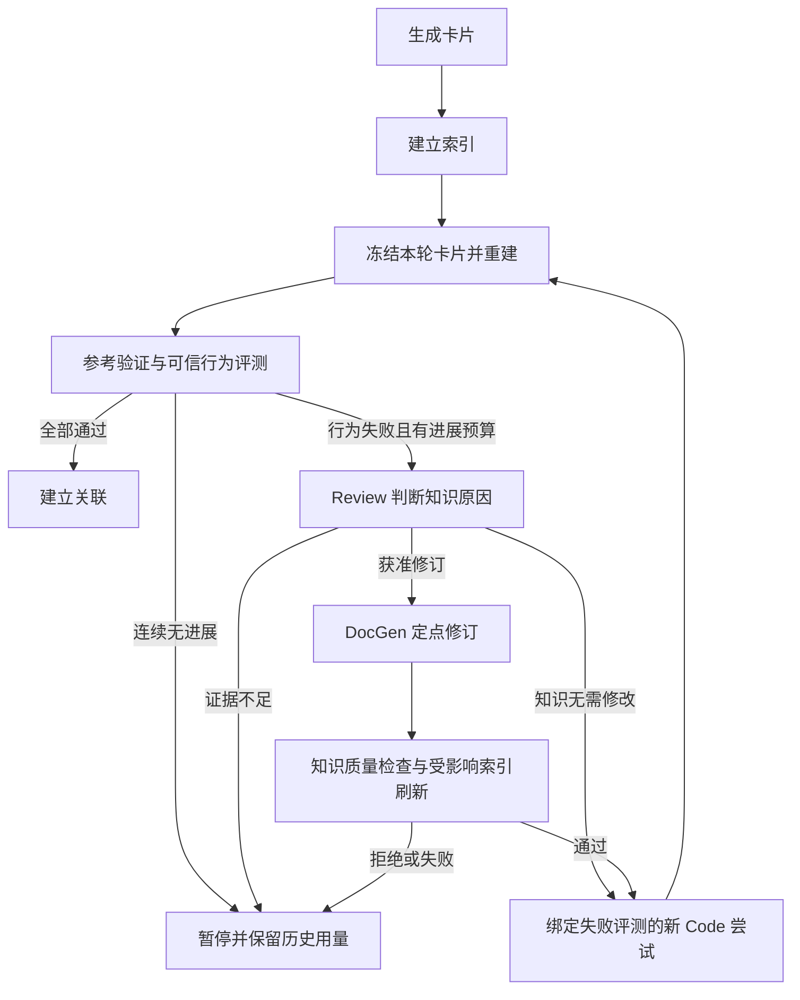

<!--
Copyright (c) 2026 linlisWorkTeam
SPDX-License-Identifier: MIT
文件功能：五阶段工作台任务、冻结输入、恢复与预算规则。
-->
# 五阶段工作台

代码位置：[StageTask](../../../../../src/domain/services/workbench/StageTask.ts)、[WorkbenchStages](../../../../../src/application/services/WorkbenchStages.ts)、[StageTaskPorts](../../../../../src/application/ports/StageTaskPorts.ts)、[SqliteStageTasks](../../../../../src/infrastructure/sqlite/SqliteStageTasks.ts)。

## 契约与边界

新执行契约为 `knowledge-workbench-v1`，阶段依次为 GENERATE、INDEX、FLYWHEEL、EVALUATE、ASSOCIATE。Domain 定义冻结输入与预算规则，Application 交接材料、调度及等待，Infrastructure 实现 SQLite 事务与 Linux 进程身份。没有新增动态 Agent 注册平台。当前已接通 GENERATE（C/C++）、INDEX，以及FLYWHEEL的代码重建和公开接口比较；EVALUATE已接通参考验证及可信用例执行，规范化源码差异与ASSOCIATE已接通，自动知识修订仍待完成，不把部分结果展示为完整验证。

StageInput 固定 projectId、源码版本/摘要、卡片版本列表、配置摘要和公开参数。规范化 JSON 与契约、预算共同产生任务 ID；重复启动相同输入返回原任务，成功结果可复用。冻结快照不能携带凭据。任务状态为 PENDING、RUNNING、SUCCEEDED、FAILED、PAUSED、CANCELLED；旧契约可读，不允许 claim/resume，恢复不改写旧执行快照。

## 幂等与恢复

同数据库使用一个执行租约，只有一项任务占用。身份绑定 Linux boot ID、PID 与进程启动时间；无法证明旧进程退出时不抢占。进程退出后，当前契约任务进入 PAUSED；旧契约仅释放已确认退出的技术租约，保留执行事实。PENDING 可在服务启动时继续排队，PAUSED/FAILED/CANCELLED 要求显式恢复并提供相同 inputDigest。

检查点按 taskId+子步骤键提交，恢复复用已完成产物。写回必须持有当前 leaseId；租约失效后拒绝迟到写入。外部副作用必须使用提供的幂等键。检查点本身不能保证模型请求恰好执行一次；模型调用前持久化预留，重试记入新 attempt，已完成生成结果先落 CAS 后交给后续阶段。

取消 RUNNING 只标记请求并传播 AbortSignal；执行器及子进程树清理退出前仍占用槽位。只有执行器返回后才能标记 CANCELLED 并启动下一任务。关闭服务先等待任务中止，再关闭存储。数据库失败向等待方抛出，不假装成功或重新启动。

## 预算

保留累计 modelCalls、reservedTokens、已报告 tokens 和 elapsedMs。预留与实际用量分开，不将预留标成供应商账单。operationId 在每次 attempt 中幂等；真实重试不能重复使用旧 attempt 的占额。取消、恢复、进程回收不清零用量。默认没有固定三轮或调用次数上限；显式预算耗尽、供应商额度失败和资源缺项暂停。供应商额度查询失败不能解释为无限额度。模型/编译执行器仍须遵守全局资源限制及进程树取消。

## 验证与剩余范围

`WorkbenchStages.test.ts` 使用真实 SQLite 连接和实际退出的子进程验证：完成子步骤复用、累计预算、跨连接取消和串行槽、进程回收、旧契约只读及迟到写入拒绝。C/C++工具链、分步执行和持久化一键协调另有专门回归与真实验收报告；这些单阶段测试不证明完整产品交付。自动知识修订、发布门禁及最终部署仍需完成。

English summary

Versioned stages freeze input and budget, reuse committed checkpoints and serialize work using a process-owned SQLite lease. Cancellation retains the slot until cleanup completes. Generation, indexing and the reconstruction/interface comparison portion of FLYWHEEL are connected; reference validation and generated behavior evaluation are connected; normalized source diagnostics and association orchestration are connected; automatic revisions remain pending.

## 项目输入

[WorkbenchProject](../../../../../src/domain/services/workbench/WorkbenchProject.ts) 定义固定输入版本。projectId绑定仓库身份；snapshotId绑定提交、源码摘要、排序后的模块选择、声明式构建约束与CAS文件引用。选定模块不能来自测试/示例或不支持语言；空选择、超限和未知模块拒绝。编译器、语言标准取有限枚举，包含目录不得越出仓库，预处理定义不允许命令或任意参数。包含目录和宏定义顺序保留，因为顺序可能影响构建。工具版本还需由实际构建阶段单独冻结。

快照是参考材料，未包含可供Code读取的公开接口；无法据此直接启动重建。文件正文与构建配置先写CAS，SQLite最后一次原子插入。相同输入重放保留原创建时间，源码或参数改变生成新输入历史。取消和读取失败不产生部分项目，已写CAS对象可后续复用。

## 知识单元与生成

KnowledgeUnits按固定仓库身份、源码模块和完整符号名生成稳定cardId；函数重载归为一个调用族，类型布局按类型名独立成卡。存储moduleId使用卡片身份，展示模块仍为sourceModule。标题变化不改变身份；正文附固定来源提交及符号尾注，源码变化不能误复用旧来源版本。语法投影尚不是完整依赖图，缺证据仍须明确记录；C++可指定类范围和符号族。

GENERATE冻结项目输入、模型配置和接口选择；逐卡提交候选版本，生成成功不等于行为验证或允许发布。配置与资源问题暂停，质量及执行错误保留原始原因，不撤销已完成卡片。阶段独立于旧Run生命周期，不把“未评测”映射为旧Run的失败或发布状态。

新阶段显式启用操作性恢复策略：额度停止、用户取消、服务关闭和预算中断写入failureCode，已消耗请求与Token不回退。这些已分类中断不消耗角色的两次语义修正额度；尝试编号持续递增，每次错误立即停止，必须显式恢复，不能自动循环调用。未知传输错误、未知进程中断和语义拒绝仍受既有尝试上限约束。旧Run不启用此策略，原限次恢复契约不变。

### 持久化一键执行契约

`knowledge-pipeline-v8` 顺序推进 GENERATE、INDEX、FLYWHEEL、EVALUATE、ASSOCIATE，复用各阶段相同的prepare/start与执行器。协调记录独立于阶段执行槽，保存冻结生成输入、每个子阶段完整输入/任务身份、已完成阶段及暂停原因；不能持有阶段租约等待子阶段。子阶段先记录后启动，崩溃间隙用同幂等键补齐。成功结果复用，恢复不修改子任务输入、配置和累计预算；模型配置与生成阶段不一致时停止。取消传播至当前子任务，进程退出后显式同版本恢复。

Domain判定推进条件：阶段成功且索引无失败、公开接口匹配、可信行为全部通过，才进入下一阶段。错误/取消/资源暂停均停在原阶段，前序产物保留。流程SUCCEEDED只表示五阶段执行完成，publicationVerified仍为false；知识修订有证据及质量门禁，最终发布另有门禁，不能由一键执行状态代替。

协调身份同时绑定所选语言工具链与执行器摘要；环境变化生成新流程身份，旧流程不能跨环境恢复。进入新阶段前复查环境摘要，子阶段仍独立冻结并检查自身工具链。

流程 v3 在启动时冻结明确选择的 materialIds 并纳入身份，只把它们交给关联阶段。新增其他材料不影响运行中输入，改变选材创建新流程并复用未变阶段。v1/v2/v3 记录只读，不跨版本恢复或取消。没有选材时仍复用库内 v1 关联任务。

## 规范化源码诊断

新重建输入显式绑定 `native-source-comparison-v1`。在 Code 完成后读取固定参考 CAS，按公开函数及参数类型定位定义，比较去注释/空白后的词法序列和控制关键词计数；类型/布局仍以 Clang 公开声明比较为准。保留标识符、常量和预处理分支，不宣称语义等价。缺少、歧义或复杂声明无法确定时明确列出未解决项，不编造零相似度。编辑距离只在限定计算预算内计算，报告公式、覆盖范围和截断情况。TinyXML2 只比较选定 XMLUtil 函数，不把整库其他代码算作缺失。

仅新增诊断而 Code 输入未变时，可复用已成功重建的生成代码。匹配固定卡片/正文、接口、项目快照/构建、模型配置和工具链摘要，只有诊断契约从缓存键中排除。复用记录原任务与代码工件，重新执行当前接口检查和诊断，不读取参考实现给 Code。历史用量通过跨重试幂等的继承记录保留，不重复收费或清零。新重建及一键契约与旧执行分离，旧执行只读；知识修订/行为评测/发布仍独立判定。

## 可信失败驱动的修订交接

修订只能使用已成功完成的 EVALUATE 任务中、通过参考验证的可信测试失败。Domain 将失败用例、固定正文摘要和 `cardId#H2` 绑定；旧章节、版本不匹配、参考失败、无行为观察的编译/运行故障均保留未解决项，不自动授权 DocGen。Review 可判断为知识缺失/错误、生成代码问题或证据不足；只允许对确有当前章节绑定的意见提出定点修订。文本相似度本身不授权修改知识。

修订执行保留原评测、Review 结果、修改前后正文及原卡片身份。DocGen 沿用现有精确 H2 范围校验，禁止改动其他章节、伪造无变化修订或修改可信测试预期。修订产物仍是候选，必须更新对应索引后才能进入下一轮重建；每轮输入、版本、历史门禁和累计用量均需保留。无有效进展或未解决诊断应暂停，不将固定三轮恢复为总上限。

已实现只读修订依据查询及Console入口：native-revision-evidence-v1按可信原始套件重算参考通过及实际差异，验证报告用例与原套件一致，再匹配固定正文摘要及当前章节。相同正文的历史版本绑定不触发新测试，但需要重新定位后才能用于修订。此查询不改变执行契约和旧任务产物；Review/DocGen修订与v4自动循环已接通，最终发布仍未完成。

修订执行设计：FLYWHEEL 的 `operation=KNOWLEDGE_REVISION`、`revisionContract=knowledge-revision-v4` 与普通代码重建分别调度。冻结评测编号、派生证据CAS、卡片版本和原模型配置。每张卡片先运行 Review，仅采纳其明确定位到候选H2的意见；未解决风险或无意见时保留原卡片。DocGen 成功后先对确定性装配完成的正文执行独立源码 Review；仅 PASS 且无纠正意见、阻塞或未解决风险时幂等提交候选版本。复核拒绝保留草稿及角色证据，不提交版本、不索引，阶段返回 UNRESOLVED。通过后，再调用同一索引用例刷新修改项；索引失败保留卡片和模型检查点，恢复不再次调用模型。独立执行与v4协调使用同一修订用例。

已接通独立修订执行、原卡片身份保留、受影响索引共享用例和Console操作；v4保存自动多轮历史。候选提交可携带expectedParentVersionId，在CAS写入后、SQLite提交前核对头版本；只允许本次已完成版本的幂等回放，不覆盖并发写入。索引与模型不占用两个执行槽，所有派生索引输入先存为检查点。质量拒绝明确返回QUALITY_REJECTED并保留候选。

Review与DocGen接收固定参考源码及可信评测，Code/TestGen保持参考实现隔离。系统生成的来源提交尾注在修订后保留，并再次校验非授权章节未改变；只有删除尾注的输出不能算有效修订。Review明确PASS且无需修改的卡片记为UNCHANGED，不阻止其他已获准修订卡片继续；证据不足的意见仍保留UNRESOLVED。

## 自动迭代协调

v4 一键流程保存每轮重建、评测、修订的冻结子任务；children 仅为当前展示引用，历史轮次不覆盖。可信行为失败才进入修订，修订成功或 Review 确认无需改知识后，以失败评测绑定的新 Code 尝试进入下一轮。Code 只收到知识/接口/构建约束，不收到用于标识重试的隐藏报告。修订内索引刷新成功后才重建。

连续三次评测没有严格缩小历史最佳失败用例集合时暂停，保留全部轮次；这不是三轮总上限，有持续行为改进可以继续。只改文字或相似度不算行为进展；失败身份绑定模块、调用、观察与预期，不绑定用例名称、说明或章节标签。退步后恢复旧水平不重置无进展计数。取消始终指向当前实际子任务，包括修订。用量按所有唯一子任务统计，不重复计入展示别名。v3及更早只读，不能跨版本恢复。

阶段执行器共享单槽，协调器不占槽等待；取消指向 activeTaskId。代码重试冻结失败评测的输入与结果摘要，重试身份不会作为模型材料发送。关联完成仍不等于通过最终发布门禁。

## 当前版本启动

v5 启动时若生成任务已有成功产物，按稳定卡片身份选择同一项目快照的当前后代版本；只读取版本记录，不读取正文。不能跨源码快照或不相干血缘替换。存在修订时将选定版本集合纳入流程身份，并在第一次索引及第一轮重建中使用；原生成产物保持不变。恢复只使用冻结版本，不重新选择当前头。当前版本未变时复用原流程，修改卡片后显式启动形成新流程。v4及更早只读。

## 修订角色交接 v2（实施中）

真实故障验收发现：原始 Review correctionId 可为自然语言标识，且含辅助字段，不能直接作为 DocGen 命令；必须使用已验证 AgentResult.payload.corrections 中标准化的意见，并校验原始正文/任务/意见内容绑定。Review 同时获得固定参考与生成代码，按当前卡片归因。已知代码错误、其他卡片的失败、计划中的后续重建不属于当前知识修订未知风险；只将当前卡片无法确定的知识问题列为 unresolvedRisks。保持未知风险阻止修订的门禁，不靠过滤风险文字放行。执行契约 knowledge-revision-v2 / pipeline-v6 与旧执行分离。

v3 修订进一步将 allowedKnowledgePaths 同时绑定 Review 的动态输出 Schema、提示词和角色校验；不得先保存一个角色成功结果后才发现其超出失败证据范围。未指定范围的旧 Review 输入行为保持原样。当前卡片的 criteria 包含本轮已经完成的 priorCardDecisions，避免将已确认的上游代码/知识错误重新误归因到其他卡片。新流程 pipeline-v7，旧实验记录只读保留。
