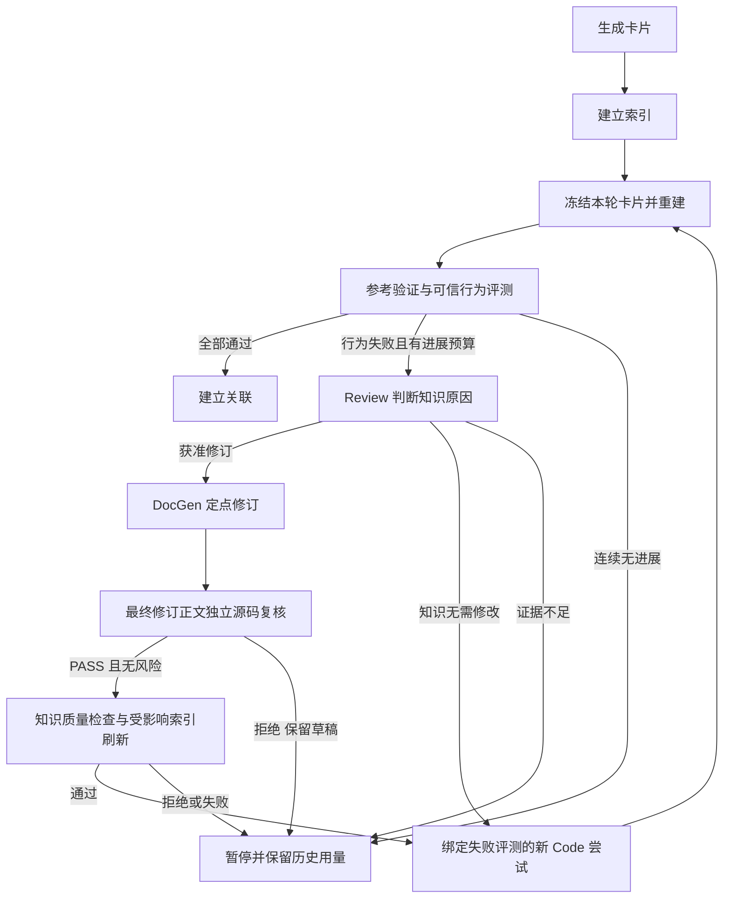

<!--
Copyright (c) 2026 linlisWorkTeam
SPDX-License-Identifier: MIT
文件功能：五阶段工作台任务、冻结输入、恢复与预算规则。
-->
# 五阶段工作台

代码位置：[StageTask](../../../../src/domain/workbench/StageTask.ts)、[WorkbenchStages](../../../../src/application/services/WorkbenchStages.ts)、[StageTaskPorts](../../../../src/application/ports/StageTaskPorts.ts)、[SqliteStageTasks](../../../../src/infrastructure/sqlite/SqliteStageTasks.ts)。

## 契约与边界

新执行契约为 `knowledge-workbench-v1`，阶段依次为 GENERATE、INDEX、FLYWHEEL、EVALUATE、ASSOCIATE。Domain 定义冻结输入与预算规则，Application 交接材料、调度及等待，Infrastructure 实现 SQLite 事务与 Linux 进程身份。没有新增动态 Agent 注册平台。当前已接通 GENERATE（C/C++）、INDEX，以及FLYWHEEL的代码重建和公开接口比较；EVALUATE已接通参考验证及可信用例执行，规范化源码差异与ASSOCIATE已接通，自动知识修订仍待完成，不把部分结果展示为完整验证。

StageInput 固定 projectId、源码版本/摘要、卡片版本列表、配置摘要和公开参数。规范化 JSON 与契约、预算共同产生任务 ID；重复启动相同输入返回原任务，成功结果可复用。冻结快照不能携带凭据。任务状态为 PENDING、RUNNING、SUCCEEDED、FAILED、PAUSED、CANCELLED；旧契约可读，不允许 claim/resume，恢复不改写旧执行快照。

## 幂等与恢复

同数据库使用一个执行租约，只有一项任务占用。身份绑定 Linux boot ID、PID 与进程启动时间；无法证明旧进程退出时不抢占。进程退出后，当前契约任务进入 PAUSED；旧契约仅释放已确认退出的技术租约，保留执行事实。PENDING 可在服务启动时继续排队，PAUSED/FAILED/CANCELLED 要求显式恢复并提供相同 inputDigest。

检查点按 taskId+子步骤键提交，恢复复用已完成产物。写回必须持有当前 leaseId；租约失效后拒绝迟到写入。外部副作用必须使用提供的幂等键。检查点本身不能保证模型请求恰好执行一次；模型调用前持久化预留，重试记入新 attempt，已完成生成结果先落 CAS 后交给后续阶段。

取消 RUNNING 只标记请求并传播 AbortSignal；执行器及子进程树清理退出前仍占用槽位。只有执行器返回后才能标记 CANCELLED 并启动下一任务。关闭服务先等待任务中止，再关闭存储。数据库失败向等待方抛出，不假装成功或重新启动。

## 预算

保留累计 modelCalls、reservedTokens、已报告 tokens 和 elapsedMs。预留与实际用量分开，不将预留标成供应商账单。operationId 在每次 attempt 中幂等；真实重试不能重复使用旧 attempt 的占额。取消、恢复、进程回收不清零用量。默认没有固定三轮或调用次数上限；显式预算耗尽、供应商额度失败和资源缺项暂停。供应商额度查询失败不能解释为无限额度。模型/编译执行器仍须遵守全局资源限制及进程树取消。

## 验证与剩余范围

`WorkbenchStages.test.ts` 使用真实 SQLite 连接和实际退出的子进程验证：完成子步骤复用、累计预算、跨连接取消和串行槽、进程回收、旧契约只读及迟到写入拒绝。C/C++工具链、分步执行和持久化一键协调另有专门回归与真实验收报告；这些单阶段测试不证明完整产品交付。自动知识修订、发布门禁及最终部署仍需完成。

English summary

Versioned stages freeze input and budget, reuse committed checkpoints and serialize work using a process-owned SQLite lease. Cancellation retains the slot until cleanup completes. Generation, indexing and the reconstruction/interface comparison portion of FLYWHEEL are connected; reference validation and generated behavior evaluation are connected; normalized source diagnostics and association orchestration are connected; automatic revisions remain pending.

## 项目输入

[WorkbenchProject](../../../../src/domain/workbench/WorkbenchProject.ts) 定义固定输入版本。projectId绑定仓库身份；snapshotId绑定提交、源码摘要、排序后的模块选择、声明式构建约束与CAS文件引用。选定模块不能来自测试/示例或不支持语言；空选择、超限和未知模块拒绝。编译器、语言标准取有限枚举，包含目录不得越出仓库，预处理定义不允许命令或任意参数。包含目录和宏定义顺序保留，因为顺序可能影响构建。工具版本还需由实际构建阶段单独冻结。

快照是参考材料，未包含可供Code读取的公开接口；无法据此直接启动重建。文件正文与构建配置先写CAS，SQLite最后一次原子插入。相同输入重放保留原创建时间，源码或参数改变生成新输入历史。取消和读取失败不产生部分项目，已写CAS对象可后续复用。

## 知识单元与生成

KnowledgeUnits按固定仓库身份、源码模块和完整符号名生成稳定cardId；函数重载归为一个调用族，类型布局按类型名独立成卡。存储moduleId使用卡片身份，展示模块仍为sourceModule。标题变化不改变身份；正文附固定来源提交及符号尾注，源码变化不能误复用旧来源版本。语法投影尚不是完整依赖图，缺证据仍须明确记录；C++可指定类范围和符号族。

GENERATE冻结项目输入、模型配置和接口选择；逐卡提交候选版本，生成成功不等于行为验证或允许发布。配置与资源问题暂停，质量及执行错误保留原始原因，不撤销已完成卡片。阶段独立于旧Run生命周期，不把“未评测”映射为旧Run的失败或发布状态。

新阶段显式启用操作性恢复策略：额度停止、用户取消、服务关闭和预算中断写入failureCode，已消耗请求与Token不回退。这些已分类中断不消耗角色的两次语义修正额度；尝试编号持续递增，每次错误立即停止，必须显式恢复，不能自动循环调用。未知传输错误、未知进程中断和语义拒绝仍受既有尝试上限约束。旧Run不启用此策略，原限次恢复契约不变。

### 持久化一键执行契约

`knowledge-pipeline-v9` 顺序推进 GENERATE、INDEX、FLYWHEEL、EVALUATE、ASSOCIATE，复用各阶段相同的prepare/start与执行器。协调记录独立于阶段执行槽，保存冻结生成输入、每个子阶段完整输入/任务身份、已完成阶段及暂停原因；不能持有阶段租约等待子阶段。子阶段先记录后启动，崩溃间隙用同幂等键补齐。成功结果复用，恢复不修改子任务输入、配置和累计预算；模型配置与生成阶段不一致时停止。取消传播至当前子任务，进程退出后显式同版本恢复。

Domain判定推进条件：阶段成功且索引无失败、公开接口匹配、可信行为全部通过，才进入下一阶段。错误/取消/资源暂停均停在原阶段，前序产物保留。流程SUCCEEDED只表示五阶段执行完成，publicationVerified仍为false；知识修订有证据及质量门禁，最终发布另有门禁，不能由一键执行状态代替。

协调身份同时绑定所选语言工具链与执行器摘要；环境变化生成新流程身份，旧流程不能跨环境恢复。进入新阶段前复查环境摘要，子阶段仍独立冻结并检查自身工具链。

流程 v3 在启动时冻结明确选择的 materialIds 并纳入身份，只把它们交给关联阶段。新增其他材料不影响运行中输入，改变选材创建新流程并复用未变阶段。v1/v2/v3 记录只读，不跨版本恢复或取消。没有选材时仍复用库内 v1 关联任务。

## 规范化源码诊断

新重建输入显式绑定 `native-source-comparison-v1`。在 Code 完成后读取固定参考 CAS，按公开函数及参数类型定位定义，比较去注释/空白后的词法序列和控制关键词计数；类型/布局仍以 Clang 公开声明比较为准。保留标识符、常量和预处理分支，不宣称语义等价。缺少、歧义或复杂声明无法确定时明确列出未解决项，不编造零相似度。编辑距离只在限定计算预算内计算，报告公式、覆盖范围和截断情况。TinyXML2 只比较选定 XMLUtil 函数，不把整库其他代码算作缺失。

仅新增诊断而 Code 输入未变时，可复用已成功重建的生成代码。匹配固定卡片/正文、接口、项目快照/构建、模型配置和工具链摘要，只有诊断契约从缓存键中排除。复用记录原任务与代码工件，重新执行当前接口检查和诊断，不读取参考实现给 Code。历史用量通过跨重试幂等的继承记录保留，不重复收费或清零。新重建及一键契约与旧执行分离，旧执行只读；知识修订/行为评测/发布仍独立判定。

## 可信失败驱动的修订交接

修订只能使用已成功完成的 EVALUATE 任务中、通过参考验证的可信测试失败。Domain 将失败用例、固定正文摘要和 `cardId#H2` 绑定；旧章节、版本不匹配、参考失败、无行为观察的编译/运行故障均保留未解决项，不自动授权 DocGen。Review 可判断为知识缺失/错误、生成代码问题或证据不足；只允许对确有当前章节绑定的意见提出定点修订。文本相似度本身不授权修改知识。

修订执行保留原评测、Review 结果、修改前后正文及原卡片身份。DocGen 沿用现有精确 H2 范围校验，禁止改动其他章节、伪造无变化修订或修改可信测试预期。修订产物仍是候选，必须更新对应索引后才能进入下一轮重建；每轮输入、版本、历史门禁和累计用量均需保留。无有效进展或未解决诊断应暂停，不将固定三轮恢复为总上限。

已实现只读修订依据查询及Console入口：native-revision-evidence-v1按可信原始套件重算参考通过及实际差异，验证报告用例与原套件一致，再匹配固定正文摘要及当前章节。相同正文的历史版本绑定不触发新测试，但需要重新定位后才能用于修订。此查询不改变执行契约和旧任务产物；Review/DocGen修订与v4自动循环已接通，最终发布仍未完成。

修订执行设计：FLYWHEEL 的 `operation=KNOWLEDGE_REVISION`、`revisionContract=knowledge-revision-v5` 与普通代码重建分别调度。冻结评测编号、派生证据CAS、卡片版本和原模型配置。每张卡片先运行 Review，仅采纳其明确定位到候选H2的意见；未解决风险或无意见时保留原卡片。DocGen 成功后先对确定性装配完成的正文执行独立源码 Review；仅 PASS 且无纠正意见、阻塞或未解决风险时幂等提交候选版本。复核拒绝保留草稿及角色证据，不提交版本、不索引，阶段返回 UNRESOLVED。通过后，再调用同一索引用例刷新修改项；索引失败保留卡片和模型检查点，恢复不再次调用模型。独立执行与v4协调使用同一修订用例。

已接通独立修订执行、原卡片身份保留、受影响索引共享用例和Console操作；v4保存自动多轮历史。候选提交可携带expectedParentVersionId，在CAS写入后、SQLite提交前核对头版本；只允许本次已完成版本的幂等回放，不覆盖并发写入。索引与模型不占用两个执行槽，所有派生索引输入先存为检查点。质量拒绝明确返回QUALITY_REJECTED并保留候选。

Review与DocGen接收固定参考源码及可信评测，Code/TestGen保持参考实现隔离。系统生成的来源提交尾注在修订后保留，并再次校验非授权章节未改变；只有删除尾注的输出不能算有效修订。Review明确PASS且无需修改的卡片记为UNCHANGED，不阻止其他已获准修订卡片继续；证据不足的意见仍保留UNRESOLVED。

## 自动迭代协调

v4 一键流程保存每轮重建、评测、修订的冻结子任务；children 仅为当前展示引用，历史轮次不覆盖。可信行为失败才进入修订，修订成功或 Review 确认无需改知识后，以失败评测绑定的新 Code 尝试进入下一轮。Code 只收到知识/接口/构建约束，不收到用于标识重试的隐藏报告。修订内索引刷新成功后才重建。

连续三次评测没有严格缩小历史最佳失败用例集合时暂停，保留全部轮次；这不是三轮总上限，有持续行为改进可以继续。只改文字或相似度不算行为进展；失败身份绑定模块、调用、观察与预期，不绑定用例名称、说明或章节标签。退步后恢复旧水平不重置无进展计数。取消始终指向当前实际子任务，包括修订。用量按所有唯一子任务统计，不重复计入展示别名。v3及更早只读，不能跨版本恢复。

阶段执行器共享单槽，协调器不占槽等待；取消指向 activeTaskId。代码重试冻结失败评测的输入与结果摘要，重试身份不会作为模型材料发送。关联完成仍不等于通过最终发布门禁。

## 当前版本启动

v5 启动时若生成任务已有成功产物，按稳定卡片身份选择同一项目快照的当前后代版本；只读取版本记录，不读取正文。不能跨源码快照或不相干血缘替换。存在修订时将选定版本集合纳入流程身份，并在第一次索引及第一轮重建中使用；原生成产物保持不变。恢复只使用冻结版本，不重新选择当前头。当前版本未变时复用原流程，修改卡片后显式启动形成新流程。v4及更早只读。

## 修订角色交接 v2（实施中）

真实故障验收发现：原始 Review correctionId 可为自然语言标识，且含辅助字段，不能直接作为 DocGen 命令；必须使用已验证 AgentResult.payload.corrections 中标准化的意见，并校验原始正文/任务/意见内容绑定。Review 同时获得固定参考与生成代码，按当前卡片归因。已知代码错误、其他卡片的失败、计划中的后续重建不属于当前知识修订未知风险；只将当前卡片无法确定的知识问题列为 unresolvedRisks。保持未知风险阻止修订的门禁，不靠过滤风险文字放行。执行契约 knowledge-revision-v2 / pipeline-v6 与旧执行分离。

v3 修订进一步将 allowedKnowledgePaths 同时绑定 Review 的动态输出 Schema、提示词和角色校验；不得先保存一个角色成功结果后才发现其超出失败证据范围。未指定范围的旧 Review 输入行为保持原样。当前卡片的 criteria 包含本轮已经完成的 priorCardDecisions，避免将已确认的上游代码/知识错误重新误归因到其他卡片。新流程 pipeline-v7，旧实验记录只读保留。

## 最终正文与源码一致性门禁（整卡复核已接通，发布待实现）

失败归因 Review 的 PASS/UNCHANGED 仅表示本轮没有获准的失败修订，不能证明该卡片的全部事实正确。修订后的源码 Review 只覆盖实际修改的授权章节，也不能替代整套最终卡片的来源一致性复核。最终门禁必须检查每张实际用于重建的冻结卡片版本，包括未修改的卡片；逐一绑定正文、固定源码/接口、适用条件、角色配置和复核结果。没有失败用例并不消除与固定源码直接矛盾的事实。

已知正文与源码矛盾时，即使重建代码碰巧正确、可信行为用例全部通过，也不得标为 VERIFIED 或发布。完整门禁还须通过固定及可信行为检查、接口检查和质量规则；所有声明只指向被验证的冻结版本。复核意见若明确指出源码矛盾，保留对应 H2 和证据，后续修订应刷新索引并重新构建评测；不能伪造一个行为失败来复用旧失败修订入口，也不能把来源复核的拒绝解释为测试失败。证据不足则暂停，保留历史预算及材料。

验收反例：某解析卡片写字符串 token 的 end 位于结束引号之后，而固定实现用结束引号位置；失败归因可能将本轮错误全部归于初始化并返回 UNCHANGED。最终来源门禁仍须拒绝该错误卡片，不能依赖生成代码是否采纳这句错误描述。这一反例已在独立真实模型验收中观察到；目前已接通修订正文源码复核与独立整卡复核；独立来源驱动修订已接通；自动流程的来源门禁已在 pipeline-v10 接通，最终联合发布事务尚未完成。

工作台发布应持久化独立、显式版本化的验证凭据，引用真实阶段/流程身份，再由现有本地发布端口生成可恢复文件收据。旧 repository.publish 会同时更新旧 Run 生命周期，不能靠构造不存在的旧 Run 来复用；需要独立的事务入口保存工作台门禁、卡片状态及审计，保留旧执行只读语义。

工作台角色审计保存每次语义尝试的 STARTED、PASSED、REJECTED、FAILED 工件；原始输出及结构化校验反馈只放 CAS，PROGRESS 事件记录绑定的角色、阶段、任务尝试编号和摘要引用。失败不能晋升为角色成功检查点。语义尝试记录按真实任务尝试隔离，同一尝试读取原记录；显式恢复仍保留历史记录和累计模型用量，已成功角色继续复用。审计增加不改变既有角色截止时间、两次语义尝试上限或模型输入。阶段证据下载只开放该任务已登记的审计引用，不允许凭摘要读取别的任务工件。

revision-v5 的修订后源码复核使用 `native-source-review-evidence-v1`：从已验证的 suite/oracle 工件重算参考通过，再选择授权章节绑定用例，明确 observedImplementation=PINNED_REFERENCE，保留实际参考观察和原始工件引用。旧生成实现的失败报告继续保存在原阶段及修订归因证据中，不作为源码复核的执行事实输入。缺少或不可信的参考观察直接拒绝，不合成期望值替代实际观察。此材料变化显式升级契约，v4及更早修订、v8及更早流程只读。

源码复核调用前先保存 revision-source-materials 检查点，包含最终草稿、固定源码、参考观察和准则的 CAS 引用；复核超时或取消后仍可读取这些确切输入，不依赖角色成功结果。

## 独立整卡来源复核

`knowledge-source-verification-v4` 是 EVALUATE 的独立操作，接受已完成的原生评测身份，不要求行为失败。冻结原评测的全部卡片、源码和配置，以固定源码及可信参考观察逐张检查全部 H2，包含此前未修改的卡片。Domain 判定 SOURCE_MATCHED、SOURCE_MISMATCH 或 UNRESOLVED；完整覆盖及精确正文版本绑定是聚合前提。每张卡片材料先落盘，成功检查点可复用，取消和恢复沿用阶段任务。来源匹配不等于 VERIFIED；来源意见驱动修订见下方独立契约；自动来源门禁见 pipeline-v13，最终发布事务仍待实现。

## 来源意见驱动修订契约

`knowledge-source-revision-v4` 以成功的整卡来源复核为独立输入，冻结该结果与原评测版本。只消费 SOURCE_MISMATCH，重新校验原 Review 命令/结果/原始输出和正文摘要，纠正意见必须指向既有 H2；保留其 PINNED_SOURCE_CONTRADICTION 来源，不能伪造失败用例。未知风险保留为未解决项。DocGen、修订后源码 Review、候选保存与增量索引复用行为修订能力；仅修订源依据变化，不修改可信预期。新版本需要重新重建、评测、整卡来源复核。接口接通后仍不授予发布资格。

## 一键来源门禁与进展（pipeline-v13）

行为用例全部通过后，必须运行相同的独立整卡来源复核。来源匹配才进入关联；未知风险暂停；明确矛盾交给同一个来源修订入口，刷新索引后使用新版本重新重建、评测及整卡复核。轮次冻结 sourceVerification 子任务和来源修订结果，取消、重启、恢复及累计用量覆盖这些子任务。旧 v9 流程只读，不跨版本恢复。

行为进展以当前连续失败阶段的历史最佳失败集合判定，通过全部可信用例后该阶段结束。来源进展以新完成且通过源码复核的 cardId/H2 计数；仅改正文摘要不算新进展。同一来源问题反复修订，连续三次没有完成新的章节复核后暂停；仍要先复测和复核最新版本，不能在成功前按轮数截断。不同章节持续取得进展可超过三轮。缺少来源执行器不得跳过门禁。完成这些门禁仍不代表固定测试及发布事务已完成。

来源复核 v2 改为逐 H2 调用同一 Review，knowledgeRef 仍指向完整冻结正文，固定源码和参考观察保持原来源。每次仅授权当前 H2，其他章节不是该次修订范围。卡片 SOURCE_MATCHED 要求全部 H2 完整覆盖且逐章匹配；任何章节缺失、未知或矛盾均不能通过。章节检查点在同版本恢复时复用。多处明确矛盾保留全部章节意见，本轮来源修订按稳定顺序修订首个问题章节，然后重新验证新版本。此材料/执行变化版本化为 source-verification-v2 / source-revision-v2，旧 v1 只读。真实 v1 的单卡请求两次在180秒内未产出最终回答；不放宽截止时间，也不把超时算匹配。

逐章复核的第一章同时覆盖标题及H2之前的前言。该区域如有不能在授权H2修订的矛盾，保留未解决风险，不得因不属于某个章节就忽略后通过。

默认模块选择以当前五阶段生成能力为准：C/C++ 可默认选择。TypeScript 保留既有模块回归执行器，但当前多卡片生成入口不支持，分析页必须说明并禁止误选，不可先默认选中再在生成时报 LANGUAGE_UNSUPPORTED。共用案例执行端口不等于已实现 TypeScript 多卡片生成。

## 固定用例阶段

`fixed-native-evaluation-v1` 是 EVALUATE 的独立操作，冻结重建任务、完整模块范围、卡片版本、用户提供的声明式固定用例与当前工具链。每个重建模块必须有且仅有一套合法用例；内容以CAS固定，传给Code的材料不增加隐藏测试。先逐案执行固定参考，实现或预期不匹配时返回REFERENCE_REJECTED并保留观察，不运行生成分支、不晋升测试、不归咎知识。参考全部通过后，在不同隔离目录执行生成文件，以同一用例比较实际值。逐案检查点支持同版本取消/恢复和结果复用。成功仍需可信测试及完整来源门禁，不直接发布；外部验收JSON的自报状态不能替代本阶段执行。

来源材料 v3：先验证完整参考 oracle 的用例覆盖和实际观察值，再仅向当前 H2 提供精确 cardId#heading 绑定的参考观察。没有绑定用例时记录 NO_DIRECT_BEHAVIOR_EVIDENCE，不补造测试或推断行为覆盖；固定源码仍是语义核验依据。完整正文与源码 CAS 引用不裁剪、不冒用摘要。应用负责验证已提供工件的摘要、冻结版本与来源绑定，Review 负责检查文字事实；不能把没有独立网络审计当作摘要未验证，也不能据此忽略正文中的来源矛盾。source-verification-v3 / source-revision-v3 / pipeline-v11 使用新输入身份；v2/v10 及更早执行只读，既有审计和累计用量保留，不迁移成功章节到不同材料契约。

## 编译数据库构建候选

仓库分析只读取固定 Git 对象中的 compile_commands.json，不运行其中的命令。按 Clang JSON Compilation Database 的 directory/file/arguments 或 command 结构提取逐编译单元候选；arguments 优先，command 仅词法解码，不进行 shell 展开。候选记录来源文件、记录序号、源码路径、可表达的编译器/标准/包含目录/定义及未支持项。绝对路径仅在固定仓库内转换为相对路径，仓库外依赖明确列为问题；不映射到任意宿主路径或自动下载。候选不自动覆盖现有构建参数：前台查看并应用到构建表单，再保存冻结项目输入。存在未支持参数时不提供一键应用，不能将部分解析称作完整构建配置。Make/CMake 的动态配置执行、生成依赖和逐模块不同参数仍需要后续实现。格式依据：https://clang.llvm.org/docs/JSONCompilationDatabase.html 。

### 来源矛盾保留（v4）

同一项目快照、源码与正文版本中，已有明确矛盾不能被之后一次 PASS 清除。新来源任务启动时冻结旧来源任务中已完成章节的明确纠正意见；逐项验证阶段输入摘要、原检查点、正文、Review命令/结果/原始输出及引用工件。允许读取旧v2/v3只读执行的证据，不恢复或修改旧执行。相同章节按最早有效意见稳定选择；继承记录不是新Review调用，显式记录originEvidence，完整来源聚合仍要求所有章节。后续来源修订重新验证原命令身份后消费同一纠正意见；修订后正文版本改变则不再继承旧正文意见，仍须重新重建、评测和源码核验。冻结的历史集合在恢复时不变。此输入与授权规则升版source-verification-v4/source-revision-v4/pipeline-v12，v3/v11及更早只读。

来源v4仍按精确章节绑定提供完整case，但不丢弃其他章节观察：relatedObservations保留模块全部其他已验证案例的摘要（案例身份、描述、章节和实际观察），完整suite/oracle工件仍可审计。摘要不是完整输入定义；章节标签不作为事实适用范围的硬边界。此调整修复真实v3漏判已有字段语义矛盾的反例。

### 一键固定用例（pipeline-v13）

启动可提供按模块的固定suite，冻结到CAS并纳入流程身份。选用固定用例时必须覆盖重建的全部模块。每轮可信行为评测通过后，同一WorkbenchFixedEvaluation用例分别验证参考与新生成实现；固定失败暂停该轮，不生成知识纠正、不改预期、不进入来源核验或关联。逐案例恢复及取消沿用阶段任务，固定子任务计入历史、累计用量与证据下载。每次修订后新重建仍使用启动时相同固定suite。未提供固定用例的历史兼容操作可继续生成/可信评测/来源/关联，但不具备最终验证发布条件，页面明确标注；最终发布事务仍待接通。旧v12不跨版本恢复。

### 冻结来源复核时间策略

新来源任务在输入中冻结 sourceReviewPolicy={schemaVersion:source-review-policy-v1, timeoutMs:600000}。Application仅将此已验证策略加入来源criteria，Domain Review限定FINAL_SOURCE_REVIEW与REVISION_SOURCE_REVIEW两个阶段可消费该策略。普通Review和旧来源输入未含策略时仍为180000ms，旧criteria不补字段。来源修订继承原来源任务策略，取消、供应商额度、阶段总预算与适配器本身超时仍优先生效，不增加语义重试次数。最长600000ms，不接受其他值或额外字段；新的策略改变阶段输入摘要，不改旧任务、历史用量和成功检查点。pipeline-v14使新的协调执行选择该策略，旧v13流程只读。依据真实流式诊断：180秒时仍持续收到推理输出且无最终回答，不能把时间截断当语义拒绝或降低质量门禁。

### 联合发布证据约束（实施中）

最终发布必须重新读取重建、可信评测、固定评测及完整来源复核的持久化结果，不能仅依据流程SUCCEEDED或某个子任务的通过标签。Domain联合门禁要求四任务均成功、身份摘要有效，绑定同一项目/源码快照/配置/完整卡片版本集合；两类评测绑定同一重建结果摘要，来源绑定该可信评测结果摘要。模块和卡片必须完整且无重复，可信与固定用例通过数等于非零总数，来源正文摘要与待发布卡片一致，固定suite与启动冻结输入一致。相似度不能覆盖这些失败。

Domain返回的联合证据凭据只表示记录交叉校验通过；Application仍须校验引用CAS和原始报告、执行SQLite发布审计与可恢复Markdown发布事务后才能授予VERIFIED。此轮先实现并验证联合证据规则，不修改旧发布状态、不把凭据当作已发布记录。

发布证据准备由Application重读四任务和不可变卡片，核对cardId/moduleId/bodyDigest及快照，再遍历输入、结果和卡片正文引用的CAS图，逐件验证摘要和大小。引用图重复项只读取一次，JSON引用继续展开，超限或缺失立即拒绝；通过后把联合凭据和已验证引用清单写入CAS，返回PREPARED/publicationVerified=false。准备不产生已发布版本，原始报告的行为/来源语义复算与SQLite/Markdown发布提交仍是后续必需步骤。

固定报告原始观察校验已接入准备服务：报告必须属于固定阶段result.artifactRefs，绑定模块、重建任务、源码快照/摘要及启动冻结suite；Domain按原suite重新比较参考和生成两侧逐案actual，且编译/执行退出码为0、无超时/输出截断，案例完整无重复。合法CAS摘要和FIXED_PASSED标签不能替代重算。可信测试集及来源逐章原始报告的语义校验仍待接通，不授予VERIFIED。

固定发布报告绑定进一步要求codeRef与对应重建模块完全一致，fingerprintRef与固定任务该语言的冻结工具链引用一致，cardVersionIds完整匹配模块卡片，cards中的稳定身份/版本/bodyRef逐项匹配持久化卡片。仅保留任务编号而替换代码、正文或工具链的报告必须拒绝。原快照manifest和可信/来源原始报告仍由后续发布语义校验负责。

可信报告发布复核的Domain规则：校验TRUSTED集的cacheKey/referenceKey/testSetId派生关系，对冻结suite重新核对oracle和生成case的实际结果及构建/执行状态；报告内input与expected必须逐案等于可信suite，不允许用修改预期后的PASS通过。此规则需由Application传入已校验CAS和源码/知识绑定的真实测试集，不能单独表示已发布。

发布准备v2已接可信复核：从NativeTestStore重读并冻结测试集记录，纳入准备凭据与递归CAS检查；验证快照/来源版本、卡片正文摘要、工具链摘要与引用，要求报告属于可信阶段工件且计数一致。参考manifest摘要与测试集绑定一致，生成manifest摘要与报告一致，其语言及逐文件内容摘要必须对应重建代码，再调用Domain逐案重算。仍不授予VERIFIED；项目manifest与接口/策略绑定、来源原始Review覆盖及最终发布事务尚需完成。

发布准备v3重读项目快照，核对项目/快照/来源版本及摘要，并将快照与源码引用纳入凭据和CAS扫描。固定报告manifestRef必须等于项目分析清单；可信参考manifest的源文件路径/摘要必须覆盖项目source文件，参考和生成manifest的标准化构建参数均与冻结项目一致，并要求启用sanitizers。接口与策略材料及来源Review原始覆盖仍待核验，不授予VERIFIED。

来源发布章节复核规则：原始Review必须明确PASS、无阻塞/纠正/未解决风险；标准化结果必须同一来源任务的成功review/attribution且无纠正/风险，绑定原始输出、命令及知识正文。命令的源码、参考观察、criteria引用须逐项一致，criteria必须绑定同一稳定卡片/版本/正文、当前H2及首章前言检查范围。此规则用于后续Application逐章重读与完整覆盖检查，不以它单独替代整卡/发布事务。

发布准备v4已接逐章来源复核：Application重读持久化正文，以实际H2清单要求sections完整且唯一，逐章验证卡片绑定、阶段工件归属、命令和结果信封schema，再调用原始Review规则。继承意见不能作为新的PASS发布证据。测试夹具改为含实际H2与真实形状命令/结果CAS，不跳过来源门禁。仍须继续核验参考源码内容与项目及观察材料与可信集的对应关系，PREPARED不是发布完成。

发布准备v5核验来源材料：来源reference必须属于该卡片模块的固定源码路径和内容摘要，来源版本/摘要及契约一致；从对应可信集读取suite/oracle，按当前cardId/H2重新计算sourceSectionObservations，完整核对材料中的直接案例和相关观察摘要。不能把合法CAS摘要当作与参考事实对应的证明。仍须继续接口/策略/suite schema等绑定及发布事务，PREPARED不是VERIFIED。

真实材料验收发现知识单元moduleId与源码模块ID不同。联合证据v2/准备v6分开保存：cards.moduleId保留知识单元身份（用于正文路径、来源criteria），sourceModules[versionId]冻结metadata.sourceModule（用于项目模块、Code/测试集分组）。不得以源码模块ID覆盖知识单元身份。测试夹具使用不同值，覆盖实际仓库结构；此修正不改旧卡片及执行记录。

发布准备v7从Code冻结公开接口及项目源路径重建NativeContract，固定与可信suite都必须重新通过assertNativeBehaviorSuite；不能仅有expected而不调用目标API。可信集interfaceDigest必须等于该契约摘要，policyDigest从冻结configurationRef的test-gen提示词/角色执行版本/契约/供应商配置按原native-test-policy-v1公式重算，配置工件摘要必须对应阶段configurationDigest。仍不替代最终发布事务。

发布准备v8按原createProjectSnapshot规则重算projectId/snapshotId，不迁移旧身份。分析manifest必须匹配仓库/目录/commit/sourceDigest，选中模块与原清单完整一致；冻结sourceFiles必须完整覆盖选中源路径与全部build文件，路径唯一，objectId/kind/size逐项匹配分析记录。新增测试包含遗漏构建输入后重新生成合法快照身份仍被拒绝的情况。后续交付重点转向SQLite审计与可恢复Markdown发布事务及入口。

### 本地发布事务

Application先完成当前发布准备，再冻结卡片Markdown/YAML、准备证据和文件清单到CAS。Domain由这些引用生成独立workbench-publication-v1身份，SQLite原子写PREPARED及审计，Infrastructure向专属临时目录导出并校验全部文件，再原子改名为发布目录，最后SQLite置COMMITTED。仅COMMITTED记录授予本次冻结版本VERIFIED；不重写原知识正文、旧门禁或旧Flywheel runId。崩溃、导出失败时保留PREPARED和错误，恢复只重放相同CAS工件。重复提交与重复恢复不新增发布或提交事件。导出路径只由受限的发布ID及稳定cardId组成，不接受任意宿主路径。

一键执行契约 knowledge-pipeline-v15 增加 publicationId，旧v14及以前只读且不跨契约恢复。固定用例流程在五阶段成功后提交同一独立发布用例，固定子任务suiteRefs必须与流程冻结输入完全一致。Domain校验提交状态、项目、最后迭代完整版本集合和发布身份；PREPARED、缺固定用例、旧流程或其他版本不得投影为已验证。没有固定用例仍可保留五阶段产物，但 publicationVerified=false。发布事务成功后保存流程publicationId；返回丢失时恢复调用相同用例复用内容身份，不重跑成功阶段。

模块构建配置：项目可冻结moduleBuilds，键必须是所选源码模块，值是完整声明式BuildConstraints。缺少覆盖的模块继承项目build；参数进入snapshot身份。存在模块配置时按模块标识生成工具链指纹键，生成/Code/可信与固定评测/发布都读取有效模块配置；未使用模块配置的旧快照保留原语言指纹键和身份。HTTP与表单逐模块编辑，不接受任意命令。实现过程中须验证同语言不同宏/标准隔离，不能只保存配置而仍使用全局参数。

真实来源意见发现仓库清单sourceDigest与单源码工件SHA被混为一谈。只读重算已证实jsmn该两类摘要分别匹配冻结清单和正文所列jsmn.h工件；原UNRESOLVED不改判。新来源输入显式冻结sourceEvidencePolicy=source-evidence-bindings-v1，criteria补充snapshot/commit、manifestRef和模块源文件路径/objectId/artifactRef，说明两类摘要含义；旧无policy任务继续原冻结材料，不在恢复时补入新说明。未知policy拒绝。最终发布对新policy逐章复核该对应关系，不能用解释掩盖真实摘要/路径/提交不匹配。新材料须重新模型核验后才可能改变结论，既有矛盾继续保留。

独立来源修订的新输入冻结 sourceCorrectionPolicy=source-correction-selection-v1：整卡UNRESOLVED可含独立SOURCE_MISMATCH章节，按原章节顺序只选择一个绑定同cardId/versionId/moduleId/bodyDigest且无章节未知风险的纠正。仍重新校验原Review命令/结果/原始输出，不能把其他章节风险移除或整卡改判。旧无policy输入沿用整卡选择，不在恢复时补策略；未知policy拒绝。修订后仍保持UNRESOLVED汇总并刷新受影响索引。一键流程对未知来源的停止规则本次保持，自动混合风险推进尚待独立设计/验证。

一键新契约knowledge-pipeline-v16允许来源有混合风险但仍存在已绑定明确章节纠正时进入修订，不把来源门禁改为通过。新选择策略修订结果即使UNRESOLVED，只有已保存ACCEPTED版本、完整版本替换映射和增量索引成功才可继续重建；缺索引、质量拒绝、无有效版本或无明确纠正均停止。每轮仍重新行为/来源核验，无进展规则与预算累计保持，关联/发布仍要求完整来源成功。v15及更早协调记录只读，不跨版本恢复。

## 来源缺证据的补充测试（已实现，待真实验收）

真实来源任务826fed的错误码卡片在摘要绑定澄清后，仍要求tokens=NULL下INVAL/PART及括号路径的直接行为证据。原NativeSuiteEvaluation在存在inherited测试时不会调用propose，正文/策略变化只重验旧例，因此无法补上这个缺口；普通模式继续保留此复用规则，显式补证模式负责新增。Domain的nativeSupplementGates已实现历史/候选预期冲突分类与不变合并；NativeSuiteEvaluation已有显式native-supplement-v1模式及冻结需求摘要，先处理历史门禁、单独验证候选、仅通过后合并，成功的相同需求复用。真实SQLite/CAS及受控参考观察测试覆盖拒绝隔离、旧集合不变和复用，不代表真实编译或模型验收。WorkbenchEvaluation已按明确拒绝类型区分新候选与历史冲突；来源需求提取已校验完整卡片/章节绑定并生成摘要；HTTP可从指定来源任务启动补证，Console来源面板提供“补充验证用例”并切换到新评测状态。一键自动补证已接入v17并通过受控协调测试；真实双目标补证和完整发布验收仍未完成。

补充测试由成功来源任务及其冻结未知章节触发，绑定同一代码重建、知识版本、来源/接口/工具链和模型配置；不接受随意改变旧expected。Domain提取cardId#H2的证据需求并区分旧可信参考冲突与新候选拒绝。Application把需求交给现有TestGen，先验证原可信门禁，再在固定参考实现验证新候选；只有候选全部通过且不覆盖/冲突旧输入预期时，才把新增用例并入新的可信集合。失败候选单独保留为未晋升证据，旧可信集合和预期不删除、不修改。相同冻结补充任务复用成功结果，恢复保留累计预算。

NativeSuiteEvaluation的新增模式必须显式版本化/冻结补充需求摘要，普通prepare仍只复用旧可信例，避免每批无条件请求模型。补充候选与历史门禁使用分离的参考检查点和拒绝类别；不能用reused>0把新候选失败误标为旧可信冲突。最终使用合并后可信集合评测原重建实现，并重新做完整来源复核；新增用例通过本身不授权修订或发布。

Console提供“补充验证用例”动作，展示复用/新增/拒绝数量及未解决章节，不要求编辑JSON。一键流程优先修正明确来源矛盾；只剩证据缺口时可补充测试。仍需版本化协调契约，按未知章节集合是否实际缩小判定进展，连续无有效进展暂停；不能靠增加重复用例或重写风险文本重置预算。新的行为失败走既有可信失败修订流程，完整来源通过前仍禁止关联/发布。

验收需覆盖：已有可信测试仍产生并验证新增例；新候选失败不改旧可信状态；同输入复用、变更重新验证；输入预期冲突拒绝；模型中断/索引及阶段恢复不丢旧产物；新增例有真实参考观察且映射当前H2；补充后来源仍未知时不放行。现有可信复用及固定预期断言保留。

一键补证契约升级为knowledge-pipeline-v17：来源无明确可修订意见但含完整绑定的未知章节时，冻结同Code的补充评测，下一轮复用Code及固定评测，重新执行可信/来源检查。记录unknownSections，只有其集合严格缩小算进展，连续三次不缩小暂停。旧v16及以前只读，不跨版本恢复。存在部分已保存修订及明确无新版本的UNRESOLVED卡时，校验完整替换映射后允许重建；质量拒绝、错误映射或无新版本仍停止。最终来源门禁不变。

### 补证目标命中约束（已接入新补证任务，真实验收继续）

真实补证f1c54生成29个候选，2个参考失败且整批未晋升，旧31可信例保留；审计同时确认候选未引用6个请求补证章节中的任何一个。不能以“新增用例”替代实际补证。新增冻结的补证目标策略要求至少一个候选引用本次需求中的精确cardId#H2；未命中时在编译前记录候选与目标缺口，拒绝晋升并向下一次TestGen提供反馈。保留各未命中章节供来源复核，不伪造全覆盖。命中标签仅说明定位，不证明语义正确，更不允许把无法用行为用例证明的摘要/来源元信息伪装成行为门禁通过。普通评测及旧冻结输入不在恢复时注入新规则；策略必须有显式版本并进入阶段输入和缓存身份。测试应覆盖真实无命中候选拒绝、同输入恢复反馈、原可信期望不变，以及仅部分命中时仍保留未解决章节。

当前NativeSupplementTargets使用native-supplement-targets-v1规范化并校验精确章节集合，区分matched/unmatched与semanticCoverageProven=false。NativeSuiteEvaluation仅在显式传入targets时启用，策略进入缓存摘要；零命中保存候选/覆盖检查点与空参考观察并拒绝，不执行候选。未传入targets的旧执行保持原契约。阶段prepare冻结、拒绝反馈及Console显示现已接入，尚未部署此变更。

WorkbenchEvaluation新补证输入冻结supplementTargets及其显式contract，执行时与冻结来源需求完整比对，再按模块交接。候选拒绝报告包含targetCoverage；同任务恢复将缺口和旧候选反馈给TestGen，使用原累计预算。成功结果和缓存读取也提供段落定位报告；页面显示未命中段落，零命中明确说明未执行候选。若同来源/代码已有旧策略任务，prepare保留其原身份和策略，不以新任务替代重试。旧任务升级新策略的显式预算迁移尚未提供。

### 来源复核的实际构建证据（已接入新来源任务，原生回归待完成）

当前来源复核提供源码、摘要绑定及参考观察，却未提供可信测试集实际冻结的referenceRef与fingerprintRef内容。因此不能要求Review凭空确定本轮编译器、标准、宏定义或平台。新增独立版本source-execution-scope-v1，把经过CAS校验的参考构建清单和工具链记录绑定到同一可信测试集；验证referenceDigest、工具链摘要、语言与完整模块构建参数一致。报告只声明SINGLE_FROZEN_BUILD，不把definitions为空解释成所有宏组合已验证，也不推断编译器预定义宏。未测试平台、宏组合及不在承诺内的输入不伪造验证覆盖，卡片中的实际事实矛盾仍需原Review门禁处理。新策略进入阶段冻结输入；旧输入恢复不注入新证据或新准则，未知风险不直接清除。已有明确源码矛盾保留原始Review证据，不因新构建材料而删除，也不伪装成新策略复核结果。

WorkbenchSourceVerification新任务冻结sourceExecutionPolicy及executionScopesRef，执行前重读可信测试集和CAS核对范围，按模块提供构建清单/工具链原记录，并将其保存为阶段工件。已有同评测且未包含sourceExecutionPolicy的旧来源任务保持原身份、策略和累计用量；新策略任务仍重新收集并冻结历史矛盾，输入变化时建立对应任务，输入未变时复用原任务。恢复始终使用原冻结输入和累计用量。发布准备独立重建范围并逐章核对criteria.executionScope及冻结工件，变更声明不能借有效CAS哈希绕过绑定。历史明确矛盾仍需实际修订后重新审核，不能依靠新增配置材料直接放行。

构建范围在执行前校验后立即保存source-execution-scope检查点，工件包含冻结scope清单和原reference/fingerprint引用；运行、取消或失败时均可通过既有阶段下载授权读取。前端只有发现该引用已绑定检查点/最终结果时才请求，避免PENDING期间404被缓存为长期不可读。尚未完成校验时显示等待原因，不暴露未绑定工件。

## 自定义文件夹模块

项目可以使用原始分析候选，也可以明确提供一组有名称的文件夹模块，两种选择互斥。Domain 验证名称唯一、目录在固定源码清单内、递归路径边界完整，并拒绝未支持或混合实现语言。模块的来源路径由服务端解析，客户端不能指定任意源码正文或改变对象摘要。名称和文件夹定义随项目快照冻结，后续修改产生新的快照，旧卡片和任务仍绑定原输入。文件夹下的测试只进入测试路径清单，不传给 Code 作为参考实现。

## 模块批次队列

模块批次采用独立的 `workbench-batch-v1` 记录，固定项目、源码快照和模块身份，包含调度设置和有序轮次。编号按模块名、北京时间日期、当日递增序号生成；旧路径型模块名称将 `/` 显示为 `-`。相同显示名称共用数据库序列避免编号冲突。创建幂等键与输入摘要绑定，重复请求不增加序号，冲突输入拒绝。未自动运行的批次初始为 READY；自动运行批次具有明确的分钟频率和待执行轮次。

SQLite 用事务分配编号，以项目与模块为范围建立唯一执行租约，同模块最多领取一个批次，不同模块可以分别领取。领取不等于模型或编译同时执行，实际任务仍服从现有资源限制。历史轮次不可修改，新轮次有独立执行标识；释放租约必须已经结束或暂停当前轮次，不能使两个活动批次占用同一个模块。批次持久化端口位于 [WorkbenchBatchPorts.ts](../../../../src/application/ports/WorkbenchBatchPorts.ts)，规则位于 [WorkbenchBatch.ts](../../../../src/domain/workbench/WorkbenchBatch.ts)，SQLite 实现在 [SqliteWorkbenchBatches.ts](../../../../src/infrastructure/sqlite/SqliteWorkbenchBatches.ts)。批次应用通过固定的单模块源码快照调用同一个五阶段协调器；前台已合入飞轮批次页，真实模型最终发布验收仍待完成。

调度器对已成功轮次按完成时间计算下次运行时间；失败、取消或质量暂停不会自动另起一轮。进程租约记录 Linux 启动身份，只有确认旧进程退出后才能接管；恢复保留轮次、executionKey 与 pipelineId。显式恢复调用原流程恢复入口，沿用冻结输入和累计用量；新增轮次才产生新执行标识。创建、新增轮次、恢复和取消均有持久化幂等命令。

协调器接受内部可选 executionKey，通过唯一索引绑定轮次和原流程；重启重放在读取当前模型配置前寻找原记录，输入请求摘要不一致则拒绝。该摘要为哈希，不将固定测试正文复制到阶段参数。未提供 executionKey 的原有流程身份保持不变。批次 API 位于 `/api/v1/workbench-batches`，应用在 [WorkbenchBatches.ts](../../../../src/application/services/WorkbenchBatches.ts)。

批次可冻结 `module-execution-v1` 执行配置：当前模块的接口入口、类/符号范围、明确材料快照标识及固定用例集。配置记录在SQLite不可变批次输入中，创建幂等摘要覆盖配置；所有轮次使用同一组输入，不允许运行中改写固定预期。材料必须已存在，接口入口属于选定模块。每轮调用同一个流程协调器，由其将固定用例存入CAS并验证公开接口/用例能力边界；未提供固定用例仍不能取得最终发布资格。旧批次未设置execution字段时保留原始空配置语义；未知配置契约拒绝执行，不跨版本解释。列表只返回执行配置摘要，单批次详情按需读取固定测试正文。

### 来源事实与行为覆盖的复核策略

新来源任务冻结 sourceAssessmentPolicy=source-assessment-v1，进入阶段输入摘要和逐章 criteria；来源修订必须继承同一策略，拒绝篡改。旧输入不注入新指令，普通 Review 不接受该策略。保留冻结的角色提示词及用户补充，同时明确来源阶段中 checkReportRef 是固定源码、evaluationReportRef 是参考观察；不要求普通评测模式的生成代码对比和历史摘要。静态事实可由源码及绑定直接证明，实测和跨平台覆盖声明仍必须有相应执行证据。明确注明的范围外事项不自动成为当前事实错误，尚无法证明的断言、范围自相矛盾和既有源码矛盾仍保留。publicationVerified=false 仅表明未获发布授权。此策略不改变逐章完整覆盖、可信测试、来源纠正历史或联合发布门禁；受控测试不能证明真实模型已正确复核。

旧 v2/v3/v4 来源记录中，未使用 assessment 策略且 Review 载荷恰为四个来源引用的历史命令，允许生成仅供当前 schema 校验的只读视图，补明 workbench-review-v1。原始 CAS、命令摘要、纠正意见和授权仍使用原记录；额外字段、未知契约和新策略命令不适配。此兼容仅用于保留和修订既有源码矛盾，不用于发布 PASS 或恢复旧执行。

### 本地目录项目快照

项目设置可以读取服务器本地代码目录，无需 Git 根目录。前台请求 WORKTREE，基础设施以 directory-snapshot-v1 冻结全部普通文件内容（包括文档和二进制）及链接目标文本；目录版本显示为 directory:内容摘要，与 Git 提交区分。模块仅决定生成范围，未选文件仍在项目清单和内容寻址存储中。Git 元数据 .git 明确排除，链接不跟随，设备和管道拒绝；不得将工作台运行数据目录递归纳入项目。旧 Git 提交接口与旧输入保持原读取语义。

目录访问仍限定配置根目录，使用不跟随链接的文件/目录描述符确认真实边界；逐文件检查大小、身份和读取前后状态，结束前重新检查成员清单及文件状态。读取期间变化、取消或超限不提交快照清单。限额为20000个目录项、单文件8MiB、内容合计64MiB和60秒采集期限；生成源码原单文件1MiB、所选合计8MiB上限保留。文件内容进入CAS后原子保存快照清单，读取旧快照必须校验清单摘要及引用内容，不能从已修改目录重新读正文。

## 批次删除契约

删除预览由领域依据明确归属和完整引用图计算，保留共享依赖、源码与配置，拒绝活动执行和不完整清单。确认绑定规范化清单摘要；应用层在与写入互斥的事务内重新读取清单，变化后要求重新预览，不接受客户端文件路径或隐式确认。同一确认重复提交读取原回执，不重新删除或重置任务预算。

删除意图先持久化，每个数据库内的记录移除与本地回执原子提交。回执明确区分RECORDS_PENDING、CLEANUP_PENDING与DELETED；中断后按同一意图恢复，不将跨库提交视为单事务。文件清理保持引用保护并完成幂等清理后才能标记DELETED。统一应用已接到公共Composition、HTTP与前台二次确认。受支持的运行目录可执行删除；单独保留的评测目录当前明确拒绝，不静默遗漏。

BatchDeletions统一异步preview、confirm、recover，整个操作由存储端口的exclusive边界包围。确认时重新读取库存和当前意图；已有意图必须再次核对目标和二次确认，使用恢复边界继续。SqliteBatchDeletions只负责把该端口映射到SqliteDeletionRecovery，旧单库删除引擎已移除，不维护另一套执行回执。生产组装须提供维护屏障、完整写入排他与全范围库存，不能仅把Promise串行化就视为跨进程互斥。

只读记录扫描器已接入实际表结构：模块批次经轮次关联流程，流程关联阶段任务，知识版本按生成或修订任务确定归属；旧版本仅凭 candidate_knowledge 检查点输出绑定生成运行，不用模块名或评测消费推断归属。共享阶段、知识父版本和索引均保留引用。序号、累计用量、配置及幂等命令保留为受保护记录，墓碑协议保留这些身份与预算，不能直接删掉这些记录来使预览通过。未知表列为未分类且保留引用；缺主键、损坏JSON、活动任务拒绝产生可删除清单。扫描结果只提供摘要、主键及工件引用，不包含行正文或配置值。

工件图按内容摘要串行展开，校验每个文件的大小与摘要，并追踪JSON中的嵌套工件和实体引用；共享工件及源码依赖由同一领域规则保留。读取上限为单工件32MiB、累计256MiB和100000个节点，超限不退化为浅扫描。引用字段中的裸工件标识可由只读适配器解析；不能把同样带sha256前缀的记录指纹、工具链指纹或源码版本当作文件。Linux读取逐级锚定目录描述符，不跟随目录或文件链接，非普通文件、内容变化、权限错误及摘要不符均拒绝；只有确认不存在才列入缺失清单。缺失工件计零回收字节且不补写文件，缺失状态进入清单摘要；确认前文件重新出现必须重新预览。扫描器和物理清理已接到删除API，确认前重建清单。

跨库恢复协调器先持久化经确认的删除意图和投影契约，再逐库提交记录变更与本地回执。第二个库失败或中央进度写入失败时，以各库本地回执恢复，不重复执行已提交的删除，也不重置累计用量。投影契约改变、已提交阶段丢失本地回执均暂停，不能猜测继续；只有所有记录提交且文件适配器确认清理完成后才结束恢复。它不是跨库原子事务：调用者必须在准备前禁止其他读写，启动时恢复未完成意图后才提供服务。恢复机制、墓碑与清理已接入服务；启动时若有未完成意图，页面先提供恢复入口，完成后恢复阶段、流程和批次队列。

服务入口已接入维护屏障：每个HTTP数据操作持有操作许可；开始独占维护时必须没有其他请求、内存中的后台任务或持久执行租约。维护期间新数据请求返回503，已打开的SSE暂停数据库轮询，批次调度不领取任务。启动发现deletion-recovery.sqlite未完成意图时，不恢复阶段/流程队列，也不领取模块批次，保留静态资源、健康、维护状态与已确认删除的恢复入口；损坏日志不按“无待恢复删除”放行。屏障目前覆盖Console入口与调度，尚不代表任意外部CLI或直接SQLite连接已互斥；最终删除接入还须完整写入边界及跨库快照复核。

恢复意图升级为deletion-recovery-v2，首次准备时持久化各库的行定位与摘要见证；重试直接复用，不能在前序库已删除后重新捕获剩余行。行执行器只接受服务端生成的白名单表/主键，先在当前写事务中复核全部行摘要，再按子表优先顺序删除，始终开启外键检查。行变化、缺行或未支持表不能猜测跳过。工作台批次、流程、阶段删除时保留执行标识、原记录摘要及阶段累计用量；同一事务写入墓碑，数据库触发器拒绝重建同一已删除身份，批次序列及用量账本不删除。旧创建命令不能返回不存在的批次，新批次继续下一个编号。

这部分已在真实阶段/批次存储和磁盘重启测试中验证，但只验证存储执行边界。完整引用授权、共享执行引用的墓碑语义、文件清理和HTTP二次确认仍须串联。旧v1删除意图不能跨契约恢复；不得将行执行器直接暴露为客户端任意删除接口。

删除计划升级为batch-deletion-v2，区分硬引用与只需执行身份的auditReferences。审计边只允许指向run/batch/pipeline/stage，不能用来弱化源码或工件引用，也不能同时把同一边声明为硬引用和审计引用。配置、调用用量、阶段用量与批次幂等表的明确父键可由执行墓碑承接；JSON中的功能依赖仍保留。旧计划不得直接确认或清理。

行见证升级为deletion-rows-v2，支持旧runs：保留最小父行及原iteration供配置外键和审计使用，清除best_version_id引用，并写删除标记。业务getRun、Console列表/详情/进度、知识关联运行列表及运行统计排除已删除运行；累计提供方用量不清零。运行及其事件、评测、门禁、检查点和配置的新写入由触发器拒绝，不能复活旧运行或以新结果覆盖审计。发布记录按签发门禁归属，本地发布按一致的输入/收据runId归属，不因为知识版本共享就永久保留旧发布。catalog提交事件仅在模块、版本和正文工件一致时归属于版本，未知关系仍保留。

旧运行已通过完整数据库引用规划到事务删除和重启读取的临时数据验证；生产HTTP仍未接入删除。旧基础设施失败可能保留GENERATING/EVALUATING等业务状态，删除资格须结合真实执行状态与活跃句柄，不能将这类状态一律解释为当前运行，也不能未经验证直接放行。LangGraph检查点库已有专用库存与行清理适配器，仍待生产删除用例串联。

维护屏障在锁内读取真实工作流执行状态；核验期间拒绝其他请求及恢复操作，核验失败或状态不可用不得执行删除。核验返回后再次检查请求有效性与本地空闲状态；请求已释放不能继续删除。工作台持久租约仍独立检查，旧运行则结合工作流执行状态与检查点进程身份；业务VERIFIED也不能覆盖执行RUNNING。只有明确没有工作流的旧记录才回退到已结束的业务状态，其他读取错误均不放行。读取原始执行视图，不触发业务状态同步。

SqliteDeletionRunStates冻结运行、检查点与执行者摘要，在异步检查结束以及库存/行捕获时复核。业务GENERATING等阶段的FAILED执行可形成删除清单，仍有运行检查点时必须证明进程身份已退出；缺身份、未知检查点状态及活动孤立检查点均阻止删除。快照只在本次维护操作内使用，不缓存到后续确认；它不能替代跨进程写入排他或LangGraph完整文件清理。

SqliteGraphDeletion单独读取LangGraph库，避免把同名checkpoints表误认成业务检查点。检查点及writes按thread_id归属于对应运行，覆盖所有命名空间；无对应运行的线程保留，并保护其引用。扫描JSON序列化数据时不调用反序列化构造器，追踪工件、业务实体和内部检查点引用；不支持的编码、损坏JSON及未知表/列拒绝清理，不静默跳过。单序列化字段上限8MiB、累计128MiB、100000行，逐条读取，超限暂停。

graph-deletion-rows-v1见证冻结线程全部行标识和原始存储摘要。只能删除完整线程；共享保留或确认后增加待提交记录均拒绝。调用者写事务内同时清除checkpoints/writes并写线程墓碑，SQLite触发器阻止旧线程INSERT/UPDATE；逐库回执使后续参与库失败后恢复不再清理已提交线程。数据库空间不承诺立即缩小，也不把记录数折算成物理回收字节。适配器已使用实际SqliteSaver验证，维护屏障、跨库生产用例和文件清理的最终组合仍待完成。

SqliteDeletionSnapshot合并业务表、图内部记录、递归CAS图和已配置发布文件。先补齐业务记录指向内部检查点的引用，再递归检查CAS文件中的实体及检查点引用；未知表不得进入可删除快照。异步文件扫描前后重读记录摘要并复核发布文件，变化则拒绝本次结果。存在发布或索引记录却未配置文件范围时返回DELETION_PUBLICATION_SCOPE_REQUIRED；不能据此忽略其他执行目录的归属。

CasDeletionFiles以cas-deletion-files-v1冻结确认清单中的文件标识、存在状态和大小，不接收路径。记录提交后，先校验所有剩余文件，再逐文件核验摘要与句柄身份并unlink/fsync父目录；不跟随链接，不删除共享或未选中CAS。部分清理后缺失的文件可继续，重试对缺失位置所在目录也执行fsync；预览时缺失而后来出现的文件不得删除，要求重新确认。执行期间调用者必须保持完整写入排他，文件校验不是跨进程锁。CAS适配器尚未接入生产删除确认/恢复用例。

删除恢复契约升级为deletion-recovery-v4，对应应用回执batch-deletion-receipt-v2，持久记录准备、全部记录提交及最终完成时间，恢复保留已有时间。首次prepare同时冻结数据库与文件见证，持久保存文件参与者名称、契约和scope；同一意图重试不能重新capture。带命名空间的删除项必须有对应参与者，避免漏掉文件却宣告完成。文件scope绑定CAS绝对目录及设备/目录inode，替换目录或改变范围均拒绝；相对路径在构造时固定为绝对路径。旧v2/v3意图不能跨版本恢复。

completeAfterFiles实际执行配置的文件清理器，只有全部成功才写COMPLETE；文件失败或完成回执丢失时保留RECORDS_COMMITTED。重启继续用持久见证，已提交数据库只核对本地回执，文件清理允许重复。文件契约/scope变化在applyRecords前即拒绝；清理器必须同步且幂等。真实SQLite和CAS重启测试覆盖此流程，统一用例与HTTP确认已接入；保留评测目录等未覆盖配置仍明确拒绝。

PublishedDeletionManifest从旧发布输入/收据、新发布冻结文件清单及索引markdownRef推导相对路径、摘要和字节数。旧发布复用LocalPublicationContent渲染，不从目录名猜测；收据与输入身份、正文摘要或文件根不一致时拒绝。索引写入和清理共用稳定文件名函数。清单不含正文，文件观察前不能直接视作磁盘现状。

PublishedDeletionFiles以published-deletion-files-v1冻结文件存在状态、预期摘要、相对路径及目录scope。文件节点属于对应发布/索引记录，共享保留随领域规则传播。观察及清理使用与CAS共用的目录描述符、O_NOFOLLOW、内容/句柄核验；全部剩余文件先预检，再逐文件删除并fsync，允许中断后重试。缺失文件单独报告，预览后重新出现不得删除。只删列入清单的文件，保留未知目录成员、存储标记和Git元数据，不递归清目录或自动同步Git。公共组装校验授权根与当前及历史项目、已提交旧场景的源码目录不重叠。

运行目录并发约束：Linux Console、CLI与AgentRun的公共Composition在打开存储前持有同一规范路径下runtime-access.lock的生命周期共享锁。维护先关闭本进程入口，再以非阻塞flock升级为独占锁；其他实例仍持有共享锁时拒绝维护，不终止其他任务。排他期间重新核对运行状态，结束后恢复共享锁；恢复失败或锁文件身份变化时关闭普通入口。进程退出由内核释放锁，锁文件不删除。该约束覆盖采用当前Composition的入口，不覆盖旧版本进程或直接操作数据库的外部工具，部署切换必须先停止旧服务。

运行存储组装只接受服务器明确配置的CAS、索引、发布根与数据库连接；历史收据不得扩展授权目录。授权根按真实路径与源码目录双向检查，不允许产物根包含源码或落入源码树，不允许多个产物根重叠；源码目录尚不存在时仍按最近真实父目录保护。每次清单读取、记录提交、文件清理前重新验证目录范围。SqliteRuntimeDeletions组合行、图、CAS和发布文件参与者，首次清单仅用于首次冻结；恢复只读取已持久化见证。组装必须发生在维护独占锁内，数据库由调用方关闭。公共RuntimeDeletionOperations在维护会话内组装、执行并关闭额外数据库连接；单独保留的评测目录尚不支持删除。

角色工作区衍生文件通过服务端模型审计中的workspaceRoot和runId归属到执行记录，读取既有.flywheel-workspace.json的明确文件清单及摘要。只接受配置的工作区根内既有目录格式，阶段材料工作区另外校验幂等键摘要。清单读取不跟随符号链接，限制体积并核对读取期间身份；不递归清理额外文件。共享视图随完整引用图保护，存在未知共同所有者时额外建立保护引用；完全属于已不存在执行的历史审计不自动回收目录。工作区文件复用持久文件见证协议，清单自身随文件删除；用量和模型审计记录不随工作区清除。公共入口读取既有模型审计并纳入工作区清理；无审计归属的目录继续保留。

CodeAgent本地会话按服务器审计中的幂等键确定文件名，并校验当前sessionId确实出现在该键的审计中。删除清单只保存文件路径摘要、内容摘要、字节数和归属，不保存会话标识或原始幂等键。共同所有者和未知共同所有者沿引用图保留；完全未知归属不读取或自动清理。文件发生变化、链接替代、审计损坏时拒绝清理；同一冻结见证支持删除后重复执行。SqliteRuntimeDeletions通过显式sessions配置追加此类文件，审计记录自身继续保留。

DSH单次调用临时home通过受保护审计中的幂等键摘要关联执行；未知归属不自动清理，共同所有者仍受保护。独立文件参与者冻结目录身份、普通文件内容摘要和符号链接目标摘要，不保存文件正文或链接目标文本。扫描和清理逐层使用不跟随链接的目录句柄；清理只unlink已确认叶子并同步父目录，链接目标（包括工具链与依赖目录）不访问、不删除。恢复允许已删除叶子缺失，但拒绝新成员、目录替换和文件变化。空目录保留以支持原见证重试。限制每次清单10万项、逻辑内容128MiB、单文件32MiB和目录深度24；未知home顶层布局拒绝删除。该参与者已接入公共删除入口；固定纳入dsh和dsh-configured两套根，按稳定命名空间分别冻结目录身份与文件见证。多根共享同一删除计划，文件参与者逐个清理；后一个根失败后使用各自原见证恢复，不能跨根交换见证。10万项与128MiB为全部DSH根合计上限，不按根放大限额。

删除入口不接受客户端目录或清单。预览请求只生成计划；确认请求必须带原planId和confirmed:true。未完成回执以202返回，前台显示记录待处理或文件待清理；重载后先读取维护状态，提供已确认删除的恢复操作。恢复接口仅能推进已持久化意图，不创建新删除。配置损坏、目录越权、活动执行或未覆盖的保留目录都明确拒绝。HTTP错误使用中文说明，不回传底层文件内容。
