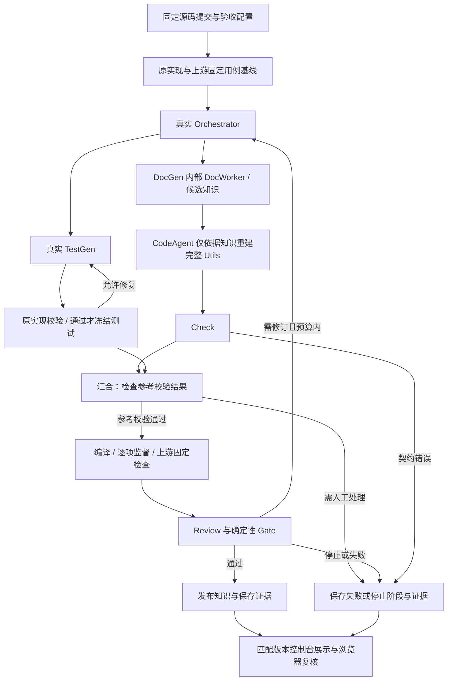

<!--
Copyright (c) 2026 linlisWorkTeam
SPDX-License-Identifier: MIT
文件功能：可信项目评测执行设计。
-->
# 可信项目评测执行设计

代码位置：[ModuleCaseExecutor.ts](../../../../src/infrastructure/evaluation/project/ModuleCaseExecutor.ts)、[TrustedProjectEvaluator.ts](../../../../src/infrastructure/evaluation/project/TrustedProjectEvaluator.ts)、[CaseRunner.ts](../../../../src/infrastructure/evaluation/project/CaseRunner.ts)、[NativeCaseSupervisor.c](../../../../src/infrastructure/evaluation/project/NativeCaseSupervisor.c)、[TestExecutionPlan.ts](../../../../src/domain/agents/testGenAgent/TestExecutionPlan.ts)、[ProjectScenario.ts](../../../../src/application/services/ProjectScenario.ts)。

## 输入、构建与替换

TrustedProjectEvaluator 接受固定源码快照、generatedFiles、prepareCommands、commands，以及自动飞轮提供的 testSuite 和重建范围 replaceSourcePaths。参考校验和生成评测使用独立副本；生成文件在 Application 通过白名单校验，执行器继续拒绝越界路径、符号链接和缺失重建文件。重建前删除目标原实现，再写入候选，不能用漏生成的原实现补齐测试。原项目工作树不变。

## Linux 独立模块门禁

TypeScript 独立模块使用 `moduleSuite` 分支及 `module-cases-v1` 数据契约。每个案例只有唯一编号、说明、公开函数参数和 JSON 预期值。Application 在角色生成之前冻结固定门禁；TestGen 候选必须先在固定提交的参考模块全案验证，失败候选不得通过删案、改预期或执行候选脚本晋升。候选只追加评测，不能替换固定门禁。

`inspect` 通过 `git show <commit>:<path>` 读取授权源码与公开接口，分别保存内容工件和摘要清单。参考评测再次验证源码与清单摘要。生成评测要求恰好一份同路径实现，仅写入该实现，不复制参考仓库、其他源码或测试。参考工作树保持只读。

构建进程只读挂载待测模块、公开签名、受信编译配置和随包 TypeScript 工具目录，只有专门的构建输出目录可写。编译采用 strict、noEmitOnError、erasableSyntaxOnly 和公开签名赋值检查，拒绝类型忽略指令。运行进程只挂载编译后的 JS 与固定执行器，无参考源码、编译器和预期值。静态及动态模块导入均拒绝。

安装启动器设置 `WP_BUNDLED_LIB_DIR` 为当前 Node 的同级 tools/lib；验证器拒绝任意目录、子目录、非动态库文件或符号链接。宿主 Git/prlimit 只接收此专用库路径；评测和 DSH 隔离空间只读映射至 `/runtime-libs` 并显式设置 `LD_LIBRARY_PATH`，不依赖宿主预装对应运行库，也不扩大应用或用户目录的可见范围。

每个案例使用独立 `bwrap --unshare-all` 进程，文件只读、网络隔离、能力全部移除，环境不继承凭据；Node permission 进一步限制文件与子进程能力。执行器将模块放入独立 JS 上下文，避免模块修改宿主的序列化函数。JS 上下文不作为唯一安全边界，仍由内核隔离包围。案例的实际 JSON 值交回宿主，用深相等比较预期值；不读取 TAP、退出码自报计数或 Agent 自评作为通过依据。

每套案例串行重复 5 次，首个失败停止后续执行，未执行案例保留在总数中。任意构建或案例失败均不能 PASS。单个运行进程最大堆 64 MiB、虚拟地址空间 1 GiB、输出 128 KiB、墙钟 5 秒；编译进程 GOMAXPROCS=1、GOMEMLIMIT=128MiB、地址空间 2 GiB、墙钟 30 秒。所有飞轮的模块评测与模型请求共享同一个外部重进程槽，排队期间也响应取消与整次预算。取消、超时及输出超限杀死进程组，PID 命名空间销毁全部后代；隔离组件或内核能力不可用时失败关闭，禁止退回无隔离运行。

证据使用 `module-evaluation-v1`，记录源码/案例/工具/执行器摘要、每案每次实际值、预期值、错误、构建结果和执行次数。原始候选脚本仅供阅读复现，不进入可信执行路径。旧命令场景仍为受信项目兼容模式，不作为本版独立模块隔离验收证据。执行器返回事实，EvalRunnerDomainService 决定门禁。

## 原生测试源码门禁

通用命令工具白名单包含 node、pnpm、cargo、gcc、g++、binary；自动 C/C++ 测试集合必须绑定可解析的 gcc/g++ 编译链接与后续 binary test 命令。每个测试翻译单元恰好属于一个原生构建，编译参数显式包含测试源文件与唯一 -o 输出；每个构建须有对应运行命令。独立脚本或不明确的构建关系以 TEST_BUILD_CONFIGURATION_INVALID 返回配置失败，不能回退为猜测测试命令。

绑定时分别相对于每条命令的 cwd 规范化源文件、编译输出和执行路径，允许根内 `.`/`..`，拒绝逃逸；实际执行还拒绝 cwd/可执行路径的符号链接。未指定 cwd 时使用副本根目录；原项目宏、头文件目录、链接和运行参数保留，框架仅追加 runner 源码。命令通过 argv 执行。

## 外部逐用例监督

testSuite 使用 `native-cases-v2-supervised` 协议，含 files 与 cases，caseId 和 entryPoint 均唯一。生成源码提供 `int entryPoint(void)`，不定义 main。CaseRunner 生成按外部索引选择一个入口的 main；每个用例分别启动独立进程，不支持跨用例全局状态。

受信父监督器由独立 gcc 命令编译，不混入项目编译参数。Linux x86_64 下用 nm 获取入口符号，ptrace 观察实际入口及返回地址并读取 int 返回值。被测子进程关闭结果 FD 3；监督器通过该独立通道返回 entered、returned、value 和 reason。被测 stdout/stderr 只作日志；读取 runner、伪造 nonce/TAP/成功总数或 exit(0) 都不能冒充正常返回。

父进程在 syscall 执行前检查 ABI 与许可范围，拒绝写文件、写结果通道、派生/替换进程、ptrace、修改其他进程及未知 syscall；只允许向被测进程自身发信号，保证 assert/abort 是普通测试失败，同时阻止杀死监督器。平台、gcc/nm、入口符号或 ptrace / PTRACE_GET_SYSCALL_INFO 不可用均失败，不退回 stdout 协议。

普通返回非零、断言或提前退出会失败，但继续调度其他清单入口。每个 binary 命令的 timeoutMs 和 maxOutputBytes 由该命令所有用例共享；超限不能通过，后续记录调度及未完成情况。命令 repetitions 逐次记录，附加命令的成功计数不能抵消固定清单缺项。

## 结果、失败与可信边界

评测保存每条命令退出码、耗时、超时、输出限制和日志，以及每个 case 的监督事实、commandIndex、attempt 和监督进程记录。绑定构建的 testsPassed/testsTotal 来自逐项监督结果；监督进程 exitCode=0 只代表传输完成，还必须 returned=true 且 value=0 才算该用例 PASS。未携带 testSuite 的旧通用执行路径仍支持输出解析，其结果不等同于当前自动飞轮的逐入口证明。

证据绑定源码清单、测试/生成文件摘要、runner 与监督工具指纹，并检查生成文件未被改写。prepare 失败、超时、输出超限、监督缺失或拒绝操作归为基础设施/配置故障，Application 停止并交人工；首次候选的编译、普通返回或断言失败可由 TestGen 有限修复。固定集合复用失败不自动改写测试。执行器只返回事实，Domain Gate 决定发布，详见 [TestGen](../../domainFunction/agents/testGenAgent/TestGenAgent.md) 和 [Workflow](../../domainFunction/workflow/Workflow.md)。

参考源码、构建配置和工具链仍是受信输入。监督器约束生成原生程序的逐入口执行与结果通道，不证明断言充分、参考业务正确，也不提供完整文件读取隔离、通用敌对项目沙箱或 LanguagePlugin。

## 验收

### 2026-09-11 cJSON Utils 真实模型端到端验收

本节是本次手动验收计划，不新增永久 CI。用户已确认使用真实模型分析有代表性的开源模块，并要求先记录计划再执行。执行结果追加到 [Agent 验收报告](../../../reports/AgentSpecRepairAndE2E.md)，计划不等于通过证据。

#### 固定范围与运行配置

- 执行基线：domain-knowledge `7a9b3bb`，`contract-v8` / `domain-agents-v8-supervised-routing`；最终记录实际运行提交和工作区差异。
- 上游：<https://github.com/DaveGamble/cJSON>，`v1.7.19` / `c859b25da02955fef659d658b8f324b5cde87be3`。保留许可证及原始 Git 身份；目标 `cJSON_Utils.c` 为 1481 行，`cJSON_Utils.h` 为 88 行、14 个公开声明。
- 完整重建 `cJSON_Utils.c`；`cJSON_Utils.h`、`cJSON.h` 和 `cJSON.c` 作为固定接口及基础依赖，不允许生成结果修改。重建评测删除原目标实现后写入模型输出。
- 行为范围：JSON Pointer、JSON Patch 的生成和应用、Merge Patch 的生成和应用、大小写选项、排序、路径反查、所有权和错误后的对象状态。无网络服务、文件持久化或多线程业务验收。
- 模型：复用已有加密提供方配置中的 `deepseek-v4-flash`，经真实 HTTPS 上游、DSH SDK 和生产角色入口调用；启动前重新验证连接。禁止 fixture、预设角色回答或修改评分来通过。
- 一次完整运行，最多 3 轮（含首轮），从 workflow.start 后计时 30 分钟；单角色超时 10 分钟，Schema 最多 2 次，TestGen 修复最多 1 次，DocWorker 数量 1，串行构建。配置/基础设施错误保留证据后停止；任何另起批次须记录原因，不能把前次失败覆盖。
- 启动记录：首批 `028d17d6-8543-4c3a-910b-dbfabc21831c` 在 Orchestrator 正式请求收到 OpenCode Go `MissingSessionID` 后停止；模型目录探测成功不等于推理成功。补齐官方要求的会话/客户端头并完成适配回归后，允许一个替代批次继续本次验收，保留首批所有记录。传输指纹变化，禁止复用原失败批次的冻结配置。
- 第二批 `70522e65-8242-4dd5-817d-784df94538b9` 的真实 TestGen 返回40项用例，但 sourceEvidence 全部使用 `文件:函数` 而不是契约规定的精确文件路径，校验失败。保留原输出；在 promptAddon 澄清既有字段格式后进行第三批，仍由模型重新生成，不手工修改其答案，不放宽校验。
- 第三批排查并发节点发现，执行者将 moduleId 填成带点的 `cjson-utils-v1.7.19`，违反 DocGen 已有 ID 规则，第二、三批 DocGen 均在调用模型前失败。这是本次场景配置错误，不是模型理解失败。修正为 `cjson-utils-v1-7-19` 并加入启动前 ID 检查后，执行第四个且最后一个批次；保留前三批，不将配置错误批次计为完成业务验收。每批的三轮/30分钟边界不变。
- 使用新的独立 runtime 和保留评测目录；密钥只进入加密配置及进程内存，不进入场景、报告、日志或公开工件。运行目录由会话实际创建并记录，不复用线上 MVP 数据库。

#### 文档、测试依据与材料边界

配套文档为上游 README、两个公开头文件，以及 RFC 6901、6902、7396。固定版本行为和标准要求分开记录：例如 ApplyPatches 失败不保证原子回滚、生成补丁可能排序输入对象；遇到差异不得悄悄改源码或测试预期。

知识生成角色读取目标实现和公开接口；必须产出含全部目标 API、参数/返回值、所有权、副作用、错误处理、边界及源码引用的单份知识文档。CodeAgent 只读取知识及裁剪后的编写配置，不能读取原目标源码或固定验收答案。基础库接口须在知识中说明，固定头文件由编译器使用。Check/Review 按既有授权获得源码和评测证据。

TestGen 真实生成独立测试候选，在原实现通过并固定后，每轮原样复用。测试提供 `int entryPoint(void)`、唯一用例标识，不定义 main；编译显式使用 gcc、C99、固定基础库和 `tests/generated.c`。禁止将原实现复制进测试、模拟目标函数或用测试输出摘要代替逐项执行。

上游固定测试包括 `json_patch_tests.c`、`old_utils_tests.c`、`misc_utils_tests.c` 以及随仓库提供的 JSON 数据。三个 JSON 文件共 121 条记录，其中 4 条原始禁用；必须分开记录启用、禁用、实际执行和通过数量，不将三个 Unity 分组当成全部逐项用例。保留上游断言及数据，在原实现和重建实现上执行；作为附加 check 命令的任何非零退出均阻止评测通过。这些上游进程退出码不是 native-cases-v2 的逐项监督证明，两类证据分开报告。

补充复核覆盖：空指针/空路径、嵌套对象和数组、`~0`/`~1` 转义、非法及越界下标、数组追加、六种 Patch 操作、操作顺序与失败后状态、Merge Patch 的 null 删除和数组替换、大小写、生成补丁后回放一致性。依据应来自固定文档和上游预期；不能只依赖模型自行生成的断言。先建立原实现基线，基线失败单独记录，不能归因于模型重建。

执行后依据实际拓扑校正上图：Code/Check 与参考测试分支在 evaluation 汇合，参考失败不代表 Code 从未启动。第四批最终结果为 FAILED / CHECK_EVIDENCE_INVALID，生成测试参考校验两次均 48/49，重建独立编译失败，没有发布；完整记录见上述验收报告。

#### 通过标准与前台展示

| 编号 | 本次判定 |
| --- | --- |
| CJSON-REAL-01 | 真实提供方调用有角色、模型、时间、状态记录；无模拟回答；用量未知明确标 null |
| CJSON-REAL-02 | 冻结源码与依赖摘要不变，完整替换目标实现；CodeAgent 无原实现/固定答案读取权限 |
| CJSON-REAL-03 | 14 个公开接口的文档覆盖可逐项核对；关键副作用与所有权有依据；缺项算未完成 |
| CJSON-REAL-04 | 原实现基线通过；生成测试按 native-cases-v2-supervised 逐项执行；重建实现通过固定上游检查和补充复核 |
| CJSON-REAL-05 | Gate PASS 才发布，数据库版本、发布正文、证据摘要一致；失败不能手动改为 VERIFIED |
| CJSON-REAL-06 | 控制台能打开本次 run、节点、评测、知识和产物；显示真实模型及结果；公开页面不暴露配置密钥 |

整体验收 PASS 需要全部标准通过；仅 workflow Gate PASS 不能代替文档覆盖及展示复核。首轮通过则如实记修订路径 NOT_EXERCISED；不注入预设错误冒充真实模型自然修订。超时、提供方额度/认证失败或角色失败记录实际状态，不循环重试到通过。

当前在线副本使用旧协议，先启动与本次执行提交匹配的独立控制台并提供独立验收地址，保留原 MVP 地址与数据。不得直接将 v8 数据交给旧运行程序。切换原公共地址或合并历史数据留作独立部署动作。

保留输入清单、Git 提交、脱敏配置、各角色原始工件、每轮知识/代码/评测、监督事实、固定测试日志、事件、CAS 摘要和浏览器证据。临时编译产物在证据固定后可清理；最终报告区分参考基线、真实模型运行、业务复核、浏览器展示各自状态。

TestEntryContract、TestBuildBinding、TestCaseExecution、NativeCaseSupervisor 集成测试覆盖入口/头文件、cwd、多文件 C/C++、伪协议、提前退出、断言、超时、缺符号及内核拒绝 ptrace；AgentRevisionFlow 验收真实 SDK 两轮修订及一次发布。版本及保留产物见 [报告](../../../reports/AgentSpecRepairAndE2E.md)；受控模型不代表真实模型质量验收。

文档关系：[设计目录](../../README.md)负责代码与设计定位；[开发指南](../../../Development.md)说明修改和交付步骤。

## 原生工具链隔离边界

现有ModuleCaseExecutor的captureIsolated已抽取到runtime/IsolatedCommand供TypeScript与C/C++共用，保持旧TS调用的参数及报告。原生调用额外要求独立cgroup v2，设置memory.max、memory.swap.max=0、pids.max和memory.oom.group；受信Node启动器先将自身加入组，再execve资源限制器和Bubblewrap，消除启动后迁入的fork竞态。输入源码只读挂载，构建输出独立可写；网络与PID命名空间隔离。退出、取消、超时、输出超限都清理整个资源组，确认没有进程后才返回。缺控制器/权限/工具时失败关闭，不修改宿主控制器配置或降级为宿主编译。

NativeToolchain通过NativeLanguageToolchain端口支持C/C++源码文件的隔离编译/运行与Clang声明投影。只使用现有gcc、g++、clang、clang++；不执行仓库Makefile或自动下载依赖。构建返回原始报告，失败不执行。原始stdout不是可信用例数、相似度或发布门禁。C/C++候选测试协议、测试晋升/缓存、模型重建和阶段应用接线仍未实现。

publicInterface输入明确入口和符号选择，可用astFilter限制类范围。Clang AST只保留函数类型/参数、公开字段/成员、typedef和枚举值，不输出函数体、注释、源码范围或私有成员；重载保留，重复声明合并。过滤器保留在native-interface-v1材料中，避免丢失类的选择上下文。这是声明投影，不宣称完整C++语义或AST结构相似度已实现；自动模块/依赖划分及构建配置解析仍待完成。

原生任务先检查可用内存至少576MiB、磁盘至少32MiB。源码单文件1MiB、总8MiB；编译整组内存512MiB、进程32、墙钟30秒，运行128MiB、进程16、墙钟3秒。Clang AST输出最多8MiB，其余128KiB。文件大小、CPU、描述符及取消边界由共享执行器执行。参考与生成源码必须使用不同调用和独立临时目录；最终源码/失败证据由应用层存CAS，临时构建退出后清理。

固定jsmn四种配置均已执行上游参考测试，TinyXML2已执行三个基本类型转换参考观察；记录位于workbench-progress/native-toolchain。这些不是模型Run或发布门禁，不据此把待验证候选测试晋升为可信测试。

原生行为执行器（接入中）仅生成受信harness，不执行模型测试源码；模型提供的数据经Domain校验后才能插入固定语法位置。所有变量名、类型、函数名、字段和头文件路径受白名单约束，字符串按字节转义。expected从不写入构建目录或程序参数。每次参考/生成构建使用NativeToolchain独立目录，保留资源隔离、超时与整进程树取消；stdout只能携带逐字段观察，不接受自报通过数。编译或协议失败不能被相似度覆盖。

原生行为harness强制AddressSanitizer与UndefinedBehaviorSanitizer，并在首个错误停止，以拒绝参考端越界或未定义行为的候选。ASan需要巨大虚拟影子地址，原生案例运行显式允许128TiB虚拟地址空间，但128MiB真实内存和16进程仍由强制cgroup控制；只有存在该资源组时才能使用虚拟地址覆盖。普通原生调用与TypeScript原有RLIMIT_AS不变。关闭LeakSanitizer（这里检查行为/越界，不用泄漏判定知识），不移除地址/UB检查；编译、超时、输出与namespace边界保持。

虚拟地址限制依据[Clang AddressSanitizer官方限制说明](https://clang.llvm.org/docs/AddressSanitizer.html#limitations)：64位ASan映射超过16TB影子地址，普通ulimit语义不能代替真实内存限制。这里的隔离仍由namespace和cgroup承担，sanitizer只是测试中的缺陷检测器。

原生 Code 重建材料以选定 declarations 和卡片限定功能范围，文件路径白名单只限定位置，不要求整库复制。TinyXML2 真实首轮 Code 因扩展为整库而输出截断；增加明确的所选模块边界，仍保留原接口和行为门禁。

TinyXML2 含 sanitizer 的参考构建实测超过原 1MiB 单文件限制。编译阶段单文件上限调整为 16MiB，只有声明 buildOutput 且启用进程组资源限制的受信调用才能使用；执行阶段仍为 1MiB。内存512MiB、单进程编译、30秒及隔离不变，临时文件总量仍受内存cgroup约束。引擎摘要随之变化，旧工具链任务只能读，不能跨摘要恢复；需按新摘要重建和重新验证可信测试。

生成接口编译失败的恢复：Domain NativeCodeRepair只将非超时、非输出超限、退出码1且无已知资源错误的编译诊断判为可修复代码。Application保存原生成文件和诊断为code-rejection检查点，同阶段按拒绝序号启动新Code候选，累计预算保持。Code仅获取自身旧代码和编译诊断；资源中断仍复用原候选，不改知识或可信测试。旧progress诊断须校验CAS并绑定原Code检查点后才能迁移为拒绝记录，原审计不改写。

SQLite NativeTestStore按稳定卡片集合读取全部历史TRUSTED记录（含旧无gateDigest记录），不回写旧记录。Application验证每套旧CAS与oracle后，由Domain构建不可变门禁并集；新cacheKey绑定gateDigest，referenceKey仍用于当前参考分支的事务父链。新记录携带inheritedTestSetIds。NativeTrustedGates代码加入工具链执行器指纹，旧阶段不能跨此执行语义恢复。

## 固定原生参考验收

`RunNativeFixedCases.ts` 读取 Targets.json 冻结的提交、源码摘要与声明式固定用例摘要，使用已有 NativeToolchain / NativeCaseExecutor 隔离执行。jsmn 默认 C11 配置的固定观察覆盖初始化、token 类型/起止/大小、字符串结束引号、嵌套容器与错误码；TinyXML2 限定 XMLUtil 转换、各 ToStr 重载和布尔序列化。固定用例为人工冻结的行为输入与预期，不能根据生成实现结果修改预期。参考失败保留原观察并拒绝整套验收，不晋升为可信测试。

该脚本从 Git 固定对象读取材料，不执行工作区 Makefile；原生端只输出逐字段观察，expected 留在宿主比较。报告绑定源码、用例、工具链指纹和实际逐案构建/执行，取消传播至整个隔离进程树。REFERENCE_VALIDATED 仅表示这套固定用例在该参考版本通过，不表示生成实现、知识正文或发布通过。当前工作台最终发布事务尚未消费本报告；Targets.json 的待验证状态不由脚本静默改写。jsmn 四个上游构建配置的既有参考观察单独保留，不能用默认配置的11案覆盖宣称全部配置验收。

## 多语言案例执行边界

C/C++ 原生案例和既有 TypeScript 模块案例通过同一个 LanguageCaseToolchain 端口分派到现有执行器。输入按语言区分，保留各自公开接口、测试材料和隔离约束；返回统一语言/通过数/总数包络以及原始类型化报告。TypeScript 保持五次串行重复与原始证据，原生保持 sanitizer、可信观察协议和逐案报告。共享分派不授予发布资格，不把不支持的语言映射到默认执行器。源码分析和公开接口适配仍是各语言的独立能力，本次共用的是案例执行边界。

共用分派器正文加入原生与TypeScript工具链摘要。改变执行边界后重新验证缓存，不跨旧摘要恢复构建；正在进行的只读来源复核仍使用其冻结的既有执行证据。

固定参考验收本次实际通过jsmn 11/11、XMLUtil 40/40；核对报告后在Targets.fixedSuite记录REFERENCE_VALIDATED和报告/工具链摘要。原trustedSuiteStatus保留，固定参考成功不等于候选测试自动晋升或生成实现通过。

固定验收脚本可绑定成功重建任务执行生成代码：必须同时提供runtime与reconstruction-task，校验冻结项目提交/源码摘要/默认构建配置、模块及卡片版本、Code CAS和当前公开接口。参考分支先通过，才用相同冻结用例执行生成分支；生成分支不挂载参考实现。报告记录任务/inputDigest/Code摘要/知识正文摘要，失败保留真实逐案观察；FIXED_GENERATED_VALIDATED仍非来源匹配或发布授权。此验收入口只读取既有重建任务，不调用模型，不修改可信预期或正文。

moduleSuite 与原生 testSuite 是互斥执行模式；同时传入时以 PROJECT_EVALUATION_MODE_INVALID 拒绝，不能静默忽略其中一套门禁。
