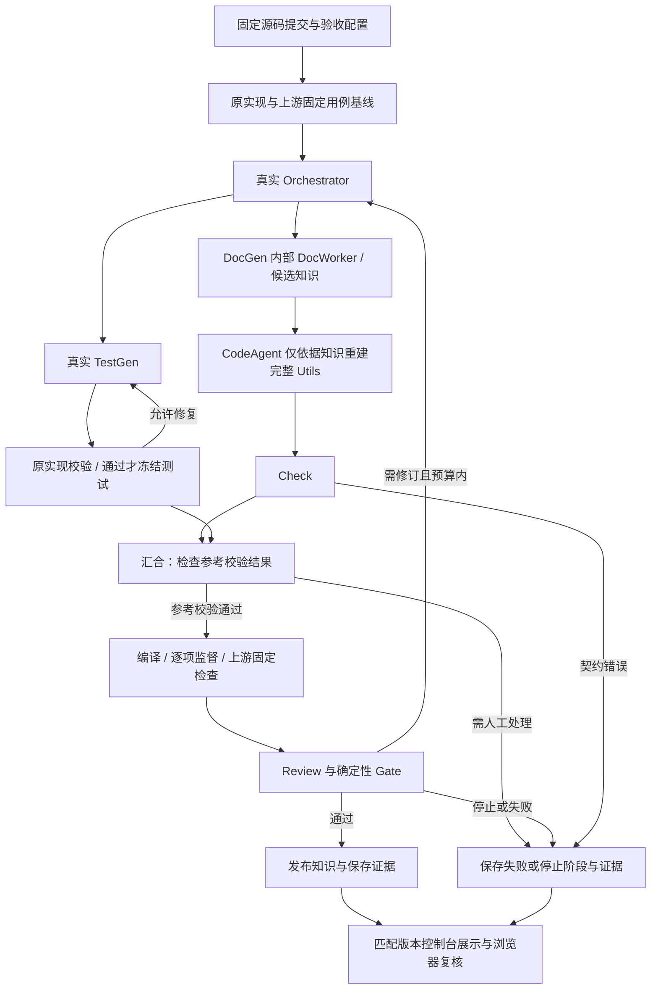

<!--
Copyright (c) 2026 linlisWorkTeam
SPDX-License-Identifier: MIT
文件功能：可信项目评测执行设计。
-->
# 可信项目评测执行设计

代码位置：[TrustedProjectEvaluator.ts](../../../../src/infrastructure/evaluation/project/TrustedProjectEvaluator.ts)、[CaseRunner.ts](../../../../src/infrastructure/evaluation/project/CaseRunner.ts)、[NativeCaseSupervisor.c](../../../../src/infrastructure/evaluation/project/NativeCaseSupervisor.c)、[TestExecutionPlan.ts](../../../../src/domain/agents/testGenAgent/TestExecutionPlan.ts)、[ProjectScenario.ts](../../../../src/application/services/ProjectScenario.ts)。

## 输入、构建与替换

TrustedProjectEvaluator 接受固定源码快照、generatedFiles、prepareCommands、commands，以及自动飞轮提供的 testSuite 和重建范围 replaceSourcePaths。参考校验和生成评测使用独立副本；生成文件在 Application 通过白名单校验，执行器继续拒绝越界路径、符号链接和缺失重建文件。重建前删除目标原实现，再写入候选，不能用漏生成的原实现补齐测试。原项目工作树不变。

通用命令工具白名单包含 node、pnpm、cargo、gcc、g++、binary；自动 C/C++ 测试集合必须绑定可解析的 gcc/g++ 编译链接与后续 binary test 命令。每个测试翻译单元恰好属于一个原生构建，编译参数显式包含测试源文件与唯一 -o 输出；每个构建须有对应运行命令。独立脚本或不明确的构建关系以 TEST_BUILD_CONFIGURATION_INVALID 返回配置失败，不能回退为猜测测试命令。

绑定时分别相对于每条命令的 cwd 规范化源文件、编译输出和执行路径，允许根内 `.`/`..`，拒绝逃逸；实际执行还拒绝 cwd/可执行路径的符号链接。未指定 cwd 时使用副本根目录；原项目宏、头文件目录、链接和运行参数保留，框架仅追加 runner 源码。命令通过 argv 执行。

## 外部逐用例监督

testSuite 使用 `native-cases-v2-supervised` 协议，含 files 与 cases，caseId 和 entryPoint 均唯一。生成源码提供 `int entryPoint(void)`，不定义 main。CaseRunner 生成按外部索引选择一个入口的 main；每个用例分别启动独立进程，不支持跨用例全局状态。

受信父监督器由独立 gcc 命令编译，不混入项目编译参数。Linux x86_64 下用 nm 获取入口符号，ptrace 观察实际入口及返回地址并读取 int 返回值。被测子进程关闭结果 FD 3；监督器通过该独立通道返回 entered、returned、value 和 reason。被测 stdout/stderr 只作日志；读取 runner、伪造 nonce/TAP/成功总数或 exit(0) 都不能冒充正常返回。

父进程在 syscall 执行前检查 ABI 与许可范围，拒绝写文件、写结果通道、派生/替换进程、ptrace、修改其他进程及未知 syscall；只允许向被测进程自身发信号，保证 assert/abort 是普通测试失败，同时阻止杀死监督器。平台、gcc/nm、入口符号或 ptrace / PTRACE_GET_SYSCALL_INFO 不可用均失败，不退回 stdout 协议。

普通返回非零、断言或提前退出会失败，但继续调度其他清单入口。每个 binary 命令的 timeoutMs 和 maxOutputBytes 由该命令所有用例共享；超限不能通过，后续记录调度及未完成情况。命令 repetitions 逐次记录，附加命令的成功计数不能抵消固定清单缺项。

## 结果、失败与可信边界

评测保存每条命令退出码、耗时、超时、输出限制和日志，以及每个 case 的监督事实、commandIndex、attempt 和监督进程记录。绑定构建的 testsPassed/testsTotal 来自逐项监督结果；监督进程 exitCode=0 只代表传输完成，还必须 returned=true 且 value=0 才算该用例 PASS。未携带 testSuite 的旧通用执行路径仍支持输出解析，其结果不等同于当前自动飞轮的逐入口证明。

证据绑定源码清单、测试/生成文件摘要、runner 与监督工具指纹，并检查生成文件未被改写。prepare 失败、超时、输出超限、监督缺失或拒绝操作归为基础设施/配置故障，Application 停止并交人工；首次候选的编译、普通返回或断言失败可由 TestGen 有限修复。固定集合复用失败不自动改写测试。执行器只返回事实，Domain Gate 决定发布，详见 [TestGen](../../domainFunction/agents/testGenAgent/TestGenAgent.md) 和 [Workflow](../../domainFunction/workflow/Workflow.md)。

参考源码、构建配置和工具链仍是受信输入。监督器约束生成原生程序的逐入口执行与结果通道，不证明断言充分、参考业务正确，也不提供完整文件读取隔离、通用敌对项目沙箱或 LanguagePlugin。

## 验收

### 2026-09-11 cJSON Utils 真实模型端到端验收

本节是本次手动验收计划，不新增永久 CI。用户已确认使用真实模型分析有代表性的开源模块，并要求先记录计划再执行。执行结果追加到 [Agent 验收报告](../../../reports/AgentSpecRepairAndE2E.md)，计划不等于通过证据。

#### 2026-09-14 v12 分批 TestGen 修复后再次完整验收

用户在完成 Worker 分配范围与 TestGen 分批/推理传输审计修复后明确要求“重新跑完cJSON验收”，授权本次新的完整批次。基线为 `099ce794e92202dc006af5df2b631bba9233c720`，包含最新 origin/main `22fe34fdf1ee9e37c08d0bd17a03b2c7e4103cf0` 与两项本地修复；修复尚未合并。本次独立工作树 `/tmp/domain-knowledge-cjson-v12`，分支 `test/cjson-utils-v12-real-e2e`，执行协议 `domain-agents-v12-testgen-batches` / `contract-v12`。启动前提交本节计划，实际执行 HEAD 记录在 Execution.json；不覆盖历史工作树或 runtime。

新证据目录 `/root/projects/domain-knowledge/.workpanel/acceptance/2026-09-14-cjson-v12-real/`。新 Run.mjs 使用当前入口，TestGen 提示遵守计划/批次 Schema，每批最多四项；不沿用旧原子输出要求。229 个源码摘要、1481 行完整目标与独立补充用例先核对，再重跑原实现基线。固定版本实际行为为依据，RFC 差异单列，保留转义路径覆盖；新测试由真实模型重新生成，不导入任何旧候选通过状态、知识或 Check 结果。

预算仍是一个新 Run、含首轮最多三轮、workflow.start 起 30 分钟、各角色/节点总计 10 分钟（DocGen 包含 Worker，TestGen 包含所有批次）、DocWorker=1、构建串行、TestGen 最多一次修复。真实 deepseek-v4-flash、生产角色、DSH SDK/Bubblewrap、thinking=disabled；maxTokens=32768，contextWindow=128000。Check 最多三个报告尝试，每次 outputAttempts=1，无底层叠加重试；其他角色最多两次 Schema 尝试。600 秒由角色/图负责取消，入口 605 秒只作取消清理失效的补充 watchdog，不给模型额外生成预算。新增 reasoningTransport 审计记录实际参数与响应计数，不能依据小型探针的结果假定长任务关闭推理一定生效。

新匹配版本只读前台使用 127.0.0.1:4313、新 SQLite/CAS 和独立临时隧道，实际浏览器核对当前 Run、节点、候选正文、通过/未通过标记。按原完整验收标准观察 Check、参考校验、真实重建编译/行为评测、Review 修订与 Gate；失败保存原始输出、逐项诊断、事件和 CAS 摘要，不手工修改模型代码，不循环新建 Run。结果补充到原报告。

本次 v12 执行已结束：Run `41b1eec9-7ead-400c-9254-f028fa48c33f`，HEAD `00214c6845a2b792452113e28373a2a453ef84a7`，737.113 秒 FAILED。Worker/DocGen 成功，43 项测试计划及前 6 批（24 个用例槽位）保存，第 7 批 SDK 初始化未发请求即超时；Code 实际请求 thinking=disabled，却收到 133511 字符推理、0 字符正文，600 秒节点超时。没有完整测试参考校验、重建编译、Check/Review/Gate 或发布；候选知识保持 CANDIDATE，未执行恢复或另开 Run。详细用量、真实请求证据及前台剩余状态不一致见原报告最新节。

#### 2026-09-14 修复后新一次完整验收

本批由用户重新授权，不受上次“第四个最后批次”的结束约定限制。GitHub 已核对 PR #49 合并于 `22fe34fdf1ee9e37c08d0bd17a03b2c7e4103cf0`，分支最终修复 `0b6a0d51fec2bbe76e581c4602659ddb82fa6b26`。从当前 origin/main 创建 `test/cjson-utils-v10-real-e2e` / `/tmp/domain-knowledge-cjson-v10`；执行源码为该合并提交，启动前只更新本计划和报告，最终记录实际 HEAD。契约为 `domain-agents-v10-check-evidence-guards` / `contract-v10`。

测试依据采用用户本次明确的“重建固定版本行为”：cJSON v1.7.19 实际实现是参考依据，RFC 符合性单独说明。转义 Patch 路径必须保留覆盖，由 TestGen 根据冻结源码推导预期；不得修改旧失败项、删除失败项或修改原实现。Code 不获得原实现、旧重建、独立用例和固定预期，只获得本次知识和编写配置；知识不得整份复制实现。Review 只读知识、Check 和评测证据，不额外读取原仓库。

新目录为 `/root/projects/domain-knowledge/.workpanel/acceptance/2026-09-14-cjson-v10-real/`，独立 `Run.mjs` 导入新工作树，使用全新 runtime/SQLite/CAS。从旧固定源码本地 clone，核对 HEAD、全部 229 个受控文件 SHA-256 及 1481 行目标；独立补充用例和上游基线重新执行。旧候选测试通过状态、v8 checkpoint 和 v9 独立 Check 结果均不导入。

预算为一次新 Run、最多 3 个业务轮次（含首轮）、从 workflow.start 调用起 30 分钟、单角色 10 分钟、DocWorker=1、构建串行、TestGen 最多一次修复；Check 首次输出后最多两次报告修正，共三次，outputAttempts=1 且 SDK 网络重试为零。其他角色沿用最多两次 Schema 尝试。SDK 超时按尝试计算，LangGraph 的 Graph.ts 另有原生节点 timeout=600000；验收入口还按 RUNNING 角色 checkpoint 累计时间监控，达到 10 分钟取消整次 Run，不叠加预算。DocGen 节点计时包含内部 Worker。本批最终由原生 TestGen 节点超时结束，外层补充 watchdog 没有触发。maxTokens=32768、contextWindow=128000，真实 deepseek-v4-flash，经配置提供方、生产角色入口和 DSH SDK/Bubblewrap；不使用 fixture 或预设回答。

Node 24.13.0 独立 bootstrap 已达到 READY，启动前再次检查。先保存原实现上游、独立 18 项和转义路径复现基线，再验证提供方连接并启动；通过事件和 checkpoint 观察实际 Check、评测、Review、Gate，未到达的阶段明确标注。任何失败先保存原始回答、编译日志、逐项结果、节点事件和摘要，不手工修补模型代码，不自动新开批次。旧 4311 服务保留，本批匹配版本只读前台使用 127.0.0.1:4312 和独立 tunnel；实际浏览器核对本批 Run、节点、知识正文与候选/发布标记。敏感 runtime 不上传，结果继续写入原报告。

本批已实际结束：Run `cb4a4f5a-d24f-47a1-87ca-37aba9a35786`，执行 HEAD `4f5c8cc7631cd6f0602a70927e0197a24adbabc7`（仅计划文档提交，生产源码与上述合并提交一致），北京时间 12:04:28—12:15:08，639.622 秒。DocWorker 覆盖声明校验失败，并行 TestGen 触及 10 分钟超时；最终 FAILED，未形成候选知识、测试冻结、重建、Check、Review 或 Gate。两个已完成回答用量 51773 tokens，TestGen 用量未知。前台最终 Run 失败可见，但 TestGen 节点残留 RUNNING，属于本次发现的状态收敛问题。详细证据及未解决项见原报告最新节，本次不追加新模型批次。

#### 固定范围与运行配置

- 执行基线：domain-knowledge `7a9b3bb`，`contract-v8` / `domain-agents-v8-supervised-routing`；最终记录实际运行提交和工作区差异。
- 上游：<https://github.com/DaveGamble/cJSON>，`v1.7.19` / `c859b25da02955fef659d658b8f324b5cde87be3`。保留许可证及原始 Git 身份；目标 `cJSON_Utils.c` 为 1481 行，`cJSON_Utils.h` 为 88 行、14 个公开声明。
- 完整重建 `cJSON_Utils.c`；`cJSON_Utils.h`、`cJSON.h` 和 `cJSON.c` 作为固定接口及基础依赖，不允许生成结果修改。重建评测删除原目标实现后写入模型输出。
- 行为范围：JSON Pointer、JSON Patch 的生成和应用、Merge Patch 的生成和应用、大小写选项、排序、路径反查、所有权和错误后的对象状态。无网络服务、文件持久化或多线程业务验收。
- 模型：复用已有加密提供方配置中的 `deepseek-v4-flash`，经真实 HTTPS 上游、DSH SDK 和生产角色入口调用；启动前重新验证连接。禁止 fixture、预设角色回答或修改评分来通过。
- 一次完整运行，最多 3 轮（含首轮），从 workflow.start 后计时 30 分钟；单角色超时 10 分钟，Schema 最多 2 次，TestGen 修复最多 1 次，DocWorker 数量 1，串行构建。配置/基础设施错误保留证据后停止；任何另起批次须记录原因，不能把前次失败覆盖。
- 启动记录：首批 `028d17d6-8543-4c3a-910b-dbfabc21831c` 在 Orchestrator 正式请求收到 OpenCode Go `MissingSessionID` 后停止；模型目录探测成功不等于推理成功。补齐官方要求的会话/客户端头并完成适配回归后，允许一个替代批次继续本次验收，保留首批所有记录。传输指纹变化，禁止复用原失败批次的冻结配置。
- 第二批 `70522e65-8242-4dd5-817d-784df94538b9` 的真实 TestGen 返回40项用例，但 sourceEvidence 全部使用 `文件:函数` 而不是契约规定的精确文件路径，校验失败。保留原输出；在 promptAddon 澄清既有字段格式后进行第三批，仍由模型重新生成，不手工修改其答案，不放宽校验。
- 第三批排查并发节点发现，执行者将 moduleId 填成带点的 `cjson-utils-v1.7.19`，违反 DocGen 已有 ID 规则，第二、三批 DocGen 均在调用模型前失败。这是本次场景配置错误，不是模型理解失败。修正为 `cjson-utils-v1-7-19` 并加入启动前 ID 检查后，执行第四个且最后一个批次；保留前三批，不将配置错误批次计为完成业务验收。每批的三轮/30分钟边界不变。
- 使用新的独立 runtime 和保留评测目录；密钥只进入加密配置及进程内存，不进入场景、报告、日志或公开工件。运行目录由会话实际创建并记录，不复用线上 MVP 数据库。

#### 文档、测试依据与材料边界

配套文档为上游 README、两个公开头文件，以及 RFC 6901、6902、7396。固定版本行为和标准要求分开记录：例如 ApplyPatches 失败不保证原子回滚、生成补丁可能排序输入对象；遇到差异不得悄悄改源码或测试预期。

知识生成角色读取目标实现和公开接口；必须产出含全部目标 API、参数/返回值、所有权、副作用、错误处理、边界及源码引用的单份知识文档。CodeAgent 只读取知识及裁剪后的编写配置，不能读取原目标源码或固定验收答案。基础库接口须在知识中说明，固定头文件由编译器使用。Check/Review 按既有授权获得源码和评测证据。

TestGen 真实生成独立测试候选，在原实现通过并固定后，每轮原样复用。测试提供 `int entryPoint(void)`、唯一用例标识，不定义 main；编译显式使用 gcc、C99、固定基础库和 `tests/generated.c`。禁止将原实现复制进测试、模拟目标函数或用测试输出摘要代替逐项执行。

上游固定测试包括 `json_patch_tests.c`、`old_utils_tests.c`、`misc_utils_tests.c` 以及随仓库提供的 JSON 数据。三个 JSON 文件共 121 条记录，其中 4 条原始禁用；必须分开记录启用、禁用、实际执行和通过数量，不将三个 Unity 分组当成全部逐项用例。保留上游断言及数据，在原实现和重建实现上执行；作为附加 check 命令的任何非零退出均阻止评测通过。这些上游进程退出码不是 native-cases-v2 的逐项监督证明，两类证据分开报告。

补充复核覆盖：空指针/空路径、嵌套对象和数组、`~0`/`~1` 转义、非法及越界下标、数组追加、六种 Patch 操作、操作顺序与失败后状态、Merge Patch 的 null 删除和数组替换、大小写、生成补丁后回放一致性。依据应来自固定文档和上游预期；不能只依赖模型自行生成的断言。先建立原实现基线，基线失败单独记录，不能归因于模型重建。

执行后依据实际拓扑校正上图：Code/Check 与参考测试分支在 evaluation 汇合，参考失败不代表 Code 从未启动。第四批最终结果为 FAILED / CHECK_EVIDENCE_INVALID，生成测试参考校验两次均 48/49，重建独立编译失败，没有发布；完整记录见上述验收报告。

#### 通过标准与前台展示

| 编号 | 本次判定 |
| --- | --- |
| CJSON-REAL-01 | 真实提供方调用有角色、模型、时间、状态记录；无模拟回答；用量未知明确标 null |
| CJSON-REAL-02 | 冻结源码与依赖摘要不变，完整替换目标实现；CodeAgent 无原实现/固定答案读取权限 |
| CJSON-REAL-03 | 14 个公开接口的文档覆盖可逐项核对；关键副作用与所有权有依据；缺项算未完成 |
| CJSON-REAL-04 | 原实现基线通过；生成测试按 native-cases-v2-supervised 逐项执行；重建实现通过固定上游检查和补充复核 |
| CJSON-REAL-05 | Gate PASS 才发布，数据库版本、发布正文、证据摘要一致；失败不能手动改为 VERIFIED |
| CJSON-REAL-06 | 控制台能打开本次 run、节点、评测、知识和产物；显示真实模型及结果；公开页面不暴露配置密钥 |

整体验收 PASS 需要全部标准通过；仅 workflow Gate PASS 不能代替文档覆盖及展示复核。首轮通过则如实记修订路径 NOT_EXERCISED；不注入预设错误冒充真实模型自然修订。超时、提供方额度/认证失败或角色失败记录实际状态，不循环重试到通过。

当前在线副本使用旧协议，先启动与本次执行提交匹配的独立控制台并提供独立验收地址，保留原 MVP 地址与数据。不得直接将 v8 数据交给旧运行程序。切换原公共地址或合并历史数据留作独立部署动作。

保留输入清单、Git 提交、脱敏配置、各角色原始工件、每轮知识/代码/评测、监督事实、固定测试日志、事件、CAS 摘要和浏览器证据。临时编译产物在证据固定后可清理；最终报告区分参考基线、真实模型运行、业务复核、浏览器展示各自状态。

TestEntryContract、TestBuildBinding、TestCaseExecution、NativeCaseSupervisor 集成测试覆盖入口/头文件、cwd、多文件 C/C++、伪协议、提前退出、断言、超时、缺符号及内核拒绝 ptrace；AgentRevisionFlow 验收真实 SDK 两轮修订及一次发布。版本及保留产物见 [报告](../../../reports/AgentSpecRepairAndE2E.md)；受控模型不代表真实模型质量验收。

文档关系：[设计目录](../../README.md)负责代码与设计定位；[开发指南](../../../Development.md)说明修改和交付步骤。

### 2026-09-14 TestGen 后续修复与小型传输诊断

v10 完整验收失败后，用户确认同时排查 reasoning 配置链路并改为 TestGen 分批生成/保存/最终验收。当前实现为 `domain-agents-v12-testgen-batches` / `contract-v12`，位于 `fix/testgen-batches-and-reasoning`，采用固定计划、每批最多四项、CAS/checkpoint 持久化；所有批次共享十分钟角色预算，原实现整体参考校验、一次修复和 Gate 发布规则不变。旧 v10 Run 和未冻结测试状态不改写。

为定位配置，仅追加一次独立真实传输诊断（60 秒、256 tokens、无重试），同一 `deepseek-v4-flash` 实际请求 thinking=disabled，3.722 秒返回简单 JSON，没有 reasoning_content，用量 490+5 tokens。本次没有重跑完整 cJSON、没有更新原前台数据来源，也不声称长任务异常已复现或解决。后续完整验收仍需明确新批次、独立 runtime 与预算。实现、受控分批恢复及真实诊断证据见[现有报告](../../../reports/AgentSpecRepairAndE2E.md#2026-09-14testgen-分批保存与-reasoning-链路诊断)。
