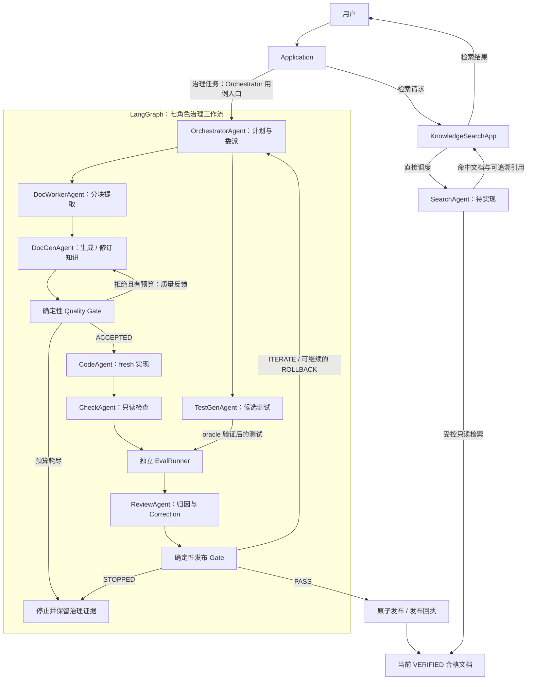

<!--
Copyright (c) 2026 linlisWorkTeam
SPDX-License-Identifier: MIT
文件功能：说明知识飞轮工作流。
-->
# 知识飞轮工作流

## Agent 治理与检索关系

下图表示目标职责与结果流向；治理子图内的调度、并行和迭代均由 LangGraph 执行，OrchestratorAgent 只产出计划。SearchAgent 是新增的独立角色（待实现），由 Application 直接调用，不加入治理子图。

图中的服务节点不增加 Agent 角色。检索不创建 FlywheelRun，不触发生成、评测、发布或恢复；候选质量通过并不足以进入检索范围，必须完成原子发布。完整检索边界见 [SearchAgent](../06-agents/search-agent.md)。

## 状态机

| 当前状态 | 事件/守卫 | 下一状态 | 副作用 |
|---|---|---|---|
| CREATED | 策略与输入 Schema 有效 | PLANNED | 固化源码快照和计划。 |
| PLANNED | 资源声明无冲突 | GENERATING | 并行启动 DocGen/DocWorker 与 TestGen。 |
| GENERATING | Quality Gate 拒绝候选且预算充足 | ITERATING | 跳过 CodeAgent，保存质量反馈。 |
| GENERATING | Quality Gate 拒绝候选且预算耗尽 | LOW_CONFIDENCE | 保存人工治理包。 |
| GENERATING | 知识、oracle、代码、检查 Artifact 齐备 | EVALUATING | 验证 oracle，隔离构建与重复测试。 |
| EVALUATING | 报告提交 | REVIEWING | 以全新只读上下文启动 Review。 |
| REVIEWING | Gate=`PASS` | PUBLISHING | 准备发布事务。 |
| REVIEWING | Gate=`ITERATE` 且预算充足 | ITERATING | 提交 Correction。 |
| REVIEWING | Gate=`ROLLBACK` | ROLLING_BACK | 选择 historical best。 |
| REVIEWING | Gate=`STOPPED` | LOW_CONFIDENCE | 生成人工治理包。 |
| ITERATING | 新知识 v+1 已提交 | GENERATING | fresh Code generation，禁止复用旧实现。 |
| ROLLING_BACK | best 恢复且预算充足 | GENERATING | 从 best 的后继轮重新生成。 |
| ROLLING_BACK | 无预算 | LOW_CONFIDENCE | 生成人工治理包。 |
| PUBLISHING | 原子发布成功 | VERIFIED | 记录发布事件。 |
| 任意非终态 | 不可恢复的业务/完整性错误 | FAILED | 保存诊断和最后 checkpoint。 |
| 任意非终态 | 用户取消 | CANCELLED | 传播取消，清理临时资源。 |

终态为 `VERIFIED, LOW_CONFIDENCE, FAILED, CANCELLED`。LangGraph 某次执行的 `FAILED` 不是 FlywheelRun 的同名业务终态：可重试的 Agent、进程或输出错误保留当前业务状态，由 `workflow-resume` 从失败 task checkpoint 继续。只有治理层认定不可恢复时才把 FlywheelRun 写为 `FAILED`；该业务终态不能隐式恢复，人工修订需创建新 Run。

## 决策规则（顺序固定）

1. 安全/完整性破坏、关键行为回归 → `ROLLBACK`。
2. 编译失败、critical gate 失败、不稳定或未达到发布阈值且仍有预算 → `ITERATE`。
3. 全部硬门、稳定性与证据完整性通过 → `PASS`。
4. 达最大迭代、连续停滞达到配置值、或没有可执行 Correction → `STOPPED`。

默认 `maxIterations=5`，是工程安全上限而非理论最优。停滞窗口和阈值必须在 RunPolicy 中固化，跨轮比较仅使用稳定 Core Gate Test Set。
