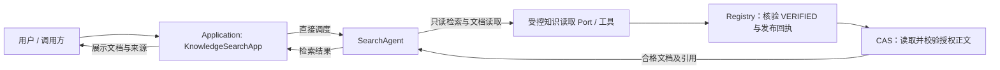

<!--
Copyright (c) 2026 linlisWorkTeam
SPDX-License-Identifier: MIT
文件功能：说明检索类 Agent。
-->
# 检索类 Agent

**设计已确认（2026-09-08）；实现状态：Planned。** 本轮只定义文档与调用边界；当前 `KnowledgeSearchApp` 提供普通查询，尚未接入 SearchAgent。需求与验收见 `KF-SYS-043` / `AC-SEARCH-001`。

## SearchAgent

- **职责**：根据用户的检索意图查找飞轮治理后正式发布的合格知识文档，返回相关文档、命中片段和可追溯引用。
- **调用方**：用户通过 Application 的 `KnowledgeSearchApp` 直接调度；不经过 Application `Orchestrator`、`OrchestratorAgent` 或 LangGraph 飞轮工作流。
- **检索范围**：Registry 中当前状态为 `VERIFIED`、具有成功发布回执且正文 Artifact 完整性有效的知识版本。`ACCEPTED` 只是候选质量检查结果，不代表已发布；`CANDIDATE`、`LOW_CONFIDENCE`、`SUPERSEDED` 均不得进入 SearchAgent 的候选集、上下文或结果。
- **非职责**：不扫描参考源码或外部原始材料，不生产或修订知识，不生成代码或测试，不参与评测、Gate、发布或飞轮调度。无命中不自动启动治理任务。

## 调用与数据边界

Application 负责输入校验、请求关联、权限、超时、取消及返回结果校验；SearchAgent 负责检索意图与相关结果组织；Infrastructure 通过 Port 提供 Agent 运行能力和只读检索工具，SDK 不进入 Application/Domain。`KnowledgeSearchApp` 是用例入口，SearchAgent 是它调用的角色，两者不互相替代。

过滤必须由受信读取服务在向 Agent 提供材料前执行，不能依赖提示词或只在最终输出时过滤。详情读取同样校验版本状态、发布回执和 Artifact 摘要；返回前复核版本仍可供消费，若期间变为 `SUPERSEDED`，剔除该项或重新检索。索引或缓存只能加速检索，不能成为发布状态的第二事实源。

## 业务输入输出约定（待实现）

| 方向 | 最小内容与约束 |
|---|---|
| 输入 | 请求关联 ID、用户查询、可选模块/分类过滤和结果上限；权限上下文由 Application 绑定，不接受用户或模型将状态范围扩大到非 `VERIFIED`。 |
| 输出 | 请求关联 ID、查询、命中文档列表；每项包含 `moduleId`、`versionId`、标题、`status=VERIFIED`、正文 `ArtifactRef`、命中片段及 provenance。相关性分数或排序理由只表达匹配程度，不代表质量或发布判定。 |
| 无命中 | 返回空列表并明确没有符合条件的已发布文档；不得用候选、历史替代版本、模型常识或新生成文档补齐。 |
| 失败 | 无效输入、越权、超时、存储不可用或正文完整性失败返回可区分的受控错误；不得将基础设施故障伪装成无命中。 |

引用的来源标识可用于追溯，不代表 SearchAgent 有权读取来源正文。返回片段必须来自命中的文档，不能编造版本或引用。

实现时须为检索请求和结果提供独立的版本化 JSON Schema，以请求 ID 关联调用，不为检索创建 `FlywheelRun`、`GenerationKey` 或图 checkpoint。现有 `agent-command.schema.json` / `agent-result.schema.json` 是七个飞轮角色的契约，不可直接以 `agentType=search` 调用，也不应为复用信封而伪造治理 `runId`。

## 与现有查询及七角色的关系

目标架构包含七个飞轮角色和一个独立 SearchAgent。SearchAgent 不加入七角色 DAG、Run 配置快照或 `WorkflowNodeProjection`，Console 的批次工作流图仍只展示该批次的治理节点。

现有 `KnowledgeSearchApp` / `KnowledgeQueryService`、CLI `query`、HTTP Knowledge 接口和 DSH `wp_knowledge_query` 是可复用的查询基础，不表示已经执行 SearchAgent。治理目录允许查看非发布状态；SearchAgent 必须使用独立受控的已发布读取范围。现有 HTTP 状态过滤语义见 [Knowledge API](../10-interfaces/http-api.md#4-knowledge)，本次不新增公开路由。

后续实现按 [AC-SEARCH-001](../13-verification/acceptance-plan.md)验证 Application 直调、发布状态过滤、引用完整性、无命中与失败行为，并证明查询不会启动或推进飞轮。
